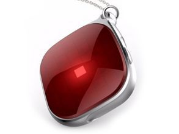

# AoYa - A10

El rastreador GPS AoYa A10 es un dispositivo compacto y versátil diseñado para su uso en vehículos. Con su función de localización por GPS, este rastreador le permite rastrear la ubicación de su vehículo en tiempo real, lo que lo convierte en una herramienta invaluable para la seguridad y el seguimiento de flotas.

El AoYa A10 cuenta con una pantalla sin pantalla, lo que lo hace discreto y fácil de ocultar en el vehículo. Con dimensiones de 38,5 mm x 38,5 mm x 17 mm, este rastreador es compacto y no ocupará mucho espacio en su vehículo.

Este rastreador utiliza la red GSM / GPRS / WiFi para transmitir datos de ubicación, lo que garantiza una cobertura confiable y una conexión estable. El chip GSM MTK y el chip GPS UBLOX garantizan una sensibilidad y precisión excepcionales, con una sensibilidad GPS de -159dBm y una precisión de 5-10 metros.

El AoYa A10 viene con una batería de iones de litio de 3.7V y 450mAh, que proporciona hasta 3 días de tiempo de trabajo. También cuenta con un micrófono incorporado, lo que le permite escuchar el audio en tiempo real desde el rastreador.

En resumen, el rastreador GPS AoYa A10 es una opción confiable y eficiente para el seguimiento de vehículos. Con su tamaño compacto, funciones avanzadas y rendimiento confiable, este rastreador es una herramienta invaluable para la seguridad y el seguimiento de flotas.

### Características destacadas:

- Tamaño compacto y discreto
- Función de localización por GPS
- Red GSM / GPRS / WiFi
- Chip GSM MTK y chip GPS UBLOX
- Sensibilidad GPS de -159dBm
- Precisión GPS de 5-10 metros
- Batería de iones de litio de 3.7V y 450mAh
- Micrófono incorporado

