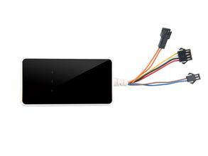

# AoYa - A18

El rastreador GPS AoYa A18 es un dispositivo de seguimiento diseñado específicamente para uso automotriz. Con un tamaño compacto de 88 mm x 46 mm x 16 mm y un peso de 80 g, este rastreador es fácil de instalar y transportar.

El AoYa A18 utiliza tecnología GPS / LBS / AGPS para proporcionar un seguimiento preciso de la ubicación en tiempo real. Con un chip GPS UBLOX y una sensibilidad GPS de -159dBm, este rastreador ofrece una precisión de 5-10 metros. Además, cuenta con una batería de emergencia de 3.7V, 250mAh que puede durar hasta 3 años en modo de espera.

Este rastreador GPS es compatible con las redes GPS / AGPS / GSM / GPRS, lo que garantiza una cobertura confiable en todo momento. Además, cuenta con un chip GSM SIMTK6260 para una conectividad estable y confiable.

El AoYa A18 es un dispositivo de seguimiento GPS en tiempo real con acceso en línea gratuito. Con su funcionalidad y características avanzadas, este rastreador es ideal para uso en vehículos, permitiendo a los propietarios rastrear y monitorear la ubicación de sus vehículos de manera efectiva y segura.

### Características destacadas:

- Tamaño compacto y peso ligero
- Tecnología GPS / LBS / AGPS para un seguimiento preciso de la ubicación
- Chip GPS UBLOX y sensibilidad GPS de -159dBm para una mayor precisión
- Batería de emergencia de larga duración en modo de espera
- Compatibilidad con redes GPS / AGPS / GSM / GPRS para una cobertura confiable
- Chip GSM SIMTK6260 para una conectividad estable
- Acceso en línea gratuito para un seguimiento en tiempo real

