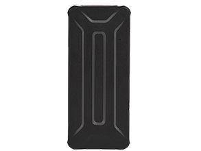

# AoYa - A206

El AoYa A206 es un rastreador GPS para uso automotriz diseñado para el seguimiento y la seguridad de vehículos. Presenta dimensiones compactas y una carcasa ligera que facilitan su colocación y ocultamiento en el automóvil. El A206 emplea posicionamiento dual con GPS y AGPS y está construido alrededor de un chip UBLOX, ofreciendo alta sensibilidad y una precisión reportada adecuada para tareas rutinarias de localización vehicular.

Como dispositivo compatible con Plaspy, el A206 puede enviar actualizaciones de ubicación a la plataforma de gestión y seguimiento de flotas de Plaspy. Esa compatibilidad convierte al A206 en una opción práctica para organizaciones e individuos que requieren visibilidad precisa de la ubicación, mayor autonomía entre cargas gracias a su batería de 7800 mAh e integración sencilla con Plaspy para monitoreo, generación de informes y alertas.

## Aspectos destacados

- Factor de forma compacto de 96 mm x 42 mm x 24 mm y peso ligero de 100 g para una instalación discreta en vehículos
- Posicionamiento dual con GPS y AGPS para obtener fijaciones de ubicación fiables en entornos de conducción habituales
- Chip GPS UBLOX con alta sensibilidad y precisión de posición de alrededor de 5 metros para un seguimiento confiable
- Gran autonomía proporcionada por una batería Li-ion de 7800 mAh, adecuada para usos prolongados
- Diseñado para uso automotriz con aplicaciones prácticas en gestión de flotas y monitoreo antirrobo
- Perfil de dispositivo sencillo que se integra con los flujos de trabajo de Plaspy para visibilidad vehicular y supervisión operativa

## Cómo funciona con Plaspy

Cuando se utiliza con Plaspy, el AoYa A206 se convierte en una fuente de datos de ubicación que Plaspy muestra en mapas, en informes y mediante alertas configurables. Plaspy procesa las actualizaciones de ubicación del A206 y las pone a disposición junto con otros dispositivos para una supervisión consolidada de la flota y análisis.

- Visualización en tiempo real e histórica de ubicaciones para vehículos individuales y flotas completas
- Alertas por geocercas y movimiento para notificar a los responsables cuando los vehículos entren o salgan de zonas definidas
- Reproducción de viajes e historial básico de rutas para revisar trayectos y puntos de parada
- Informes agregados y paneles para supervisión operativa y análisis de tendencias de uso
- Entrega de notificaciones para eventos como movimiento, paradas prolongadas o actividad fuera de zona

## Casos de uso típicos

- Seguimiento de flotas para pequeñas y medianas empresas
- Monitoreo de vehículos de alquiler y supervisión básica del uso
- Seguridad de vehículos particulares y monitoreo antirrobo
- Visibilidad en logística y reparto, donde la precisión de la ubicación y la autonomía de la batería son importantes
- Vehículos de largo recorrido o de uso irregular que se benefician de una mayor duración de batería

## Por qué elegir este rastreador con Plaspy

El AoYa A206 es una opción práctica para organizaciones que necesitan un rastreador automotriz compacto con posicionamiento preciso y amplia autonomía. Su conjunto de funciones sencillo y su tamaño compacto lo hacen adecuado para diversos escenarios de monitoreo vehicular donde el ocultamiento y la larga duración de la batería son ventajas. Combinado con Plaspy, el A206 proporciona a los operadores la visibilidad y los datos necesarios para gestionar los vehículos de manera más eficiente, sin complejidad innecesaria.

Si desea conocer más sobre cómo el AoYa A206 puede integrarse en su sistema de rastreo, consulte Plaspy para ver las funciones de la plataforma y la compatibilidad. Para obtener las especificaciones más recientes, la disponibilidad y los detalles del fabricante, verifique la información en el sitio oficial de AoYa http://www.aoyagps.com/ y conozca más sobre Plaspy en el sitio principal https://www.plaspy.com.
