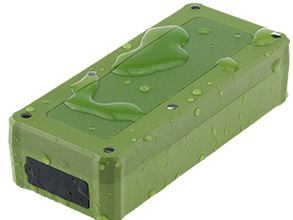

# AoYa - A206b

El AoYa A206b es un rastreador GPS automotriz compacto diseñado para el monitoreo discreto de vehículos. Con dimensiones de 96 mm x 42 mm x 24 mm y un peso aproximado de 100 g, la unidad es pequeña y ligera, lo que facilita su colocación sin llamar la atención. Usa conectividad GSM GPRS junto con un módulo u-blox para proporcionar datos de ubicación; el fabricante indica una precisión posicional de alrededor de 5 metros y alta sensibilidad GPS para obtener posiciones confiables. El A206b está pensado para escenarios donde el tamaño, la autonomía y la precisión del posicionamiento son factores determinantes.

Como dispositivo compatible con Plaspy, el A206b puede integrarse en los flujos de trabajo de gestión de flotas y monitoreo de vehículos de la plataforma Plaspy. Plaspy puede procesar las actualizaciones de ubicación del rastreador para ofrecer seguimiento visual, reproducción histórica y supervisión operativa en flotas mixtas. Esto convierte al A206b en una opción práctica para organizaciones que requieren un rastreador compacto que funcione con una plataforma de rastreo completa.

## Características principales

- Diseño compacto y ligero adecuado para una instalación discreta en vehículos
- Módulo u-blox que entrega datos de posición confiables con una precisión cercana a 5 metros
- Opera sobre tecnología de red GSM GPRS para reportes remotos
- Larga autonomía respaldada por una batería Li-ion de 5000 mAh con duración extendida en espera
- Factor de forma magnético para facilitar la fijación y el retiro sin herramientas
- Tamaño reducido y bajo peso que minimizan el impacto en el uso del vehículo

## Cómo funciona con Plaspy

El A206b transmite información de ubicación que Plaspy recibe y muestra mediante sus herramientas de gestión de flotas. Una vez integrado en Plaspy, las actualizaciones del rastreador forman parte de una vista centralizada que ayuda a los equipos a monitorear activos y a responder frente a eventos.

- Visibilidad en tiempo real de la ubicación en el mapa de Plaspy para vehículos individuales
- Reproducción histórica de rutas e historial de ubicaciones para auditoría y revisión
- Alertas y notificaciones configurables en Plaspy para movimientos o eventos de geocerca
- Informes agregados para apoyar la supervisión de la flota y el análisis operativo
- Estado centralizado del dispositivo y registro del último contacto para gestionar despliegues

## Casos de uso típicos

- Rastreo de vehículos de flotas para empresas de reparto y servicios
- Monitoreo de vehículos personales para seguridad y localización
- Vigilancia antirrobo y apoyo en recuperación para autos y vehículos comerciales ligeros
- Seguimiento temporal o de vehículos de renta donde la fijación sencilla es una ventaja
- Activos remotos o vehículos estacionales que se benefician de una batería de larga duración

## Por qué elegir este rastreador con Plaspy

El AoYa A206b combina un perfil físico reducido con una autonomía sólida y posicionamiento preciso, lo que lo convierte en una opción adecuada para organizaciones que necesitan rastreo vehicular discreto y de larga duración. Su diseño magnético y tamaño compacto facilitan el despliegue cuando no se desea una instalación permanente, mientras que el receptor u-blox ayuda a garantizar obtenciones de posición confiables para el monitoreo diario.

Al utilizarlo con Plaspy, el A206b aporta actualizaciones de ubicación consistentes a una plataforma pensada para visibilidad, alertas e informes. Si usted necesita rastreo automotriz compacto que se integre a un entorno de gestión, el A206b ofrece un equilibrio entre portabilidad y precisión posicional que satisface muchas necesidades operativas.

Para saber más sobre cómo Plaspy puede trabajar con dispositivos compatibles, visite https://www.plaspy.com. Las especificaciones del producto y su disponibilidad pueden cambiar con el tiempo, por lo que le recomendamos verificar los detalles técnicos actuales en el sitio del fabricante http://www.aoyagps.com/ antes de tomar decisiones de compra o despliegue.
