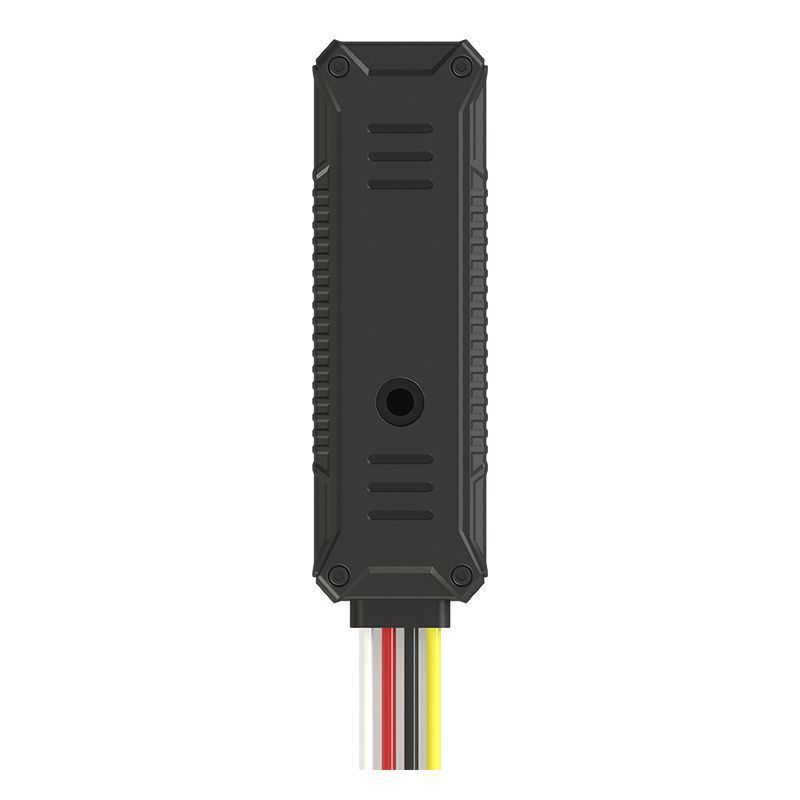

# AoYa - AY-T801

El AoYa AY-T801 es un rastreador vehicular compacto que combina posicionamiento Beidou y GPS para ofrecer localización precisa en automóviles. Diseñado con un formato pequeño y discreto, el AY-T801 se instala de forma casi imperceptible en una amplia variedad de vehículos particulares. Entre las funciones principales que describe el fabricante están la localización y reproducción de rutas, geocercas, corte remoto de motor y detección de ACC, además de varias alarmas como vibración, corte de energía, batería baja, exceso de velocidad y alarma de geocerca.

Como dispositivo compatible con Plaspy, el AY-T801 puede integrarse en la plataforma para añadir visibilidad en tiempo real y seguimiento histórico a sus flotas o al monitoreo de vehículos individuales. Su posicionamiento multimodal y su conjunto de alarmas de seguridad lo convierten en una opción práctica para empresas y particulares que necesiten monitoreo centralizado, alertas y funciones básicas de control remoto a través de las interfaces web y móvil de Plaspy.

## Características principales

- Posicionamiento dual Beidou y GPS para mayor precisión de ubicación
- Diseño ultra compacto y discreto, apto para muchos modelos de vehículos
- Soporte para corte remoto de combustible/ motor y detección de ACC para control operativo
- Múltiples tipos de alarma: vibración, exceso de velocidad, geocerca y corte de energía
- Geocerca y reproducción de rutas para revisar trayectos históricos
- Monitoreo de múltiples vehículos desde una cuenta principal con acceso web y móvil

## Integración con Plaspy

Al conectarlo a Plaspy, el AY-T801 transmite información de ubicación y estado que la plataforma procesa para ofrecer visibilidad, alertas e informes. Plaspy muestra actualizaciones de posición en tiempo real y recorridos históricos, además de notificar alarmas y cambios de estado para que los administradores de flota y propietarios puedan actuar con rapidez.

- Visualización de ubicación en tiempo real y mapas para el seguimiento continuo de vehículos
- Configuración de geocercas y reenvío de alertas basadas en eventos del rastreador
- Reproducción de rutas e historial de viajes para revisar desplazamientos y verificar actividades
- Consolidación de alertas por vibración, velocidad, energía y otros eventos compatibles
- Supervisión a nivel de flota con seguimiento de varios vehículos bajo una misma cuenta
- Cuando está configurado, Plaspy puede exponer opciones de control remoto y el estado de ACC para la gestión operativa

## Casos de uso típicos

- Prevención de robos y monitoreo de seguridad para automóviles particulares
- Rastreo de flotas para vehículos comerciales ligeros y de servicio
- Supervisión de vehículos de alquiler y reemplazo, incluyendo revisión del historial de rutas
- Monitoreo operativo de pequeñas flotas que requieren alertas de geocerca y notificaciones
- Vigilancia remota de vehículos clave cuando se necesita instalación discreta

## Por qué elegir este rastreador con Plaspy

El AY-T801 combina un perfil de hardware compacto con un conjunto amplio de funciones de seguridad y rastreo que encajan bien con los casos de uso de Plaspy. La combinación de posicionamiento Beidou y GPS ayuda a mantener la precisión en diversas condiciones, mientras que las alarmas integradas y la capacidad de control remoto facilitan una gestión ágil de flotas y vehículos. Para organizaciones que necesitan visibilidad de múltiples unidades y acceso sencillo desde web y móvil, el AY-T801 aporta las funcionalidades básicas que Plaspy puede presentar dentro de un flujo de monitoreo unificado.

Si está evaluando hardware para usar con Plaspy, el AY-T801 es una opción a considerar cuando el factor de forma compacto, la variedad de alarmas y el control remoto de motor son prioridades. Para más información sobre Plaspy y cómo se gestionan los rastreadores compatibles en la plataforma visite https://www.plaspy.com. Las especificaciones y la disponibilidad del producto pueden cambiar con el tiempo, por lo que le recomendamos verificar los detalles técnicos actuales en el sitio del fabricante http://www.aoyagps.com/.
