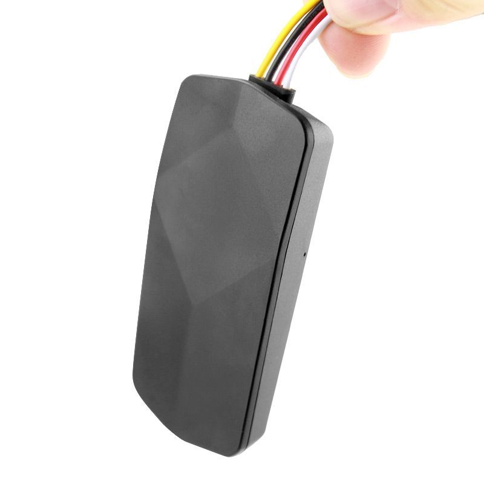

# AoYa - T2D

El AoYa T2D es un rastreador GPS automotriz compacto pensado para el seguimiento de vehículos y aplicaciones de flota. Con unas dimensiones de 82 x 39 x 15 mm y un peso de 54 g, resulta pequeño y liviano para una instalación discreta. El equipo admite posicionamiento por GPS, LBS y AGPS, y opera sobre redes 2G GSM/GPRS, ofreciendo informes de ubicación prácticos para automóviles, camiones y otros vehículos. Incluye una batería de emergencia de 180 mAh y soporta un amplio rango de voltaje de entrada, lo que lo hace adaptable a distintos sistemas eléctricos vehiculares.

Como dispositivo compatible con Plaspy, el T2D puede enviar la ubicación y el estado del vehículo al entorno de gestión de flotas de Plaspy para obtener visibilidad y control. Su factor de forma compacto y las tecnologías de seguimiento estándar lo convierten en una opción directa para organizaciones que desean consolidar flotas con dispositivos mixtos en Plaspy para monitoreo, alertas e informes. Indicar la compatibilidad facilita a los responsables de flota evaluar rápidamente si el T2D se ajusta a sus necesidades de integración con los servicios de Plaspy.

## Puntos clave

- Rastreador automotriz compacto y liviano, adecuado para montaje oculto en vehículos.
- Posicionamiento por GPS, LBS y AGPS para mayor disponibilidad de localización en distintos entornos.
- Operación en redes 2G GSM/GPRS para conectividad celular básica y envío de informes.
- Compatibilidad con un amplio rango de voltaje de entrada para uso en varios tipos de vehículos.
- Batería de emergencia integrada para mantener el seguimiento durante interrupciones de la alimentación principal.
- Integración conocida de componentes, incluyendo un chip GPS UBLOX y un chip GSM SIMTK6260.

## Cómo funciona con Plaspy

Cuando se utiliza con Plaspy, el AoYa T2D aporta datos de posición y estado del dispositivo que Plaspy procesa para ofrecer visibilidad en tiempo real y análisis históricos. Plaspy puede recibir los reportes de ubicación del T2D y mostrarlos junto con otros dispositivos de la flota para una gestión centralizada.

- Visualización centralizada de ubicaciones en los mapas de Plaspy para seguimiento en vivo.
- Geocercas y alertas de ubicación generadas a partir de las actualizaciones del T2D.
- Datos históricos de viajes y reproducción de rutas para revisiones operativas e informes.
- Paneles de estado de la flota que integran unidades T2D en la misma interfaz que otros rastreadores compatibles.
- Reenvío de eventos y alarmas del dispositivo hacia los flujos de notificación de Plaspy.

## Casos de uso típicos

- Monitoreo de flotas ligeras a medianas para gestión de rutas y supervisión operativa.
- Seguridad vehicular y apoyo en recuperación mediante reporte continuo de ubicación.
- Supervisión de flotas mixtas donde se prefieren rastreadores de tamaño reducido.
- Seguimiento temporal de vehículos cuando es importante un factor de forma pequeño y batería de emergencia.
- Visibilidad operativa para flotas compartidas o de uso rotativo.

## Por qué elegir este rastreador con Plaspy

El AoYa T2D es una opción práctica para flotas que requieren un rastreador pequeño y orientado a aplicaciones vehiculares compatible con las funciones de gestión e informes de Plaspy. Su combinación de GPS, AGPS y LBS junto con un amplio rango de voltaje y batería de emergencia lo hace flexible para distintos tipos de vehículos sin añadir complejidad innecesaria.

Si usted administra vehículos y desea integrar rastreadores compactos en una plataforma única, combinar el T2D con Plaspy ofrece un camino claro hacia la monitorización centralizada, las alertas y los informes básicos. Para conocer más sobre cómo Plaspy soporta distintos modelos de rastreadores y explorar las capacidades de la plataforma, visite https://www.plaspy.com. Las especificaciones del producto, la disponibilidad y los detalles del fabricante pueden cambiar con el tiempo, por lo que le recomendamos verificar las especificaciones técnicas actuales en el sitio oficial del fabricante http://www.aoyagps.com/.
