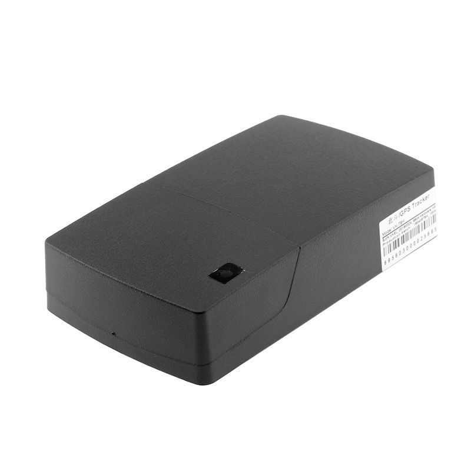

# AoYa - T9H

El AoYa T9H es un mini rastreador GPS compacto y versátil, pensado para ofrecer monitoreo de ubicación preciso y confiable. Con dimensiones reducidas de 49 mm x 66 mm x 15 mm y un peso de solo 141 g, el T9H es fácil de transportar y ocultar, por lo que resulta adecuado para seguimiento personal y diversas aplicaciones de rastreo de activos. El dispositivo emplea un chip GPS de alto rendimiento compatible con señales u blox y BDS, y ofrece una precisión típica de posición de alrededor de 5 metros, lo que permite un rastreo exacto en muchos entornos operativos.

Este modelo es compatible con Plaspy, lo que lo convierte en una opción práctica para quienes desean integrar un rastreador compacto con una plataforma moderna de gestión de flotas y activos. El T9H soporta amplias bandas GSM y cuenta con GPRS incorporado con TCP/IP para transmisión de datos, y su batería de gran capacidad de 6000 mAh permite largos intervalos de funcionamiento entre cargas. Estos factores se combinan para ofrecer visibilidad continua y monitoreo remoto simplificado cuando el dispositivo se integra con Plaspy.

## Características principales

- Factor de forma compacto y liviano de 49 mm x 66 mm x 15 mm y 141 g, ideal para ubicaciones discretas
- Chip GPS de alto rendimiento compatible con u blox y BDS para obtención confiable de posición
- Precisión de ubicación reportada alrededor de 5 metros para un seguimiento preciso
- Soporte de amplias bandas GSM para una cobertura amplia
- GPRS integrado con TCP/IP para transmisión de datos en tiempo real a plataformas en la nube
- Batería de gran capacidad de 6000 mAh diseñada para intervalos de rastreo prolongados

## Cómo funciona con Plaspy

Cuando se utiliza con Plaspy, el AoYa T9H envía datos de ubicación a la plataforma para proporcionar visibilidad continua y supervisión operativa. Plaspy incorpora las actualizaciones de posición del equipo y las muestra junto con otros activos para que los equipos puedan monitorear movimientos y estados desde una única interfaz.

- Visualización de ubicación en tiempo real en los mapas de Plaspy para seguimiento en vivo y visibilidad de la flota
- Histórico de recorridos y posiciones para revisión posterior y generación de informes
- Alertas y notificaciones configurables en Plaspy según eventos de movimiento o ubicación
- Informes agregados y exportación de datos para apoyar el análisis operativo
- Listado centralizado de dispositivos y vista de estado para gestionar múltiples unidades T9H

## Casos de uso habituales

- Seguridad personal y rastreo de activos móviles donde se requiere un dispositivo pequeño y discreto
- Monitoreo de vehículos de flota para vehículos pequeños o activos auxiliares
- Rastreo de equipos valiosos o carga durante transporte o almacenamiento
- Monitoreos de larga duración que se beneficien de una alta autonomía de batería
- Despliegues temporales o estacionales en los que la portabilidad es importante

## Por qué elegir este rastreador con Plaspy

El AoYa T9H es una opción práctica para organizaciones e individuos que necesitan un rastreador pequeño y fácil de desplegar que se integre con una plataforma de gestión en la nube. Su combinación de tamaño reducido, posicionamiento preciso, compatibilidad GSM amplia y gran capacidad de batería lo hace idóneo para casos donde se valore un rastreo discreto y de larga duración. Integrar el T9H con Plaspy permite a los equipos consolidar la visibilidad entre dispositivos y aprovechar el monitoreo y los informes centralizados.

Si usted está evaluando rastreadores compactos para integrar con Plaspy, el T9H merece consideración en escenarios que prioricen la portabilidad y la autonomía. Para conocer más sobre cómo Plaspy soporta dispositivos como el AoYa T9H, visite el sitio web de Plaspy en https://www.plaspy.com. Las especificaciones del producto, la disponibilidad y los detalles del fabricante pueden cambiar con el tiempo, por lo que le recomendamos verificar la información técnica y el soporte directamente con el fabricante en http://www.aoyagps.com/ antes de tomar decisiones de compra.
