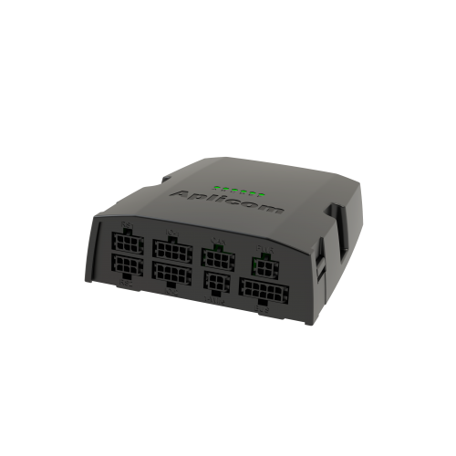

# Aplicom - A11 LTE

El Aplicom A11 LTE es un dispositivo telemático diseñado para la gestión de flotas y activos. Ofrece conectividad móvil global mediante comunicaciones 4G LTE y permite el emparejamiento de dispositivos Bluetooth para ampliar la identificación y recoger datos complementarios. Se presenta como una opción versátil y comprobada en campo, apta tanto para flotas pequeñas como para despliegues de activos a gran escala.

Como dispositivo compatible con Plaspy, el A11 LTE puede enviar datos de ubicación e identificación de dispositivos a los flujos de monitoreo de Plaspy. Su capacidad de roaming global y las opciones de emparejamiento Bluetooth lo hacen útil para organizaciones que necesitan visibilidad continua e identificación flexible de activos entre regiones. Además, funciones como las actualizaciones por aire facilitan el mantenimiento remoto dentro de un entorno de flota.

## Características principales

- Conectividad móvil 4G LTE global diseñada para amplia cobertura y roaming
- Emparejamiento Bluetooth para balizas y etiquetas que permiten identificar activos o usuarios
- Soporta balizas y sensores Bluetooth LE 5.0 para recopilar datos adicionales y estados on/off
- Funcionalidad OTA para simplificar la configuración y actualización de los equipos de forma remota
- Diseño probado en campo, adecuado tanto para flotas pequeñas como para grandes despliegues de activos
- Versátil para múltiples escenarios operativos donde se requiere visibilidad remota

## Integración con Plaspy

El A11 LTE se integra con Plaspy para proporcionar datos continuos de ubicación e identificación de activos, ayudando a los equipos a mantener la conciencia operativa desde una plataforma centralizada.

- Envíe actualizaciones de ubicación en tiempo real a Plaspy para seguimiento de flotas y visibilidad de rutas
- Use los datos de balizas y etiquetas Bluetooth para identificar activos, usuarios o ubicaciones específicas en los paneles de Plaspy
- Active alertas y notificaciones en Plaspy según cambios de ubicación o eventos de identificación
- Combine la visibilidad del dispositivo con los informes de Plaspy para análisis operativos e indicadores de desempeño de la flota
- Aproveche la capacidad OTA para reducir el mantenimiento manual mientras gestiona dispositivos y activos desde Plaspy

## Casos de uso típicos

- Seguimiento de flotas nacionales e internacionales donde se requiere conectividad en roaming
- Identificación de activos en entornos mixtos mediante etiquetas y balizas Bluetooth
- Monitoreo de sitios remotos donde la conectividad móvil continua facilita la supervisión
- Flotas de alquiler y equipos compartidos con identificación por activo
- Operaciones que se benefician de actualizaciones remotas para minimizar tiempos de inactividad

## Por qué elegir este rastreador con Plaspy

El A11 LTE combina amplia cobertura móvil con identificación basada en Bluetooth, lo que lo convierte en una opción adecuada cuando necesita visibilidad de la ubicación y la capacidad de distinguir o etiquetar activos individuales. Su capacidad de actualización OTA también ayuda a reducir los esfuerzos de mantenimiento en campo, complementando la gestión centralizada de dispositivos e informes en Plaspy.

Para organizaciones que evalúan hardware telemático para usar con Plaspy, el A11 LTE ofrece un equilibrio entre conectividad e identificación flexible de activos. Si sus operaciones requieren roaming global, gestión remota de equipos y la posibilidad de enriquecer datos con balizas Bluetooth, este modelo puede aportar valor práctico mientras alimenta las herramientas de monitoreo e informes de Plaspy.

Learn more about Plaspy on the main website https://www.plaspy.com. Product specifications, availability, and manufacturer details can change over time; verify current specifications on the official Aplicom site https://www.aplicom.com/
