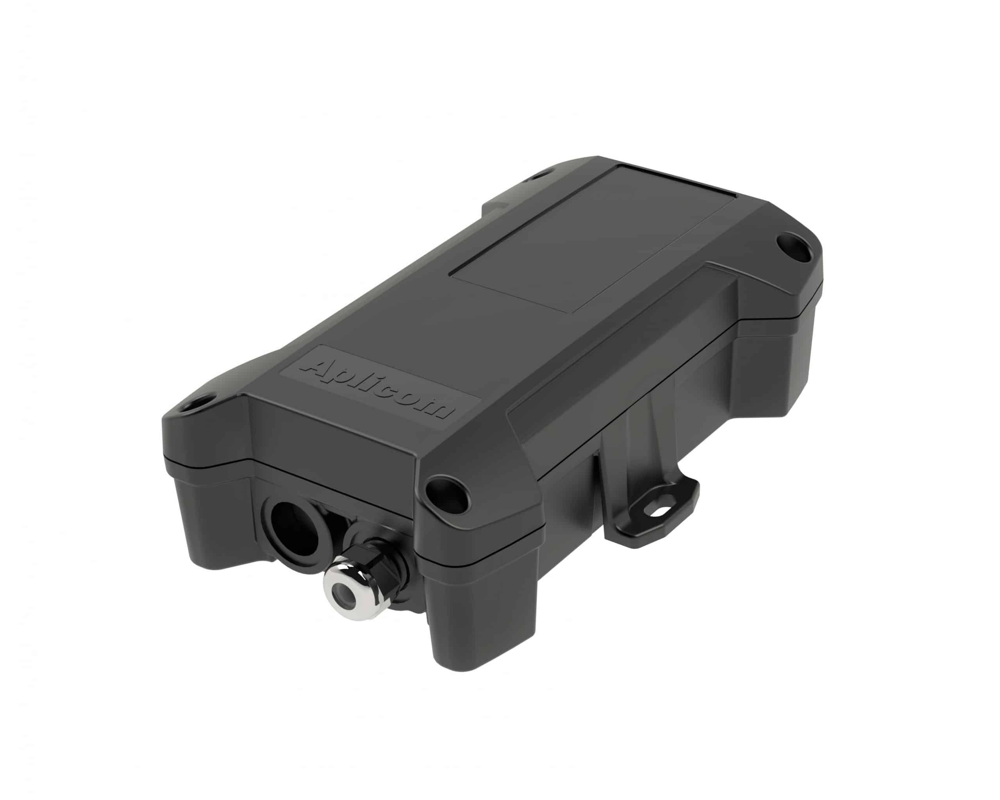

# Aplicom - A9 IPEX PRO

El Aplicom A9 IPEX PRO es un rastreador GPS y unidad telemática de construcción robusta, diseñado para uso exigente en campo. Orientado a remolques, maquinaria pesada y telemetría en activos estacionarios (como máquinas expendedoras), el A9 IPEX PRO ofrece seguimiento en tiempo real fiable, captura de telemetría sólida y una carcasa sellada con clasificación IP67 para soportar condiciones ambientales adversas. Incluye batería interna para escenarios de alimentación intermitente y está pensado para entregar datos de posición y señales operativas consistentes para la supervisión de flotas y activos.

Como dispositivo compatible con Plaspy, el A9 IPEX PRO puede enviar ubicación y telemetría a Plaspy para lograr una visibilidad consolidada de la flota y generar reportes. Su soporte para datos de bus de vehículo, entradas configurables y reportes por eventos lo hacen práctico para flujos de trabajo de gestión de flotas y monitorización industrial cuando se integra con la plataforma Plaspy. Esta combinación permite a los operadores supervisar el movimiento de activos, recibir alertas de estado y mantener control operativo sin cambiar los sistemas back-end principales.

## Características principales

- Rastreador compatible con Plaspy pensado para remolques, equipos pesados y activos estacionarios
- Carcasa robusta con certificación IP67 y antenas internas para instalaciones a prueba de clima
- Conectividad 4G LTE y receptor GNSS mejorado para actualizaciones de posición oportunas
- Batería interna de 4000 mAh para mantener la operación durante interrupciones de energía
- CAN configurable y múltiples opciones de entrada/salida para telemetría de vehículo e integración de sensores
- Acelerómetro integrado y reloj en tiempo real para detección de movimiento y marcas de tiempo precisas
- Gestión por aire (OTA) y herramientas de configuración Aplicom para facilitar el mantenimiento remoto

## Cómo funciona con Plaspy

Al conectarse a Plaspy, el A9 IPEX PRO reenvía ubicaciones GNSS, estados de entradas y mensajes basados en eventos para que su instancia de Plaspy proporcione conciencia situacional continua y alertas accionables. Integrar este rastreador en Plaspy ayuda a centralizar la telemetría de la flota y permite reportes y monitorización a través de distintos tipos de activos.

- Actualizaciones de ubicación y telemetría en tiempo real para reproducción de rutas y paneles de seguimiento en vivo
- Telemetría del bus CAN enviada a Plaspy para diagnóstico y análisis de datos del vehículo cuando esté disponible
- Reporte de entradas digitales y analógicas para alertas de puertas, alarmas o estados de encendido
- Eventos de movimiento e impacto detectados por el acelerómetro interno para detección de manipulación y notificaciones
- Configuración remota y actualizaciones de firmware para mantener las implementaciones Plaspy al día sin acceso físico

## Casos de uso típicos

- Seguimiento de remolques y recolección de datos EBS para mejorar la utilización y planificación de mantenimiento
- Telemática de camiones pesados y gestión de flotas con datos del vehículo enviados a Plaspy
- Monitorización de máquinas expendedoras y activos estacionarios en ubicaciones remotas o al aire libre
- IoT industrial y telemetría de equipos remotos usando CAN serial y entradas analógicas
- Flujos de trabajo antirobo y detección de manipulación mediante acelerómetro y vigilancia de entradas

## Por qué elegir este rastreador con Plaspy

El Aplicom A9 IPEX PRO es una opción sólida para organizaciones que requieren un rastreador durable y listo para campo que entregue ubicación y telemetría de vehículo a Plaspy. Su diseño robusto, batería interna y opciones flexibles de E/S lo hacen especialmente adecuado para remolques y equipos que enfrentan cortes de energía y condiciones adversas. Combinar la gestión de dispositivos Aplicom con los paneles de Plaspy ofrece una vía práctica para escalar implementaciones y mantener la visibilidad operativa.

Para obtener más información sobre el uso de este rastreador con Plaspy visite https://www.plaspy.com. Las especificaciones del producto, disponibilidad y detalles del fabricante pueden cambiar con el tiempo, por lo que debe verificar las especificaciones actuales en el sitio del fabricante https://www.aplicom.com/
