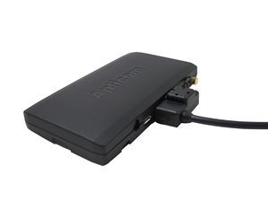

# Aplicom - A9 Quick

El Aplicom A9 Quick es una unidad telemática portátil para vehículos, pensada para rastreo y localización con despliegue rápido. Se conecta en el encendedor del vehículo para facilitar su traslado entre unidades sin complicaciones. Ofrece la funcionalidad preconfigurada del A9 NEX y admite un teclado externo de 3 botones llamado Aplicom 3PAD para entrada y reportes sencillos por parte del conductor.

Como equipo compatible con Plaspy, el A9 Quick se integra en la plataforma para proporcionar visibilidad centralizada de la flota y supervisión operativa. Su portabilidad y configuración preajustada lo hacen ideal para flotas que requieren incorporación rápida de vehículos temporales o rotativos, manteniendo historial de ubicaciones, reporte de conductores y monitoreo de geocercas dentro de Plaspy.

## Características principales

- Diseño portátil de conexión al encendedor para transferencia rápida entre vehículos y puesta en marcha inmediata
- Funcionalidad A9 NEX preconfigurada que acelera la instalación y despliegue
- Primera fijación rápida con GPS asistido para reducir el tiempo inicial de posicionamiento
- Antenas internas y posicionamiento GPS/GLONASS con respaldo por red celular para cobertura confiable
- Batería interna de respaldo que mantiene la operación durante interrupciones de alimentación
- Acelerómetro 3D para detección de movimiento y funciones de activación
- Soporte para geocercas con múltiples formas y reportes de entrada/salida

## Cómo funciona con Plaspy

Al integrarse con Plaspy, el A9 Quick envía actualizaciones de posición y eventos de forma continua hacia los paneles y reportes de Plaspy. Su estado preconfigurado reduce el esfuerzo de integración y, cuando se utiliza con el Aplicom 3PAD, puede transmitir eventos iniciados por el conductor.

- Visibilidad en tiempo real de la ubicación de los vehículos gestionados en Plaspy
- Alertas de geocerca e informes históricos de geocercas dentro de Plaspy
- Notificaciones de movimiento y actividad derivadas del acelerómetro del dispositivo
- Entradas de reporte del conductor desde el Aplicom 3PAD reflejadas en los registros de Plaspy
- Historial de rutas y eventos disponible para reportes y análisis en Plaspy

## Casos de uso típicos

- Alquileres de corta duración y flotas compartidas donde las unidades se mueven con frecuencia
- Flotas temporales o estacionales que requieren instalación y remoción rápidas
- Servicios de última milla y flotas de reparto que necesitan reportes sencillos por parte del conductor
- Equipos de campo o contratistas que requieren seguimiento portátil con configuración mínima
- Situaciones que demandan monitoreo de geocercas y detección básica de movimiento

## Por qué elegir este rastreador con Plaspy

El A9 Quick es una opción práctica para organizaciones que priorizan la portabilidad y la facilidad de despliegue. Su conexión al encendedor y ajustes preconfigurados reducen el tiempo para entrar en operación, mientras que funciones como posicionamiento asistido, energía de respaldo y geocercas contribuyen a mantener datos de ubicación fiables para la supervisión de la flota.

En conjunto con Plaspy, el A9 Quick ofrece la visibilidad y los reportes esenciales que la mayoría de los gestores de flota necesitan sin procesos de configuración extensos. Para empresas que rotan unidades entre vehículos o que requieren opciones de entrada de conductor sencillas, este dispositivo brinda un equilibrio entre conveniencia y funcionalidad de rastreo confiable.

Para más información sobre cómo el Aplicom A9 Quick funciona con Plaspy visite https://www.plaspy.com. Las especificaciones y la disponibilidad del producto pueden cambiar con el tiempo, por lo que le recomendamos verificar los detalles actuales en el sitio del fabricante https://www.aplicom.com/.
