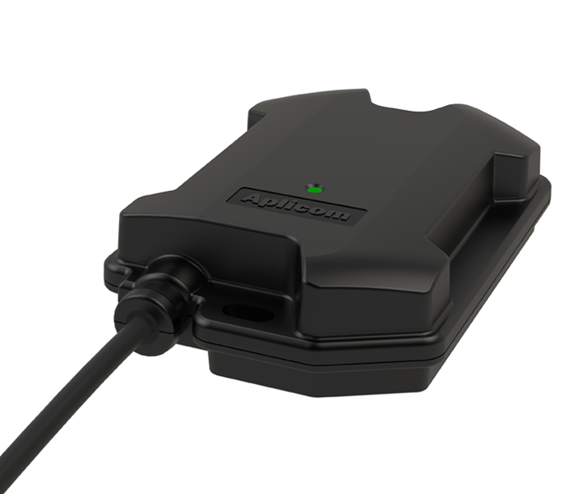

# Aplicom - T10 G

El Aplicom T10 G es un rastreador GPS de clase CAN, robusto y compatible con Plaspy, diseñado para la gestión moderna de flotas y telemetría de vehículos. Producido por Aplicom, el T10 G combina una carcasa resistente con grado IP67, instalación plug-and-play y acceso integrado al bus CAN para entregar datos fiables del vehículo para seguimiento en tiempo real, diagnósticos y flujos de trabajo de telemática de flotas integrados con Plaspy.

Diseñado para flotas en roaming y entornos exigentes, el T10 G utiliza conectividad celular a prueba de futuro \(LTE Cat M1 con roaming global 4G y respaldo 2G\) junto con la gestión de dispositivos Aplicom Silver Cloud para provisión remota y entrega de datos. Úselo con Plaspy para añadir telemetría a nivel de vehículo, señales derivadas del CAN y reporte continuo de ubicación a sus operaciones de flota, flujos de trabajo antirrobo y paneles de telemetría.

## Key Highlights

- Compatible con Plaspy: integra telemetría del vehículo y reporte de ubicación en los paneles y flujos de trabajo de Plaspy para seguimiento en tiempo real.
- Carcasa robusta, con clasificación IP67, para operación fiable en entornos exigentes de flotas e industriales.
- Interfaz CAN integrada que recoge datos del bus del vehículo, como estado de encendido, diagnóstico del motor y telemetría relacionada con el combustible cuando estén disponibles en el bus.
- Conectividad celular a prueba de futuro: soporte LTE Cat M1 con roaming 4G global y respaldo 2G para mantener la conectividad entre regiones.
- Instalación plug-and-play minimiza el tiempo de inactividad y acelera el despliegue en una flota mixta.
- Gestión remota del dispositivo a través de Aplicom Silver Cloud permite provisión, configuración y flujos de trabajo de firmware a escala.
- Kit de inicio y variante 2G disponibles para pruebas y despliegues en áreas con redes heredadas.

## How It Works with Plaspy

El Aplicom T10 G transmite telemetría del vehículo y datos del bus CAN a la capa de gestión de dispositivos de Aplicom y puede conectarse a Plaspy para seguimiento en tiempo real, alertas e informes. Plaspy puede consumir las cargas telemétricas proporcionadas por el T10 G \(ubicación y señales derivadas del CAN\) para ofrecer insights de gestión de flotas, alertas antirrobo e informes operativos.

- Actualizaciones de ubicación y telemetría en tiempo real \(el reporte de ubicación está disponible donde GNSS esté habilitado en el dispositivo/variante\).
- Datos del bus CAN del vehículo, como estado de encendido, códigos de diagnóstico de averías y telemetría de nivel de combustible cuando estas señales estén presentes en el bus del vehículo.
- La provisión y configuración remotas a través de Aplicom Silver Cloud le permiten empezar a transmitir telemática crítica para la misión a Plaspy de forma rápida.
- La resiliencia de la red mediante LTE Cat M1 y respaldo 2G mantiene el flujo de telemetría en áreas con cobertura variable, importante para flotas en roaming.
- Soporte de kit de inicio para despliegues piloto y pruebas antes de una implementación a gran escala en flotas gestionadas por Plaspy.

## Technical Overview

| Connectivity | LTE Cat M1 \(LTE-M\) with global 4G roaming capability; 2G fallback supported |
| --- | --- |
| Bands | Specific LTE/2G bands vary by variant and region — consult the Aplicom product datasheet for band details |
| Power & Battery | Powering details not specified in provided description; consult the datasheet for vehicle power and any backup battery options |
| Interfaces | Built-in CAN interface for vehicle-bus data capture; plug-and-play installation simplifies wiring and setup |
| GNSS | Location reporting is part of typical telematics workflows; check product datasheet for GNSS module availability per variant |
| Bluetooth | Bluetooth sensor support not specified in the description — review the datasheet for BLE sensor options |
| Remote Management | Aplicom Silver Cloud device management for remote provisioning, configuration and data delivery |
| Form Factor | Compact, rugged IP67 enclosure suited for vehicle/asset mounting; starter kit available for pilots |

## Use Cases

- Gestión de flotas: seguimiento centralizado de vehículos, monitorización de rutas y telemetría integrada en Plaspy para visibilidad operativa.
- Antirrobo y seguridad: utilice el estado de encendido y las señales de ubicación para detectar movimientos no autorizados y apoyar flujos de inmovilización a través de los sistemas del vehículo.
- Telemetría remota para vehículos industriales: recopilar diagnósticos del bus CAN y datos del motor para mantenimiento preventivo y monitoreo de la disponibilidad.
- Seguimiento de remolques y activos: diseño robusto y roaming celular hacen que la unidad sea adecuada para remolques y activos que operan en distintas regiones.
- Despliegues piloto y pruebas: utilice el T10 G Starter Kit y la variante 2G de T10 para implementaciones por fases y comprobaciones de compatibilidad antes de la integración a gran escala con Plaspy.

## Why Choose This Tracker with Plaspy

El Aplicom T10 G aporta hardware duradero y visibilidad a nivel de vehículo para flotas impulsadas por Plaspy. Su interfaz CAN facilita extraer el estado de encendido, mensajes de diagnóstico y telemetría relacionada con el combustible desde el bus del vehículo y alimentar esos datos en Plaspy para telemetría, informes y flujos de trabajo antirrobo. LTE Cat M1 más respaldo 2G y roaming 4G global reducen el riesgo de conectividad en operaciones internacionales o remotas, mientras que Aplicom Silver Cloud simplifica la provisión y gestión del ciclo de vida de forma remota, para que dediques menos tiempo a la configuración del dispositivo y más a la analítica y operaciones.

Para operaciones que requieren un dispositivo telemático robusto y de fácil despliegue que se integre en Plaspy para seguimiento en tiempo real y gestión de flotas, el Aplicom T10 G ofrece una combinación práctica de visibilidad del bus CAN, resiliencia celular y gestión de dispositivos habilitada en la nube. Consulte la documentación del producto de Aplicom y la página del producto T10 G para obtener detalles sobre el soporte de bandas, especificaciones GNSS y opciones de pedido, incluyendo la variante T10 2G y el kit de inicio.

