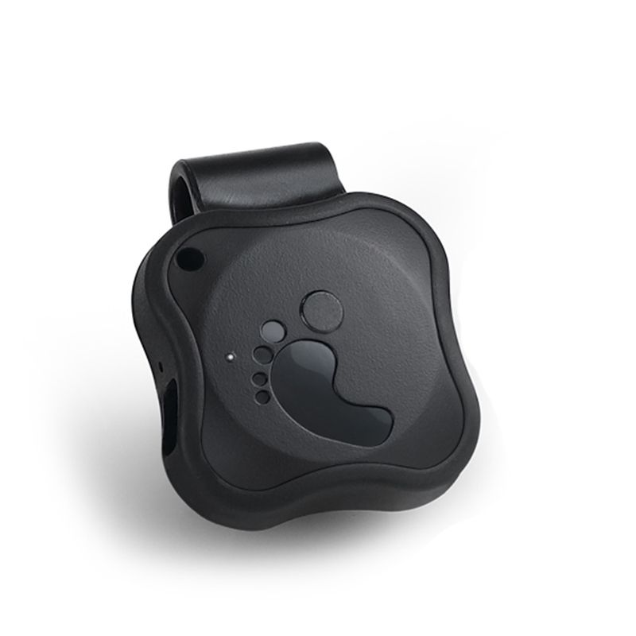

# Appello - 5P

El Appello 5P es un rastreador GPS compacto y confiable pensado para el seguimiento personal y de activos. Con unas dimensiones aproximadas de 32 x 32 x 13.5 mm y un peso de alrededor de 22 g, el 5P se puede fijar con facilidad a objetos o llevar de forma discreta. Su carcasa de APS y PC ofrece resistencia y el diseño en negro mantiene el dispositivo poco llamativo para una amplia variedad de aplicaciones.

Como dispositivo compatible con Plaspy, el 5P envía datos de posicionamiento y estado que se integran en Plaspy para ofrecer visibilidad y monitorización centralizada. Gracias al módulo GNSS U‑Blox MAX 7 y al módulo GSM de SIMCom, el rastreador proporciona posicionamientos fiables y reportes por red celular donde exista cobertura 2G, y Plaspy puede mostrar esa información junto con sus otros datos de flota y activos.

## Características principales

- Formato muy compacto, adecuado para colocación discreta en objetos personales y activos
- Construcción ligera de aproximadamente 22 g para minimizar el impacto en los elementos transportados
- Carcasa resistente de APS y PC diseñada para el uso diario
- Posicionamiento GNSS con módulo U‑Blox MAX 7 para datos de localización confiables
- Conectividad celular mediante módulo SIMCom GSM en redes 2G GPRS para reportes remotos
- Batería integrada de 350 mA con autonomía reportada de hasta 140 horas para seguimiento prolongado
- Funciones como actualizaciones por la nube y zumbador para alertas audibles

## Cómo funciona con Plaspy

Plaspy recibe las actualizaciones de ubicación y estado del dispositivo 5P y las presenta en una interfaz unificada de seguimiento para uso operativo. El rastreador envía posición e información básica de estado que Plaspy utiliza para poblar mapas, líneas de tiempo e informes, ayudando a los equipos a monitorear activos y personas desde una única plataforma.

- Visualización de ubicaciones en tiempo real e históricas en el mapa de Plaspy
- Alertas y notificaciones en Plaspy basadas en movimiento o cambios de estado reportados por el dispositivo
- Informes consolidados e historial de ubicaciones exportable para auditorías y análisis
- Visibilidad del estado del dispositivo para ayudar a planificar mantenimientos o ciclos de reemplazo de batería
- Agrupación y categorización dentro de Plaspy para gestionar múltiples unidades 5P junto a otros modelos de rastreadores

## Casos de uso típicos

- Seguimiento personal discreto para trabajadores solitarios o personas vulnerables
- Seguimiento de activos como equipos pequeños, equipaje o herramientas portátiles
- Monitoreo a largo plazo de objetos que se benefician de un rastreador compacto con larga autonomía
- Equipos de alquiler o compartidos donde se requiere un rastreo compacto y poco visible
- Situaciones en las que se prefiere un rastreador simple y duradero para obtener visibilidad básica de la ubicación

## Por qué elegir este rastreador con Plaspy

El Appello 5P es una opción práctica para organizaciones e individuos que usan Plaspy y necesitan un rastreador pequeño y ligero que pueda desplegarse en grandes cantidades o colocarse donde el tamaño y la discreción importan. Su carcasa resistente y su larga autonomía lo hacen apto para periodos de monitoreo prolongados, y funciones como el zumbador y el soporte para actualizaciones en la nube ofrecen capacidades útiles de mantenimiento y alertas.

Debido a que el 5P reporta ubicación y estado a través de redes celulares y utiliza un receptor GNSS fiable, se integra de forma natural en Plaspy para monitorización basada en mapas, alertas e informes. Esta opción resulta especialmente relevante cuando el tamaño compacto, la durabilidad y una larga autonomía en espera son prioridades y cuando la conectividad 2G GPRS satisface las necesidades operativas.

Para conocer más sobre Plaspy y cómo la plataforma puede trabajar con dispositivos Appello visite https://www.plaspy.com. Las especificaciones y la disponibilidad del producto pueden cambiar con el tiempo, por lo que le recomendamos verificar los detalles técnicos actuales y la información de soporte en el sitio del fabricante http://www.cnjeo.com/ antes de la compra.
