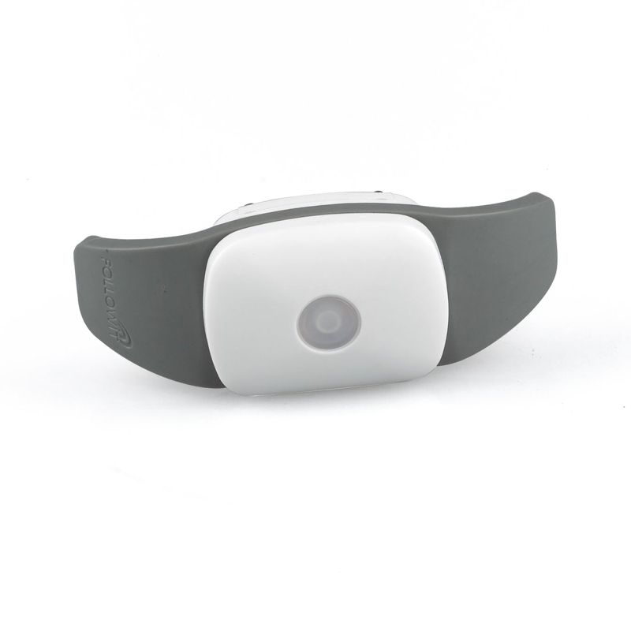

# Appello - Host

El rastreador GPS para mascotas Appello 4P de Appello es la solución perfecta para mantener a sus mascotas seguras y protegidas. Con un diseño compacto y una batería de larga duración, este rastreador es resistente al agua y puede ser utilizado en exteriores para mascotas de tamaño mediano y pequeño.

Una de las principales ventajas del Appello 4P es su tiempo de espera prolongado. A diferencia de otros rastreadores de mascotas en el mercado, que requieren una carga diaria o el uso de collares o teléfonos, este dispositivo elimina la preocupación de quedarse sin batería cuando su mascota se pierde. Con una batería de litio de gran capacidad, el Appello 4P puede durar hasta 12 meses sin necesidad de recarga.

El Appello 4P consta de una unidad de seguimiento GPS compacta y una base de alimentación. La unidad de seguimiento GPS se puede acoplar fácilmente a cualquier collar para mascotas, mientras que la base de alimentación cuenta con una batería de litio de 6000mAh y un módulo de administración inalámbrica. La base de alimentación se puede cargar de forma inalámbrica o mediante una conexión a la computadora, y también permite controlar el encendido y apagado del dispositivo.

Cuando la unidad de seguimiento GPS está cerca de la base de alimentación, la batería puede durar hasta 12 meses sin necesidad de recarga. Sin embargo, cuando la mascota se aleja del alcance de la base de alimentación \(hasta 20 metros\), el dispositivo enviará una alerta a su teléfono y se activará automáticamente para rastrear la ubicación de su mascota.

### Características destacadas:

- Diseño compacto y resistente al agua
- Batería de larga duración de hasta 12 meses
- Unidad de seguimiento GPS que se puede acoplar a cualquier collar para mascotas
- Base de alimentación con batería de litio de 6000mAh y módulo de administración inalámbrica
- Alertas automáticas cuando la mascota se aleja del alcance de la base de alimentación

