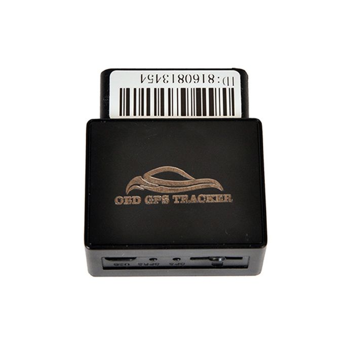

# Appello - OBD

El rastreador GPS OBD de la marca Appello es un módulo GSM MTK programado con soporte para protocolo TCP y banda GSM 4. Está equipado con el chipset GPS U-BLOX 7020, que proporciona una sensibilidad GPS de -162dB. Con un inicio en caliente de tan solo 1 segundo en promedio y un inicio cálido de 30 segundos en promedio, este rastreador GPS ofrece un rendimiento rápido y confiable.

Este rastreador GPS OBD de Appello está diseñado para funcionar en una amplia gama de condiciones. Puede operar en temperaturas que van desde -20 ° C hasta 65 ° C, lo que lo hace adecuado para su uso en diferentes entornos. Además, tiene una alta resistencia a la humedad, con una capacidad de funcionar en condiciones de humedad del 5% al 95% sin condensación.

El rastreador GPS OBD de Appello se alimenta con un voltaje de 12V y tiene una corriente promedio de menos de 84mA cuando está en modo de espera. Esto lo convierte en una opción eficiente en términos de consumo de energía.

Características destacadas:

- Módulo GSM MTK programado
- Soporte para protocolo TCP
- Banda GSM 4
- Chipset GPS U-BLOX 7020
- Sensibilidad GPS de -162dB
- Inicio en caliente de 1 segundo en promedio
- Inicio cálido de 30 segundos en promedio
- Temperatura de funcionamiento de -20 ° C a 65 ° C
- Humedad del 5% al 95% sin condensación
- Voltaje de 12V
- Corriente promedio de menos de 84mA en modo de espera

