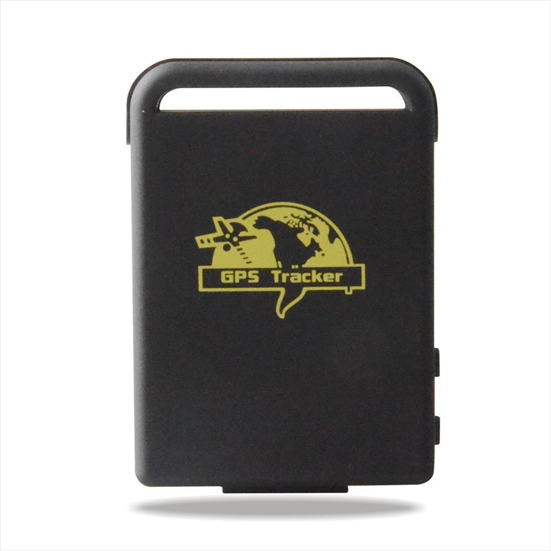

# Appello - TK102

El Appello TK102 es un rastreador GPS compacto y versátil diseñado para ofrecer localización fiable en una variedad de aplicaciones. Construido en torno a una CPU STC y el chip GPS New Star NS-1315, el TK102 proporciona alta sensibilidad GPS y buena precisión de posicionamiento. Su formato reducido y diseño liviano facilitan su instalación en lugares donde se requiere seguimiento discreto. El dispositivo admite comunicaciones GSM GPRS en frecuencias comunes y cuenta con una batería recargable que ofrece un tiempo de espera prolongado para operaciones extendidas.

Como dispositivo compatible con Plaspy, el TK102 puede enviar datos de posición a la plataforma de Plaspy para apoyar la supervisión, generación de informes y control operativo. Su combinación de posicionamiento preciso, tamaño compacto y larga autonomía lo convierte en una opción práctica para organizaciones que desean integrar un rastreador sencillo en Plaspy para el seguimiento de vehículos, activos o personal sin demandas complejas de hardware.

## Características principales

- Alta sensibilidad GPS y precisión típica alrededor de 5 metros para fijaciones de posición fiables
- Compatible con bandas GSM GPRS comunes en muchas regiones para conectividad celular
- Dimensiones compactas y peso reducido para colocación discreta y fácil portabilidad
- Batería recargable de 3.7V 850mAh que ofrece hasta 48 horas de espera para uso prolongado
- Buenas tolerancias ambientales, incluyendo rangos amplios de temperatura de operación y almacenamiento
- Cargador de pared incluido para recarga conveniente en tensiones de red habituales

## Cómo funciona con Plaspy

El TK102 puede proporcionar actualizaciones continuas de ubicación que Plaspy ingiere para mostrar datos de seguimiento en vivo e históricos en una única plataforma. Plaspy utiliza estas señales de posición para ofrecer visibilidad sobre los desplazamientos de activos y vehículos y para soportar flujos de trabajo de informes y alertas.

- Visualización de posición en tiempo real y rastro de migas para historial de movimiento
- Alarmas por geocerca y basadas en ubicación configurables en Plaspy para notificar a los operadores
- Informes agregados para análisis de rutas y revisión operativa
- Vistas centralizadas de gestión de dispositivos para supervisar estado del rastreador y nivel de batería
- Integración de los datos de ubicación del TK102 en paneles de flota para supervisión

## Casos de uso típicos

- Seguimiento básico de vehículos para flotas pequeñas o monitoreo de un solo activo
- Seguimiento de activos portátiles cuando el tamaño compacto y la posibilidad de ocultamiento son ventajosos
- Despliegues de corto a mediano plazo que requieren reportes GPS simples
- Monitoreo de personal cuando se necesitan rastreadores recargables y discretos
- Situaciones que demandan tolerancia a un amplio rango de temperaturas

## Por qué elegir este rastreador con Plaspy

El Appello TK102 ofrece un equilibrio práctico entre diseño compacto, rendimiento GPS sólido y larga autonomía, adecuado para muchas necesidades de seguimiento rutinarias. Para organizaciones que utilizan Plaspy, el TK102 constituye una fuente de datos sencilla que se puede incorporar a mapas en vivo, alertas e informes sin trabajos de integración complejos. Su simplicidad lo hace apropiado para despliegues donde la fiabilidad del posicionamiento y el mantenimiento fácil son prioridades.

Dado que los detalles del producto y la disponibilidad pueden variar con el tiempo, verifique las especificaciones técnicas más recientes y la información de accesorios en el sitio del fabricante. Para obtener más información sobre el uso de Plaspy con dispositivos compatibles visite https://www.plaspy.com. Para las especificaciones más actuales consulte al fabricante en http://www.cnjeo.com/.
