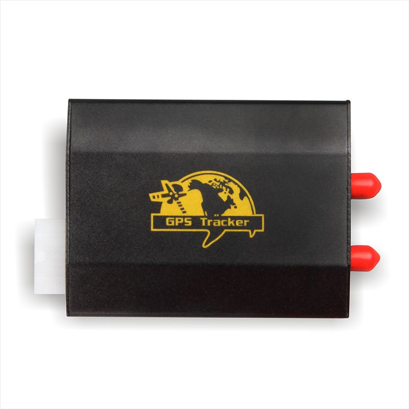

# Appello - TK103

El Appello TK103 es un rastreador GPS compacto y versátil pensado para el monitoreo en tiempo real de la ubicación de vehículos y activos portátiles. Combina un tamaño reducido y peso ligero con un módulo de posicionamiento que ofrece fijaciones de ubicación consistentes. Se informa que incorpora el chip New Star NS 1315 y un procesador tipo ARM 7, con precisión de posicionamiento en torno a los 5 metros y alta sensibilidad para mantener la recepción en entornos difíciles.

Como modelo compatible con Plaspy, el TK103 puede transmitir ubicación en vivo y el estado del dispositivo a Plaspy para supervisión centralizada e informes. Su soporte para redes GSM GPRS, la capacidad de batería en espera y un amplio rango de temperatura de funcionamiento lo hacen adecuado para distintos despliegues en campo donde usted utiliza Plaspy para rastrear unidades, generar alertas y obtener reportes operativos.

## Principales ventajas

- Dimensiones compactas y bajo peso para una colocación discreta en vehículos o activos portátiles
- Posicionamiento preciso gracias al chip New Star NS 1315 y precisión típica en torno a 5 metros
- Procesamiento basado en ARM 7 para actualizaciones de posición confiables y buena capacidad de respuesta del equipo
- Conectividad GSM GPRS para integración de seguimiento en tiempo real con plataformas como Plaspy
- Hasta 48 horas de autonomía en modo espera con la batería interna para usos intermitentes
- Amplio rango de temperatura de operación para adaptarse a diversas condiciones ambientales

## Cómo funciona con Plaspy

Al conectarse a Plaspy, el TK103 proporciona la ubicación y el estado básico del dispositivo que Plaspy presenta junto con otros datos de la flota y activos. Plaspy recibe actualizaciones periódicas del rastreador y aplica sus funciones de plataforma para mejorar la visibilidad y gestión operativa.

- Visualización en vivo de la ubicación de unidades individuales y flotas agrupadas
- Reproducción histórica de rutas y línea de tiempo de eventos para revisiones posteriores al viaje
- Alertas y notificaciones basadas en movimiento, cambios de estado o reglas predefinidas
- Informes consolidados sobre utilización de vehículos, resúmenes de viajes y tendencias operativas
- Indicadores de estado para conectividad del dispositivo y nivel de energía que facilitan la administración del parque

## Casos de uso comunes

- Rastreo de autos y motocicletas particulares para recuperación en caso de robo y monitoreo de ubicación
- Seguimiento de pequeñas flotas para vehículos comerciales ligeros y servicios
- Protección de activos portátiles y equipos de alto valor durante el transporte
- Monitoreo de vehículos de alquiler para registrar uso e historial de ubicaciones
- Supervisión operativa cuando se requiere seguimiento ocasional con dispositivos alimentados por batería

## Por qué elegir este rastreador con Plaspy

El TK103 es una opción práctica para organizaciones e individuos que necesitan un rastreador discreto que entregue actualizaciones de posición confiables. Su tamaño compacto, la precisión reportada y la compatibilidad con redes GSM lo convierten en una buena alternativa para usuarios de Plaspy que buscan visibilidad de ubicación sencilla sin requerir hardware complejo.

Aunque el TK103 ofrece la funcionalidad básica de rastreo que se integra bien con las funciones de monitoreo, informes y alertas de Plaspy, es importante que las organizaciones evalúen las capacidades del rastreador frente a sus necesidades operativas. En muchos escenarios de seguimiento de vehículos ligeros y activos, el TK103 ofrece un equilibrio útil entre portabilidad, precisión y operación con respaldo de batería.

Para más información sobre Plaspy y cómo gestiona los datos de dispositivos, visite https://www.plaspy.com. Tenga en cuenta que las especificaciones de producto, disponibilidad y datos del fabricante pueden cambiar con el tiempo; verifique las especificaciones actuales y la información de soporte con el fabricante en http://www.cnjeo.com/
