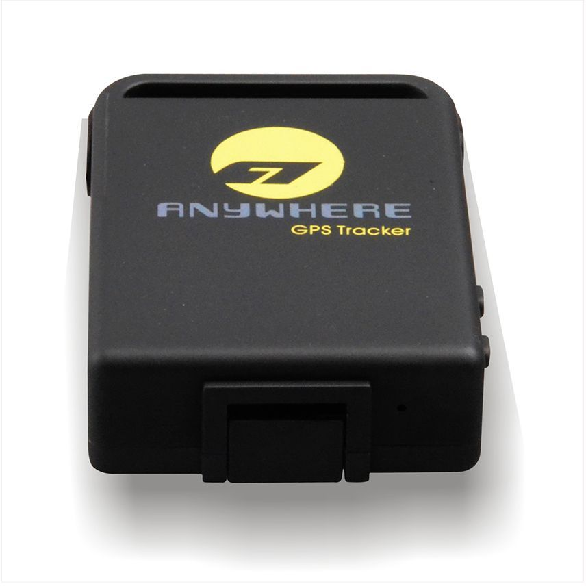

# Appello - TK106

El Appello TK106 es un rastreador GPS compacto y versátil diseñado para ofrecer monitoreo de ubicación confiable en diversas aplicaciones. Cuenta con conectividad GSM y GPRS en múltiples bandas de frecuencia y utiliza un CPU ARM junto al módulo GPS New Star NS-1315, que reporta una precisión de posición aproximada de 5 metros. Sus dimensiones reducidas y su peso ligero lo hacen ideal cuando es importante una colocación discreta y facilidad de transporte.

Como dispositivo compatible con Plaspy, el TK106 puede proporcionar datos de ubicación continuos y estado básico del equipo a la plataforma de seguimiento de Plaspy. Su compatibilidad con múltiples bandas celulares y el GPS integrado lo hacen apropiado para integrarlo en flujos de trabajo de monitoreo de flotas y activos dentro de Plaspy, donde la visibilidad, las rutas históricas y la supervisión operativa son fundamentales en el uso diario.

## Características principales

- Factor de forma compacto, aproximadamente 64 x 46 x 17 mm, que facilita su colocación  
- Compatibilidad con redes GSM GPRS en múltiples bandas para amplia cobertura  
- CHIP GPS New Star NS-1315 que ofrece precisión de ubicación reportada cercana a 5 metros  
- CPU ARM para operación del dispositivo y rendimiento de rastreo ágil  
- Batería integrada de 3.7V 850 mAh que brinda tiempo de espera prolongado para reportes periódicos  
- Construcción resistente con rango ambiental amplio y carcasa resistente a la humedad

## Cómo funciona con Plaspy

Al integrarse con Plaspy, el TK106 suministra información de ubicación y conectividad que Plaspy utiliza para mostrar posiciones en tiempo real, rutas históricas y el estado básico del dispositivo para la supervisión de flotas y activos. Plaspy ingestará los datos del rastreador y los hará disponibles a través de mapas, alertas y herramientas de informes para apoyar las decisiones operativas.

- Visibilidad de ubicaciones en tiempo real en los mapas de Plaspy para dispositivos individuales y flotas agrupadas  
- Reproducción de rutas históricas y exportación del historial de posiciones para análisis de recorridos  
- Alertas y notificaciones en Plaspy basadas en cambios en el reporte del dispositivo o eventos de ubicación  
- Monitoreo del estado del dispositivo dentro de Plaspy para detectar equipos desconectados o baja frecuencia de reportes  
- Informes y resúmenes que combinan los datos de posición del TK106 con los paneles de control de Plaspy para supervisión operativa

## Casos de uso típicos

- Localización y monitoreo de rutas para pequeñas flotas o vehículos individuales  
- Seguimiento de activos portátiles que se benefician de un dispositivo pequeño y fácil de ocultar  
- Reportes periódicos para personal de campo o trabajadores móviles cuando se requiere rastreo discreto  
- Visibilidad de equipos de renta y supervisión básica de uso  
- Monitoreo remoto en entornos que demandan un dispositivo con amplio rango de temperatura

## Por qué elegir este rastreador con Plaspy

El tamaño compacto del TK106 y su compatibilidad multi banda lo convierten en una opción práctica para organizaciones que requieren un rastreador pequeño pero capaz que funcione con una plataforma centralizada como Plaspy. Su precisión GPS y el comportamiento de batería en espera se alinean con las necesidades habituales de rastreo de flotas y activos, donde importan las actualizaciones periódicas y la posición confiable.

Al ser compatible con Plaspy, el TK106 puede añadirse a flotas mixtas de dispositivos y gestionarse junto con otros rastreadores compatibles dentro de la plataforma Plaspy. Esto permite a los operadores aprovechar las funciones de mapeo, alertas e informes de Plaspy, al tiempo que obtienen los beneficios del reducido tamaño y la tolerancia ambiental del TK106.

Para obtener más información sobre Plaspy y cómo admite rastreadores compatibles como el Appello TK106 visite https://www.plaspy.com. Las especificaciones del producto, su disponibilidad y los datos del fabricante pueden cambiar con el tiempo, por lo que se recomienda verificar las especificaciones técnicas y la información de soporte con el fabricante en http://www.cnjeo.com/ antes de tomar decisiones de compra.
