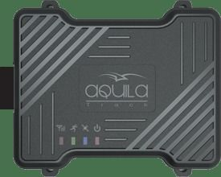

# Aquila - TS101-Basic

El Aquila TS101-Basic es un dispositivo de rastreo vehicular compacto pensado para la gestión de flotas y la supervisión de activos. Integra un interruptor anti-manipulación y una carcasa resistente con certificación IP65 que protege la electrónica frente al polvo y al agua en entornos móviles. El TS101-Basic ofrece rastreo en tiempo real y dispone de almacenamiento en estado sólido para hasta 10,000 registros de seguimiento, garantizando visibilidad en vivo y un historial fiable de movimientos.

Como dispositivo compatible con Plaspy, el TS101-Basic resulta una opción práctica para organizaciones que buscan hardware duradero junto con una plataforma de gestión de flotas. Su formato compacto y antenas internas facilitan instalaciones discretas, mientras que la batería de respaldo y el almacenamiento interno permiten mantener la continuidad de los datos que Plaspy presenta para monitoreo, generación de informes y supervisión operativa.

## Características principales

- Carcasa resistente con clasificación IP65 para protección en entornos vehiculares
- Interruptor anti-manipulación para mayor seguridad y detección de eventos
- Capacidad de rastreo en tiempo real para visibilidad de ubicación en vivo
- Almacenamiento en estado sólido para hasta 10,000 registros para reproducción histórica
- Diseño compacto con antenas internas, adecuado para montajes discretos
- Batería de respaldo integrada para preservar la operación durante interrupciones de energía

## Cómo funciona con Plaspy

Al integrarse con Plaspy, el TS101-Basic aporta información de ubicación y eventos que la plataforma puede visualizar, archivar y analizar para apoyar las operaciones de la flota. Plaspy puede utilizar los datos del dispositivo para ofrecer una vista unificada de seguimiento, alertas e informes en flotas mixtas.

- Visualización de ubicación en vivo en Plaspy para monitoreo de rutas y apoyo al despacho
- Reproducción histórica con los registros almacenados para revisar viajes y eventos pasados
- Alertas y notificaciones en Plaspy ante eventos de manipulación y otros cambios de estado
- Informes e historial exportable para análisis operativo y cumplimiento
- Continuidad en la presentación de datos cuando la batería de respaldo o el almacenamiento interno cubren brechas temporales de conectividad

## Casos de uso típicos

- Seguimiento de flotas comerciales para operaciones de logística y entrega
- Taxis y servicios de transporte donde se prefiera montaje discreto
- Flotas de alquiler y rent a car para supervisión de ubicación e historial
- Monitoreo de vehículos de seguridad y patrullaje para protección de activos
- Telemática para seguros y monitoreo básico de uso para evaluación de siniestros y riesgos
- Seguimiento general de activos cuando se requiere hardware compacto y resistente

## Por qué elegir este rastreador con Plaspy

El TS101-Basic es una opción pragmática para organizaciones que buscan un rastreador sencillo y resistente que se integre bien con software de gestión de flotas. Su combinación de protección anti-manipulación, resistencia ambiental, almacenamiento interno y batería de respaldo permite un seguimiento continuo y revisión histórica sin depender exclusivamente de conectividad constante.

Para equipos que utilizan Plaspy, el TS101-Basic puede aportar flujos de ubicación y registros de eventos confiables que mejoran la visibilidad y la toma de decisiones operativas. Su perfil compacto y opciones de montaje discreto lo hacen adaptable a múltiples tipos de vehículos y activos, mientras que Plaspy ofrece los paneles, alertas e informes para convertir los datos del dispositivo en información accionable.

Para conocer más sobre cómo Plaspy puede trabajar con rastreadores compatibles como el Aquila TS101-Basic visite https://www.plaspy.com. Las especificaciones del producto, disponibilidad y detalles del fabricante pueden cambiar con el tiempo, por lo que le recomendamos verificar las especificaciones actuales y la documentación en el sitio del fabricante https://www.itriangle.in/.
