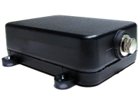

# ArkNav - AT-5000

El rastreador GPS AT-5000 de ArkNav es una solución confiable y duradera para la gestión de equipos y contenedores, así como para garantizar la seguridad y el cumplimiento de la ley. Con la tecnología GPS en constante crecimiento en popularidad, los rastreadores GPS se están convirtiendo en una herramienta esencial para las necesidades de seguridad y seguimiento diario. El AT-5000 ofrece una visibilidad mejorada de activos importantes, como equipos grandes y contenedores que a menudo se encuentran en áreas remotas durante largos períodos de tiempo.

Este rastreador GPS cuenta con tecnología GPS y GSM de última generación, antenas internas altamente sensibles y una carcasa resistente al agua y al calor. Está diseñado para soportar ambientes hostiles y condiciones de trabajo extremas, lo que lo hace ideal para equipos o activos estacionados al aire libre o semi-al aire libre. Su carcasa resistente y su batería recargable de alta calidad garantizan un rendimiento confiable incluso en entornos difíciles.

El AT-5000 ofrece una excelente administración de energía y perfiles de operación configurables, lo que permite mantener la ubicación de los activos una vez cada hora durante un máximo de 56 días. Esto mejora la eficiencia del despacho de activos, reduce los costos de mantenimiento y previene la pérdida de activos. Su diseño simple y su interfaz de usuario intuitiva reducen las falsas alarmas y los fallos de funcionamiento, brindando tranquilidad a los clientes.

Entre las características destacadas del AT-5000 se incluyen:

- Ampliación de capacidad de la batería
- A prueba de agua IP67
- Carcasa resistente al calor, hasta 85 °C
- Diseño sin botón de encendido
- Activación por temporizador y movimiento
- Ubicaciones de celda precisas
- AGPS
- Solicitud de ubicación actual mediante una llamada telefónica
- Tiempo de espera de hasta 1 año en modo de activación por movimiento
- Seguimiento una vez por hora en modo de activación por temporizador, con un tiempo de funcionamiento de hasta 50 días
- Gestión de potencia eficiente
- Envío de mapas de Google a través de SMS con hipervínculos a teléfonos celulares

El AT-5000 es ideal para la gestión de contenedores, remolques, equipos de gran tamaño y máquinas de servicio. También se puede utilizar para el seguimiento de equipos, la seguridad de caravanas, el seguimiento secreto, el seguimiento de activos de punto de venta y el seguimiento de contenedores/remolques.

