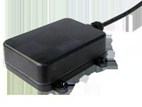

# ArkNav - RX-9 3G

El ArkNav RX-9 3G es un rastreador vehicular impermeable pensado para una amplia variedad de activos móviles, como autos, vans, camiones, remolques y maquinaria pesada. Con una carcasa robusta con certificación IP67 y antenas integradas, el RX-9 3G está diseñado para ofrecer durabilidad y una instalación discreta en entornos con humedad, polvo y vibración. El equipo incluye capacidad de posicionamiento, soporte para identificación de conductor, sensor de temperatura y colocación a prueba de manipulación, lo que ayuda a las flotas a mantener visibilidad continua de sus vehículos y equipos.

Como dispositivo compatible con Plaspy, el RX-9 3G puede enviar datos de ubicación y eventos clave a Plaspy para monitoreo, generación de informes y alertas. Su combinación de hardware resistente, sensor de temperatura, soporte para identificación de conductor y funciones de inmovilizador lo hace adecuado para los flujos de trabajo de gestión de flotas que Plaspy soporta, como monitoreo de rutas, recuperación de activos y logística con control de temperatura. Las características del RX-9 3G se alinean con las capacidades habituales de Plaspy para supervisión operativa y reportes históricos.

## Características principales

- Carcasa resistente e impermeable con protección IP67, ideal para entornos hostiles y exterior
- Módulos GPS y GSM integrados para informes de posición rápidos y confiables
- Sensor de temperatura integrado para supervisar cargas sensibles a temperatura
- Soporte para identificación de conductor y función de inmovilizador para mayor seguridad y control
- Protección contra picos de tensión de hasta 65 V para mayor fiabilidad en sistemas eléctricos vehiculares
- Almacenamiento y reenvío de un gran número de registros de ubicación para prevenir pérdida de datos
- Capacidad OTA para configuración y actualizaciones remotas que reducen visitas de mantenimiento

## Cómo funciona con Plaspy

Al integrarse con Plaspy, el RX-9 3G proporciona información continua de ubicación y eventos que Plaspy muestra, agrega y utiliza para activar notificaciones. Plaspy puede consumir los datos del rastreador para mejorar la visibilidad operativa y generar información accionable para los gestores de flota.

- Visualización en tiempo real y despliegue en mapa de vehículos y equipos dentro de Plaspy
- Reproducción histórica de rutas y revisión de ubicaciones almacenadas para análisis de viajes y auditorías
- Alertas y notificaciones por eventos como exceso de velocidad, baja tensión externa y otras condiciones configurables
- Lecturas de temperatura accesibles en Plaspy para supervisión de transportes sensibles a temperatura
- Eventos de identificación de conductor e inmovilizador disponibles para asignación de conductores, seguimiento de seguridad y procesos de recuperación
- Informes y registros exportables para revisiones operativas y cumplimiento normativo

## Casos de uso habituales

- Gestión de flotas mixtas que incluyen vehículos ligeros y maquinaria pesada
- Seguimiento de equipos de construcción y agrícolas expuestos a condiciones exigentes
- Entregas con control de temperatura que requieren monitoreo durante el tránsito
- Recuperación de vehículos y monitoreo antirrobo mediante colocación discreta y funciones de inmovilizador
- Seguimiento de remolques y activos donde la autonomía de la batería y el almacenamiento de datos son valiosos

## Por qué elegir este rastreador con Plaspy

El RX-9 3G combina un diseño de hardware resistente e impermeable con funciones que cubren las necesidades habituales de rastreo de flotas y activos. Sus antenas integradas y su carcasa sellada reducen la complejidad de instalación y la exposición a manipulaciones, mientras que el sensor de temperatura y el soporte para identificación de conductor aportan valor operativo más allá de la mera telemetría de ubicación. Unido a Plaspy, el RX-9 3G puede integrarse en una solución de monitoreo y reportes que ayuda a los equipos a mantener visibilidad, responder a incidentes y gestionar activos de forma proactiva.

Si desea saber más sobre cómo funciona el ArkNav RX-9 3G con Plaspy, visite https://www.plaspy.com para explorar las capacidades de la plataforma. Las especificaciones del producto, disponibilidad y detalles del fabricante pueden cambiar con el tiempo, por lo que verifique la información técnica vigente en el sitio oficial de ArkNav https://www.arknavgps.com.tw/.
