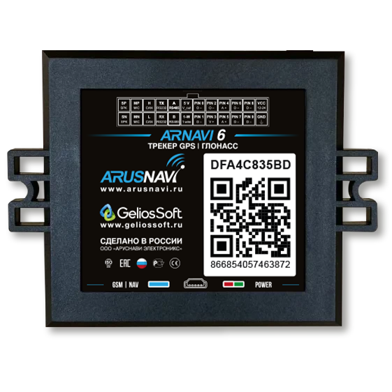

# Arusnavi - ARNAVI 6

ARNAVI 6 es un controlador de navegación profesional y compacto pensado para la gestión de flotas y la supervisión remota. Diseñado para ofrecer posicionamiento GPS fiable y telemetría vehicular detallada, el equipo integra múltiples opciones de comunicaciones y E/S que se adaptan a flotas mixtas y entornos con abundancia de sensores. Su tamaño reducido y capacidades de gestión remota lo hacen ideal en instalaciones donde la visibilidad continua y el control operativo son prioritarios.

Como dispositivo compatible con Plaspy listo para usar, ARNAVI 6 puede enviar datos de ubicación, eventos y telemetría en tiempo real directamente a Plaspy para monitoreo en vivo, generación de informes y alertas. La combinación de GNSS multiconstelación, doble SIM con respaldo opcional por Wi‑Fi y soporte para sensores inalámbricos e interfaces seriales convierte a este rastreador en una opción práctica para integrar en flujos de trabajo con Plaspy sin necesidad de puentes personalizados.

## Puntos clave

- Rastreador GPS compatible con Plaspy que ofrece actualizaciones continuas de ubicación y telemetría vehicular para la gestión de flotas.
- Conectividad celular dual SIM con opción de respaldo Wi‑Fi para mejorar disponibilidad y resiliencia en roaming.
- GNSS multiconstelación para posicionamiento más rápido y fiable en entornos diversos.
- Soporte para sensores Bluetooth y múltiples interfaces cableadas para recopilar datos de combustible, temperatura y parámetros del vehículo.
- Registro tipo caja negra integrado para captura de datos fuera de línea y sincronización posterior con Plaspy.
- Factor de forma compacto con amplias opciones de E/S y entrada de alimentación protegida, apto para instalaciones profesionales.
- Configurador web remoto y opciones de configuración desde móvil o PC para reducir tiempos de mantenimiento en campo.

## Cómo funciona con Plaspy

ARNAVI 6 transmite posición, datos de sensores y eventos a través de su enlace celular activo o del canal Wi‑Fi opcional hacia Plaspy, permitiendo seguimiento en vivo, alertas y generación de reportes históricos. Plaspy consume estos flujos para ofrecer visibilidad centralizada de la flota, análisis operativos y automatización de flujos según eventos de los dispositivos.

- Ubicación y telemetría en tiempo real en Plaspy para visibilidad de vehículos y coordinación de despachos.
- Alertas basadas en eventos como encendido, apertura de puertas o activación de alarmas para seguridad y segmentación de viajes.
- Telemetría de combustible y sensores enviada a Plaspy para monitoreo, reportes y detección de anomalías.
- Salidas de control remoto que pueden utilizarse en flujos tipo inmovilizador cuando se configuran desde Plaspy.
- Soporte para sensores Bluetooth que permite el uso de sondas y balizas inalámbricas para alimentar datos de temperatura y combustible en Plaspy.
- Registro offline en el dispositivo que asegura continuidad de datos y sincronización automática cuando se restablece la conectividad.

## Casos de uso típicos

- Gestión de flotas y despacho donde la ubicación continua y la telemetría mejoran el enrutamiento y la utilización de activos.
- Flujos de trabajo de seguridad y antirrobo usando entradas discretas, registro de eventos y control remoto de salidas.
- Programas de monitoreo de combustible que combinan sensores cableados y sondas inalámbricas para reducir pérdidas y optimizar consumo.
- Activos con alta densidad de sensores como transporte refrigerado o maquinaria de construcción que requieren telemetría de temperatura y CAN.
- Captura de eventos y diagnóstico para análisis posterior a incidentes mediante registro a bordo y capturas opcionales de cámara.

## Por qué elegir este tracker con Plaspy

ARNAVI 6 ofrece un equilibrio entre diseño compacto e interfaces profesionales, ideal para organizaciones que necesitan seguimiento en tiempo real fiable y cobertura amplia de telemetría. Su compatibilidad con Plaspy permite integrar posicionamiento GNSS, flujos de sensores y datos de eventos en una única plataforma de monitoreo e informes sin middleware complejo.

Para flotas que priorizan comunicaciones resilientes, manejabilidad remota e integración flexible de sensores, ARNAVI 6 proporciona los tipos de datos y funciones remotas que Plaspy utiliza para supervisión operativa, flujos de seguridad y análisis histórico. El dispositivo resulta especialmente útil cuando sus flotas son mixtas y las fuentes de telemetría varían, ya que ofrece una vía de integración consistente hacia Plaspy.

Si desea saber más sobre cómo ARNAVI 6 funciona con Plaspy y cómo puede encajar en su programa de flota, visite https://www.plaspy.com. Tenga en cuenta que las especificaciones del producto, su disponibilidad y los datos del fabricante pueden cambiar con el tiempo, por lo que verifique las especificaciones actuales en la documentación oficial del fabricante en https://www.arusnavi.ru.
