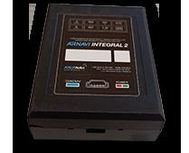

# Arusnavi - Arnavi Integral 2

El Arnavi Integral 2 es un controlador de navegación pensado para el monitoreo remoto de objetos móviles. Ofrece ubicación y seguimiento en tiempo real, por lo que resulta adecuado para rastrear vehículos, maquinaria y otros activos trasladables. El equipo se presenta como versátil y confiable, con funcionalidades como geocercas y un diseño compacto y resistente que soporta el uso continuo en condiciones operativas habituales.

Como dispositivo compatible con Plaspy, el Arnavi Integral 2 puede integrarse en los flujos de trabajo de gestión de flotas y activos para aportar visibilidad y control. Al conectarlo con Plaspy, el rastreador envía actualizaciones de ubicación y eventos que permiten a los equipos operativos supervisar movimientos, recibir alertas por cruces de límites y revisar actividad histórica para informes y análisis.

## Características principales

- Informes de ubicación en tiempo real para mantener visibilidad continua de los activos móviles
- Soporte integrado para geocercas que genera alertas cuando los activos entran o salen de zonas definidas
- Compatibilidad versátil que permite su uso con Plaspy y otras plataformas de gestión
- Diseño compacto y duradero, apto para uso diario en vehículos y equipos
- Pensado para monitoreo prolongado con batería de larga duración y desempeño fiable
- Ideal para flotas mixtas donde un solo controlador puede cubrir múltiples casos de uso

## Cómo funciona con Plaspy

El Arnavi Integral 2 envía información de ubicación y eventos que Plaspy utiliza para mostrar los activos en mapas, generar alertas y elaborar informes de actividad. La integración permite a los operadores centralizar el monitoreo y gestionar respuestas desde la plataforma Plaspy sin depender de herramientas específicas del dispositivo.

- Visibilidad en mapa de los activos rastreados con actualizaciones de posición en vivo
- Alertas de geocerca enviadas a través de Plaspy para notificar al equipo sobre eventos de límites
- Rutas históricas y registros de actividad para informes y revisión operativa
- Monitoreo a nivel de flota para ver el estado de múltiples dispositivos y grupos
- Alertas y notificaciones configurables para respaldar los flujos de trabajo operativos
- Uso de las funciones de reporte de Plaspy para analizar patrones de movimiento y utilización

## Casos de uso típicos

- Seguimiento de vehículos de flotas para logística, entregas y vehículos de servicio
- Monitoreo de maquinaria de construcción y equipo pesado para gestionar la utilización
- Supervisión de activos en renta para detectar ubicación y movimiento de bienes alquilados
- Visibilidad de ubicación de trabajadores de campo para despacho y seguridad
- Control de rutas y supervisión operativa para mejorar la eficiencia

## Por qué elegir este rastreador con Plaspy

El Arnavi Integral 2 es una opción práctica para organizaciones que buscan supervisión sencilla de ubicación y eventos. Su combinación de seguimiento en tiempo real, geocercas y diseño robusto lo hace apto para una variedad de flotas y tipos de activos. Al emparejar el dispositivo con Plaspy, los datos del equipo se integran en una plataforma de gestión unificada, lo que ayuda a convertir las actualizaciones de ubicación en información accionable y reportes periódicos.

Si desea obtener más información sobre el uso del Arnavi Integral 2 con Plaspy, visite el sitio principal de Plaspy https://www.plaspy.com para explorar las capacidades de la plataforma. Las especificaciones del producto, la disponibilidad y los detalles del fabricante pueden cambiar con el tiempo, por lo que le recomendamos verificar las especificaciones y la documentación actual en el sitio del fabricante https://www.arusnavi.ru para obtener la información más reciente.
