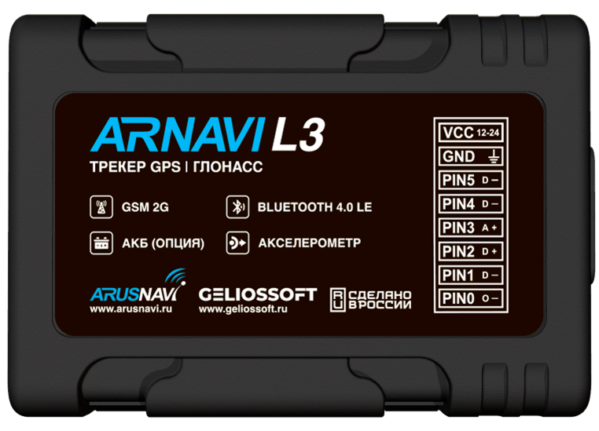

# Arusnavi - Arnavi L3

El Arnavi L3 es un rastreador GPS compacto, compatible con Plaspy, diseñado para un seguimiento en tiempo real y telemetría confiables de vehículos y activos móviles. Con unas medidas de 61 x 42 x 13 mm y 36 g, este pequeño controlador de navegación combina GNSS de múltiples constelaciones, conectividad celular 2G/GPRS, Bluetooth de baja energía para sensores externos y una robusta E/S para ofrecer una solución completa para la gestión de flotas, anti-robo y diagnóstico remoto.

Diseñado para integrarse directamente con Plaspy mediante reporte de doble servidor y protocolos telemáticos estándar, el Arnavi L3 posibilita actualizaciones de ubicación continuas, telemetría de sensores y alertas basadas en eventos. Su perfil de bajo consumo, memoria interna tipo caja negra y compatibilidad con varias familias de sensores BLE lo convierten en una opción práctica cuando se requiere un tamaño compacto, reportes confiables y telemetría flexible \(monitoreo de combustible, sondas de temperatura, estado de encendido y control de inmovilización\).

## Aspectos destacados

- Compatible con Plaspy: el reporte a dos servidores y el soporte de protocolos telemáticos comunes permiten una integración fluida con Plaspy para el seguimiento y reporte en tiempo real.
- GNSS de múltiples constelaciones: GPS, GLONASS, Galileo, BeiDou y QZSS ofrecen soluciones de posición más fiables en entornos diversos.
- Sensores Bluetooth: Bluetooth 4.0 LE admite hasta ocho sensores inalámbricos para monitorización de combustible, telemetría de temperatura y control de relevos.
- Compacto y de bajo consumo: formato ultra compacto \(61 x 42 x 13 mm\) con consumo en reposo cercano a 2 mA y activo alrededor de 40 mA para despliegues eficientes de flotas.
- Redundancia de doble servidor: reportes a dos servidores de monitoreo \(protocolos Arnavi y EGTS admitidos\) para una entrega de datos resistente y una integración flexible con Plaspy más un servidor de respaldo.
- Registro de datos robusto: una caja negra de 32 MB almacena aproximadamente 65,000 registros para conservar el historial durante periodos sin conexión o fallo de energía.
- Amplias opciones de voltaje de entrada: entrada estándar de 8–40 V o una variante L3R100 con soporte de 8–95 V para adaptarse a una amplia gama de sistemas eléctricos vehiculares.
- Configuración y actualizaciones remotas: actualizaciones de firmware basadas en web y configuración remota, además de un configurador para PC vía USB Type-C para una gestión conveniente.

## Cómo funciona con Plaspy

El Arnavi L3 utiliza su canal celular 2G/GPRS y los protocolos telemáticos compatibles para enviar en tiempo real la posición y la telemetría a plataformas de monitoreo. Con reporte de doble servidor, puedes configurar el dispositivo para enviar flujos idénticos a Plaspy y a un servidor secundario \(Arnavi o EGTS\), asegurando una entrega redundante para la gestión de flotas y sistemas de anti-robo críticos.

- Actualizaciones de ubicación y telemetría en tiempo real: las soluciones de posición GNSS se transmiten a Plaspy para mapas en vivo, geocercas y reproducción de rutas.
- Estado de encendido y eventos: entradas discretas registran el encendido y otros eventos digitales para el análisis del comportamiento del conductor y reportes basados en el estado de encendido.
- Monitoreo de combustible: lee sensores de nivel de combustible a través de Bluetooth LE o de la entrada ADC analógica, y transmite esa telemetría a Plaspy.
- Gestión remota del inmovilizador y flujos anti-robo: controla la lógica de inmovilización mediante salidas discretas y relevos en flujos de trabajo coordinados con Plaspy.
- Sensores Bluetooth: conecta sensores BLE \(combustible, temperatura, relés\) e integra esas mediciones en la telemetría y alertas de Plaspy.

## Resumen técnico

| Conectividad | 2G/GPRS \(GSM\) para transmisión de datos; reporte de doble servidor \(Arnavi, EGTS\) y soporte para los protocolos INTERNAL, EXTERNAL y USER\_AG |
| --- | --- |
| Bandas | No especificadas en la descripción |
| Alimentación & Batería | Entrada de alimentación: 8–40 V \(estándar\) o 8–95 V \(variante L3R100\); protección de la alimentación de entrada hasta 60 V; consumo de energía ~2 mA \(reposo\) a ~40 mA \(activo\) |
| Interfaces | Entradas discretas: 3 entradas negativas \(L3\) / 1 entrada negativa \(L3R\); 1 entrada discreta positiva; 1 entrada ADC \(analógica\); 1 salida discreta negativa \(no hay salidas positivas\). Opcional UART y RS-232; RS-485 en la variante L3R. |
| GNSS | GPS, GLONASS, Galileo, BeiDou y QZSS \(multi-constelación\) |
| Bluetooth | Bluetooth 4.0 LE para hasta ocho sensores inalámbricos \(compatibilidad con Arnavi BLE-LLS, ARNAVI BTS v.3, ARNAVI BLE-RELAY, familia ESCORT BLE, Teltonika Eye Sensor, ITALON BLE, Mielta Fantom BLE\) |
| Gestión Remota | El firmware admite configuración remota y actualizaciones basadas en web; configurador de PC disponible vía USB Type-C |
| Forma | Controlador de navegación compacto, 61 x 42 x 13 mm, 36 g. Incluye arnés de cableado de 60 cm. Caja negra interna de 32 MB \(~65,000 registros\) |

## Casos de uso

- Gestión de flotas: seguimiento en tiempo real continuo, historial de rutas y telemetría de comportamiento del conductor integrada en los paneles de Plaspy para la optimización logística.
- Antirrobo e inmovilización: detección de robo y flujos de inmovilización remotos mediante salidas discretas y inmovilizadores controlados por relé, coordinados a través de alertas de Plaspy.
- Monitoreo de combustible y telemetría: sondas de combustible BLE o sensores analógicos reportan los niveles de combustible a Plaspy para análisis de consumo y detección de pérdidas.
- Cargas sensibles a la temperatura: sensores Bluetooth de temperatura envían telemetría vía BLE al dispositivo y a Plaspy para monitoreo de la cadena de frío y alertas.
- Diagnóstico remoto y gestión OTA: configuración remota y actualizaciones web reducen el tiempo de inactividad del conductor y simplifican el mantenimiento del firmware en una flota mixta.

## Por qué elegir el Arnavi L3 con Plaspy

El Arnavi L3 es un rastreador GPS práctico, compatible con Plaspy, cuando se necesita hardware compacto que no comprometa la telemetría y la flexibilidad de integración. El reporte de doble servidor y el amplio soporte de protocolos facilitan la configuración con Plaspy, mientras que se añade un servidor secundario para redundancia. El GNSS de múltiples constelaciones, el soporte de sensores BLE y el perfil de bajo consumo hacen que el L3 sea adecuado para la gestión de flotas, el monitoreo de combustible y las aplicaciones anti-robo, donde el seguimiento en tiempo real fiable, la telemetría y el control remoto del inmovilizador son esenciales. Con registro de datos incorporado, configuración remota y actualizaciones web, el Arnavi L3 reduce la complejidad de los servicios de campo mientras mejora la disponibilidad y la visibilidad para las operaciones telemáticas.

