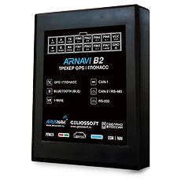

# Arusnavi - Integral 4

Integral 4 es un rastreador GPS compacto y controlador de navegación universal de Arusnavi, diseñado para la gestión profesional de flotas, telemetría y monitoreo de vehículos. Combina posicionamiento GNSS multiconstelación con antenas internas para celular y navegación, además de recolección de datos a bordo, para ofrecer ubicación en tiempo real y datos de diagnóstico precisos adecuados para la supervisión de vehículos y activos.

Como dispositivo compatible con Plaspy, Integral 4 puede enviar datos de posición, sensores y eventos a Plaspy para supervisión centralizada, alertas e informes. Su combinación de conectividad celular, Bluetooth interno y un conjunto amplio de interfaces cableadas lo hace ideal para despliegues de flota y telemetría que requieren ingestión fluida en los paneles y flujos de trabajo de Plaspy.

## Características principales

- Rastreador compatible con Plaspy con soporte multi GNSS para posicionamiento en tiempo real y registro de rutas confiable.
- Módem celular con doble SIM y 2G y antenas internas para mantener conectividad continua en entornos móviles.
- Amplia variedad de interfaces, incluyendo USB, 1 WIRE, RS 485 y opciones configurables de bus vehicular, además de UART RS 232 opcional para integrar telemetría.
- Bluetooth Low Energy interno con capacidad para emparejar hasta 10 sensores externos para temperatura, proximidad y telemetría auxiliar.
- Registro tipo caja negra interno capaz de almacenar grandes conjuntos de datos para continuidad offline y posterior subida a Plaspy.
- Entradas y salidas discretas configurables y una entrada analógica ADC para supervisar encendido, puertas y señales por eventos.
- Factor de forma compacto, adecuado para instalaciones en espacios reducidos de vehículos y activos móviles.

## Cómo funciona con Plaspy

Integral 4 transmite posiciones GNSS, telemetría desde buses vehiculares y lecturas de sensores a Plaspy a través de su conexión celular, de modo que usted puede ver ubicaciones en vivo, eventos e historial en la plataforma Plaspy. La configuración de servidor y los formatos de datos compatibles permiten que registros de ubicación, diagnóstico y eventos aparezcan como seguimiento en tiempo real, alertas e informes históricos.

- Actualizaciones de ubicación y telemetría en tiempo real derivadas de GNSS multiconstelación y fuentes de telemetría a bordo.
- Monitoreo de eventos para encendido, puertas y estado de alarmas mediante entradas discretas y detección de movimiento para eventos de desplazamiento.
- Telemetría de combustible y sensores por RS 485 o integración con el bus vehicular cuando esté disponible, para soportar flujos de trabajo de detección de consumo y pérdidas.
- Acciones remotas y de inmovilizador implementables mediante salidas configurables y flujos de control desde Plaspy.
- Soporte para sensores Bluetooth y balizas para telemetría auxiliar como control de temperatura, conteo de pasajeros o detección de proximidad.
- Registro offline tipo caja negra que guarda registros localmente y los reenvía a Plaspy cuando se restablece la conectividad para preservar el historial.

## Casos de uso típicos

- Gestión de flotas con seguimiento en vivo, historial de rutas y diagnóstico vehicular para planificación operativa y de mantenimiento.
- Monitoreo de combustible e integración de telemetría para detectar anomalías y apoyar análisis de consumo.
- Control de transporte de pasajeros combinando sensores de ocupación, RFID y dispositivos BLE para cumplimiento de rutas y supervisión operativa.
- Antirrobo y monitoreo de seguridad mediante eventos de puertas y encendido, detección de movimiento y salidas de control remoto.
- Telemetría de activos y equipos para remolques, contenedores y maquinaria móvil que requieren dispositivos compactos y registro robusto.

## Por qué elegir este rastreador con Plaspy

Integral 4 es una opción práctica para organizaciones que usan Plaspy y necesitan un dispositivo compacto que equilibre posicionamiento preciso, múltiples interfaces de telemetría y registro de nivel empresarial. Su posicionamiento multi GNSS, conectividad celular con doble SIM y Bluetooth interno simplifican la integración de sensores y la instalación en espacios reducidos, mientras que las opciones de bus y serie configurables permiten capturar diagnósticos vehiculares y datos de combustible para análisis centralizados en Plaspy.

Para despliegues que requieren continuidad offline fiable y una amplia gama de entradas y salidas, Integral 4 ofrece captura de datos y capacidades de gestión remota sencillas que se integran en los flujos de monitoreo, alertas e informes impulsados por Plaspy. Su conjunto de funciones cubre necesidades comunes de rastreo de flotas y activos sin exigir adaptaciones complejas en la plataforma.

Learn more about Plaspy and how compatible devices are used in fleet and asset management on the Plaspy website https://www.plaspy.com. Product specifications, availability and manufacturer documentation can change over time so verify current details on the official Arusnavi site https://www.arusnavi.ru.
