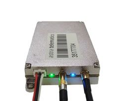

# Astra Telematics - AT110

El rastreador GPS Astra Telematics AT110 ha sido diseñado utilizando la última tecnología, incluyendo un procesador Cortex M3, SiRFStar IV GPS, Bluetooth Low Energy y CAN Bus, junto con una gestión inteligente de energía y batería. Con sus dimensiones compactas y antenas externas, el Astra Telematics AT110 es fácil de instalar y pasa desapercibido en apariencia.

Este rastreador GPS es ideal para aplicaciones de seguimiento y recuperación de vehículos, gestión de flotas y sistemas de navegación inteligentes. Cuenta con una banda GSM cuatribanda completa y no tiene capacidad de voz. Además, tiene una batería de respaldo, memoria interna y se comunica a través de GPRS, TCP y UDP.

El Astra Telematics AT110 ofrece opciones de posicionamiento basadas en tiempo y distancia, y cuenta con funciones de ahorro de energía. También tiene más de 4 entradas digitales y eventos internos basados en ellos. Las antenas incluidas son GPS y GSM, y la carcasa está hecha de aluminio. Además, este rastreador GPS tiene conexiones adicionales para fijar antenas, identificación del conductor y un puerto serie. También es compatible con CAN Bus FMS y está fabricado en Europa.

Con todas estas características y su diseño compacto, el Astra Telematics AT110 es una excelente opción para aquellos que buscan un rastreador GPS confiable y de alta calidad.

