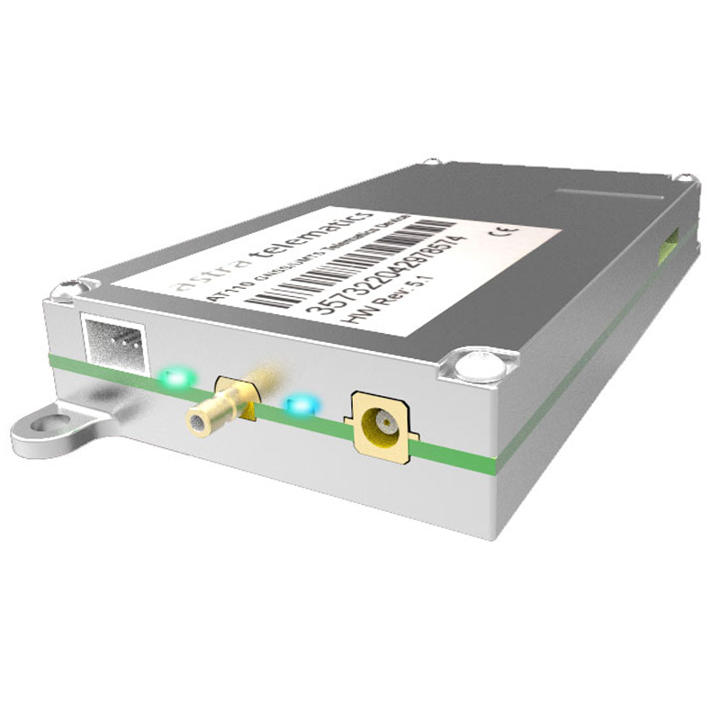

# Astra Telematics - AT111

El Astra Telematics AT111 es un rastreador GPS compacto pensado para instalaciones telemáticas profesionales que requieren colocar antenas externas. Basado en la plataforma probada AT241, el AT111 ofrece conectividad celular multinetwork y posicionamiento GNSS multiconstelación en una resistente carcasa de aleación de aluminio. Su conjunto de funciones y su factor de forma lo hacen adecuado para seguimiento en tiempo real, telemetría y protección de activos en vehículos y maquinaria pesada.

Como dispositivo compatible con Plaspy, el AT111 se integra en los flujos de trabajo de gestión de flotas y monitoreo de activos para aportar datos de ubicación, telemetría y eventos a los paneles e informes de Plaspy. Las opciones de antena GNSS y GSM externas, el acceso sencillo a la SIM y una batería de respaldo hacen que la unidad sea práctica en instalaciones donde la ubicación de la antena o el montaje oculto son importantes, mientras que las actualizaciones continuas del sistema y la garantía de varios años ayudan a mantener las integraciones actualizadas.

## Aspectos destacados

- Rastreador GPS compatible con Plaspy para integración de ubicación en vivo, telemetría y alertas.
- Conectividad celular multinetwork con LTE M y soporte 2G para amplia cobertura.
- Posicionamiento GNSS multiconstelación con opciones de antena externa para mejor recepción.
- Amplias entradas y salidas y conexiones vehiculares, incluyendo CANBus, RS232 y 1 Wire para captura de telemetría.
- Batería de respaldo integrada para mantener reportes durante la pérdida de alimentación primaria.
- Carcasa compacta y resistente de aleación de aluminio, adecuada para instalaciones telemáticas profesionales.
- Garantía del fabricante y actualizaciones del sistema para respaldar despliegues a largo plazo.

## Cómo funciona con Plaspy

El AT111 transmite posiciones, sensores y telemetría del vehículo a través de redes celulares hacia Plaspy, donde esos datos se incorporan a mapas, registros históricos, alertas e informes. Plaspy usa las corrientes de telemetría y eventos del dispositivo para proporcionar conciencia situacional, supervisión operativa y notificaciones configurables para equipos de flotas y gestión de activos. Las conexiones para antenas externas permiten a los integradores ubicar las antenas en los puntos de mejor recepción mientras colocan el rastreador en lugares discretos o protegidos.

- Actualizaciones en tiempo real de ubicación y telemetría transmitidas a Plaspy para mapeo e historial de rutas.
- Reporte de eventos y estados como encendido, puertas y señales de alarma capturadas mediante entradas digitales y CANBus.
- Telemetría del vehículo y datos relacionados con combustible integrados en los informes de Plaspy a partir de CANBus y entradas analógicas.
- Flujos de trabajo de control remoto, como comandos de inmovilizador, ejecutados mediante salidas digitales y los canales de comando de Plaspy.
- Soporte para combinar datos de sensores externos o gateways para que flujos BLE u otros sensores se correlacionen con la ubicación y telemetría del AT111 en Plaspy.

## Casos de uso típicos

- Gestión de flotas y monitoreo de rutas para operaciones de logística, servicio y transporte.
- Antirrobo e inmovilización remota para vehículos y activos de alto valor.
- Rastreo de maquinaria y equipos en planta cuando se requiere colocar antenas externas para visibilidad GNSS.
- Monitoreo de combustible y telemetría del motor para mantenimiento y control de costos.
- Evaluaciones rápidas y despliegues piloto usando cableado y opciones de antena incluidos en kits.

## Por qué elegir este rastreador con Plaspy

El AT111 es una opción práctica cuando necesita un rastreador compacto y compatible con Plaspy que ofrezca capacidades telemáticas profesionales. La flexibilidad para antenas externas resuelve desafíos comunes de instalación y ayuda a garantizar recepción GNSS constante incluso desde ubicaciones de montaje ocultas. La combinación de múltiples interfaces vehiculares, batería de respaldo y construcción robusta lo hace idóneo para flotas y monitoreo de activos donde la telemetría confiable y el reporte ininterrumpido son críticos.

Elegir el AT111 con Plaspy ofrece a las organizaciones una ruta de integración clara desde la telemetría del dispositivo hasta paneles, alertas e informes operativos. Para más detalles sobre Plaspy y cómo funciona con dispositivos como el AT111, aprenda más sobre Plaspy en el sitio principal https://www.plaspy.com. Las especificaciones del producto, la disponibilidad y el soporte del fabricante pueden cambiar con el tiempo, así que por favor verifique los detalles técnicos actuales y la información de garantía con el fabricante en https://astratelematics.com/.
