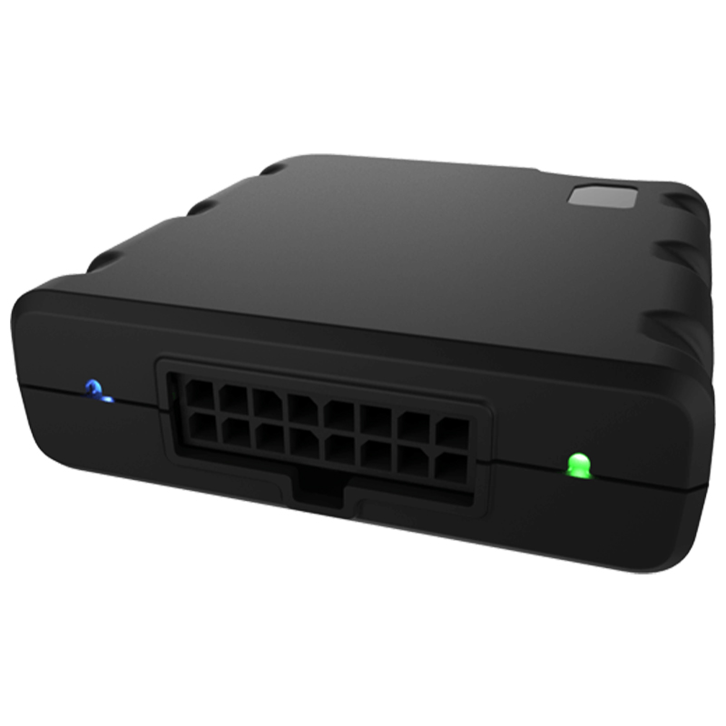

# Astra Telematics - AT202

El AT202 es un rastreador GPS compacto y de alto rendimiento diseñado para aplicaciones modernas de IoT y gestión de flotas. Combina soporte GNSS multiconstelación con comunicaciones celulares multi red para ofrecer posicionamiento confiable y amplia cobertura en seguimiento en tiempo real. El equipo está construido con tolerancia eléctrica robusta adecuada para sistemas vehiculares de hasta 65V e incluye una batería de respaldo interna de capacidad moderada, antenas internas y un acelerómetro integrado para mantener los reportes en condiciones de baja energía o desconexión.

Como dispositivo compatible con Plaspy, el AT202 puede transmitir ubicación y telemetría del vehículo a Plaspy para una monitorización y generación de reportes unificados de la flota. Su completo conjunto de entradas y salidas y sus interfaces telemétricas permiten a integradores y responsables de flota enviar canales CANBus, eventos digitales, valores ADC y mensajes serie a Plaspy, donde los datos se parsean, generan alertas y se almacenan para análisis histórico y supervisión operativa.

## Características principales

- Soporte GNSS multiconstelación para posicionamiento fiable en distintas regiones.
- Conectividad celular multi red, incluyendo opciones heredadas y LPWA, para cobertura amplia.
- Suite de E/S completa que incluye CANBus, entradas y salidas digitales, ADC, RS232 y 1 Wire para telemetría e identificación de conductor.
- Batería interna de respaldo de 900 mAh y acelerómetro integrado para soportar reportes en bajo consumo y detección de movimiento.
- Tolerancia eléctrica hasta 65V, lo que hace al equipo adecuado para una variedad de autos, camiones y muchas plataformas de vehículos eléctricos.
- Disponible en múltiples variantes de kit con documentación y accesorios para facilitar el despliegue.

## Cómo funciona con Plaspy

El AT202 envía soluciones GNSS y telemetría vehicular a través de enlaces celulares hacia Plaspy, donde esos datos se procesan para seguimiento en vivo, detección de eventos y reportes históricos. Plaspy recibe las entradas crudas del dispositivo y las convierte en información operativa útil, alertas y reportes estándar que usted puede usar para monitoreo y toma de decisiones.

- Actualizaciones de ubicación en tiempo real y datos de movimiento visibles en el panel de Plaspy.
- Parseo de canales CANBus para telemetría del vehículo como odómetro y métricas relacionadas con el motor, cuando estén disponibles.
- Eventos por entradas digitales para puerta, ignición y otras señales binarias utilizadas en alertas y flujos de trabajo.
- Lecturas ADC para sensores analógicos, incluido nivel de combustible cuando un sensor está conectado y configurado.
- Soporte RS232 y 1 Wire para sensores externos e integración de identificación de conductor, para atribuir eventos al personal correspondiente.
- Eventos basados en acelerómetro para detección de movimiento e impacto, útiles en alertas por manipulación y anti robo, además de reportes de estado de batería de respaldo y conectividad.

## Casos de uso típicos

- Gestión de flotas con ubicación continua de vehículos, reproducción de rutas y supervisión de despachos.
- Flujos de trabajo de anti robo y recuperación usando alertas de acelerómetro, reglas de eventos y controles remotos de salida.
- Telemetría vehicular y monitoreo de combustible mediante canales CANBus e inputs ADC para planificación de mantenimiento.
- Identificación de conductor y control de acceso usando dispositivos de ID conectados por 1 Wire o serie.
- Monitoreo de activos en flotas mixtas donde se requiere un factor de forma compacto y mayor tolerancia a voltajes.

## Por qué elegir este tracker con Plaspy

El AT202 es una opción práctica para organizaciones que necesitan un rastreador compacto compatible con Plaspy y con amplias capacidades telemétricas. Su combinación de GNSS multiconstelación, comunicaciones celulares multi red y un conjunto completo de interfaces permite a los integradores capturar y transmitir una amplia variedad de señales vehiculares a Plaspy sin necesidad de hardware adicional extenso. Las características de resiliencia integradas, como la batería interna de respaldo y el acelerómetro, ayudan a mantener la visibilidad en escenarios de baja energía o desconexión, y la tolerancia eléctrica del equipo facilita despliegues en vehículos convencionales y en muchos eléctricos.

La documentación, los kits de accesorios y las opciones de personalización disponibles están diseñados para reducir el tiempo de integración y ayudar a los equipos a configurar los reportes según sus necesidades operativas. Para conocer más sobre Plaspy y cómo dispositivos como el AT202 pueden integrarse en su programa de flota visite https://www.plaspy.com. Las especificaciones y la disponibilidad de producto pueden cambiar con el tiempo, por lo que le recomendamos verificar los detalles técnicos vigentes y las opciones de variantes en el sitio del fabricante https://astratelematics.com/.
