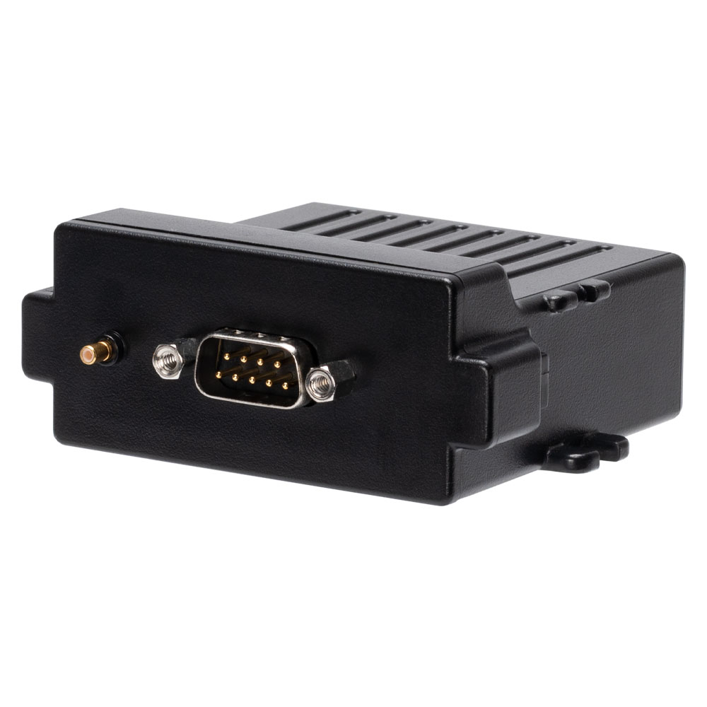

# Astra Telematics - AT211

El Astra AT211 es un rastreador GPS robusto diseñado específicamente para maquinaria pesada, equipo de obra y otros activos expuestos al exterior. Basado en la plataforma AT200 de Astra Telematics, el AT211 combina una carcasa compacta y resistente a la intemperie con conectividad multinetwork y opciones de entradas/salidas prácticas para ofrecer informes de ubicación y estado fiables en entornos exigentes.

Como dispositivo totalmente compatible con Plaspy, el AT211 se puede integrar en flotas y flujos de trabajo de monitoreo de activos en Plaspy para ofrecer visibilidad en tiempo real y alertas basadas en eventos. Su combinación de construcción duradera, conectividad amplia y funciones móviles opcionales lo convierten en una opción relevante para organizaciones que usan Plaspy para centralizar seguimiento, seguridad y reportes operativos de maquinaria y vehículos.

## Características principales

- Carcasa con certificación IP67 para resistencia al polvo, agua y vibración en entornos industriales y al aire libre.
- Conectividad multinetwork que incluye GSM GPRS y LTE Cat M1 y NB-IoT para amplia cobertura y operación de bajo consumo.
- Diseño compacto con antenas internas y opción de antena GNSS externa para mejorar la recepción en máquinas con carrocería metálica.
- Acelerómetro MEMS integrado e indicadores LED para detección de movimiento y diagnóstico durante la instalación.
- Juego de E/S práctico que incluye entradas y salidas digitales, interfaz RS232 DB9 y puerto 1-Wire para sensores periféricos.
- Batería interna de respaldo de 510 mAh para mantener los reportes durante pérdida de alimentación o manipulación, y amplio rango de tensión de funcionamiento para adaptarse a distintos equipos.
- Soporte opcional de Bluetooth Low Energy para funciones de inmovilizador e identificación de conductor mediante las herramientas móviles de Astra.

## Cómo funciona con Plaspy

Cuando se conecta a Plaspy, el AT211 transmite datos de ubicación y estado a la plataforma para que usted, como gestor de flota o propietario de equipos, pueda monitorear activos, configurar alertas y generar informes desde una sola interfaz. Plaspy recibe los flujos del dispositivo y presenta eventos de movimiento, el estado de las entradas y actualizaciones posicionales para supervisión operativa y procesos de seguridad.

- Las actualizaciones de ubicación y la telemetría en tiempo real aparecen en Plaspy para seguimiento en vivo y reproducción histórica.
- Eventos de movimiento e impactos derivados del acelerómetro interno pueden activar notificaciones y acciones de respuesta ante robo.
- El estado de entradas y salidas digitales está disponible en Plaspy para monitorear ignición, puertas, circuitos de alarma o para ejecutar acciones remotas simples.
- Funcionalidades con BLE, como control de inmovilizador e identificación de conductor, pueden integrarse en los flujos de Plaspy cuando se usan junto con las herramientas móviles de Astra.
- Los datos de telemetría y uso pueden alimentar los informes de Plaspy para análisis de utilización, planificación de mantenimiento y auditoría de seguridad.

## Casos de uso típicos

- Asegurar maquinaria y equipo de obra en sitios remotos mediante alertas de movimiento y flujos gestionados de inmovilizador.
- Detectar remolques, caravanas y equipos movidos sin autorización con notificación inmediata en Plaspy.
- Gestión de flotas y equipos en construcción y agricultura donde se requiere un rastreo resistente y telemetría básica.
- Seguimiento resistente a la intemperie para motos y caravanas donde se necesita hardware compacto y duradero.
- Monitoreo de activos en entornos exigentes donde una antena GNSS externa y soporte para redes de área amplia de bajo consumo mejoran la fiabilidad.

## Por qué elegir este rastreador con Plaspy

El AT211 es una opción práctica para organizaciones que necesitan un rastreador robusto y fácil de desplegar que se integre con Plaspy. Su carcasa IP67, amplia tolerancia de voltaje y batería de respaldo reducen tiempos de inactividad y limitaciones durante la instalación en flotas mixtas y equipos. La conectividad multinetwork y el BLE opcional amplían la flexibilidad de despliegue manteniendo el equipo compacto.

Al ser totalmente compatible con Plaspy, el AT211 puede añadirse a las pilas de monitoreo de Plaspy para ofrecer visibilidad de ubicación, alertas basadas en eventos y reportes por activo sin desarrollos personalizados complejos. Para más información sobre cómo Plaspy soporta dispositivos como el AT211 visite https://www.plaspy.com. Las especificaciones del producto y la disponibilidad pueden cambiar con el tiempo, por lo que le recomendamos verificar los detalles actuales y la documentación oficial en el sitio del fabricante https://astratelematics.com/.
