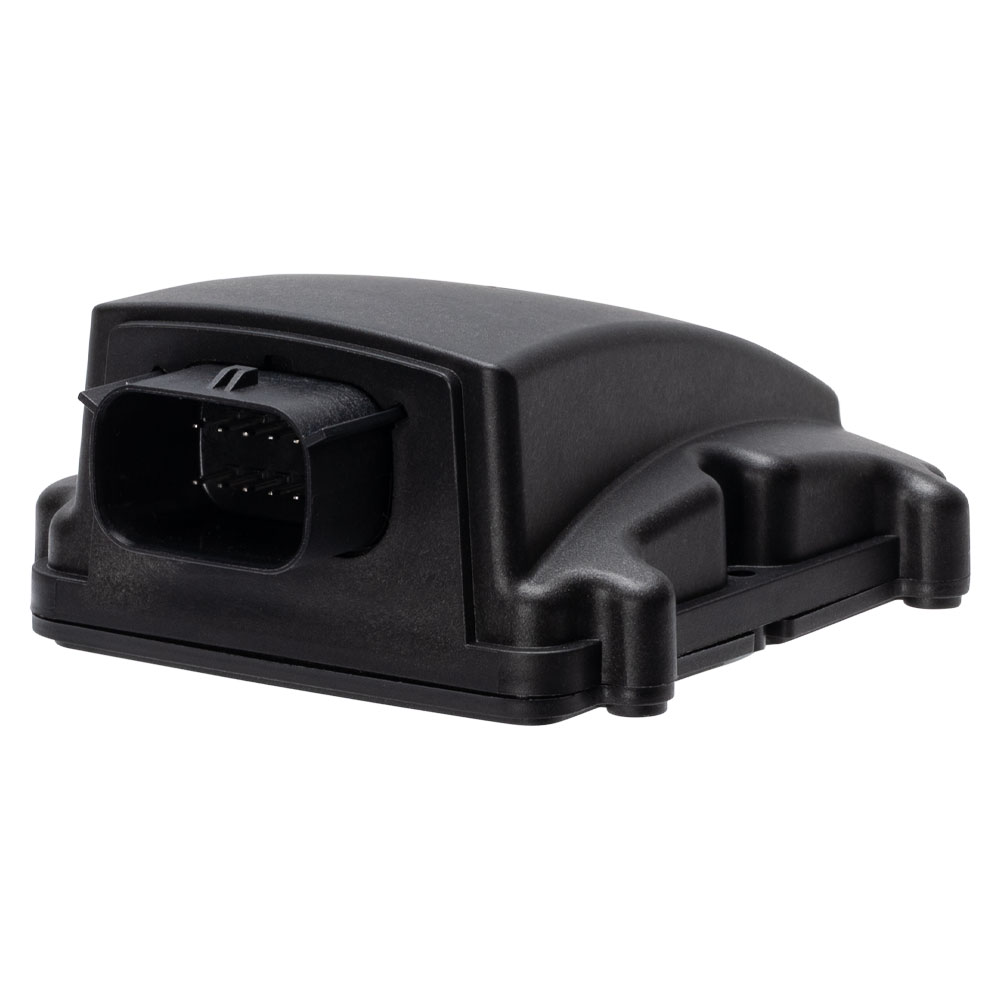

# Astra Telematics - AT402

El Astra Telematics AT402 es un rastreador GPS compatible con Plaspy, diseñado para moto‑sharing y despliegues de vehículos conectados. Basándose en la probada serie AT400, el AT402 combina conectividad celular LTE‑M con respaldo GSM/GPRS 2G para ofrecer seguimiento en tiempo real y telemetría de vehículos fiables para la gestión de flotas, protección antirrobo y servicios de movilidad compartida. Compacto, preparado para uso automotriz y con clasificación IP65, la unidad está diseñada para facilitar la instalación con antenas GNSS y GSM internas y un conector de cableado automotriz para montaje en producción o de posventa.

El AT402 admite un amplio conjunto de interfaces — CANBus para datos del vehículo, BLE para interacciones con dispositivos locales, RS232 y 1‑Wire para periféricos, además de E/S digitales y soporte de driver ID — lo que permite a Plaspy recibir telemetría rica, eventos de encendido y de conductor. Con una batería de respaldo de 510 mAh, un rango de tensión de operación \(6–65 V\) y la garantía de cinco años de Astra, además de actualizaciones del sistema de por vida, el AT402 equilibra costo, durabilidad y flexibilidad de integración para seguimiento en tiempo real y analítica de flotas basada en Plaspy.

## Aspectos clave

- Dispositivo compatible con Plaspy con conectividad LTE‑M principal y respaldo GSM/GPRS 2G para seguimiento en tiempo real continuo.
- Diseño automotriz robusto IP65 con antenas GNSS y GSM internas para instalación simplificada y una fijación de ubicación fiable.
- Soporte CANBus y RS232 para telemetría del vehículo, permitiendo monitoreo de combustible y gestión avanzada de flotas cuando se usa con Plaspy.
- Bluetooth Low Energy \(BLE\) para emparejar con sensores, interacciones de proximidad y gestión de dispositivos de corto alcance.
- Batería interna de respaldo de 510 mAh que ofrece aproximadamente seis días en modo de bajo consumo con informes cada 24 horas para resiliencia antirrobo.
- E/S del vehículo, incluyendo 2 entradas digitales, 2 salidas digitales y soporte de driver ID para capturar el estado de encendido e habilitar funciones de inmovilizador o control remoto.
- Con garantía de cinco años de Astra, actualizaciones del sistema de por vida y personalización gratuita de hardware/informes para apoyar la escalabilidad en Plaspy.

## Cómo funciona con Plaspy

El AT402 transmite la posición GNSS y telemetría a través de LTE‑M \(con respaldo 2G\) a la nube de Plaspy, donde los datos se procesan para seguimiento en tiempo real, alertas e informes. Plaspy puede consumir parámetros de CANBus del vehículo, eventos de entradas digitales y datos de sensores BLE enviados por el dispositivo para ofrecer un panel unificado de gestión de flotas y flujos de trabajo de anti‑robo. Las opciones de integración y los kits de evaluación de Astra facilitan el registro de unidades AT402 en Plaspy para monitoreo, geocercas y análisis operativos.

- Actualización de ubicación en tiempo real y telemetría multi‑GNSS \(GPS, Galileo, GLONASS, BeiDou\).
- Monitoreo de encendido y entradas digitales para eventos de inicio/parada y disparadores de alarmas.
- Telemetría del vehículo a través de CANBus — admite consumo de combustible, velocidad y otros parámetros del bus del vehículo cuando son expuestos por el propio vehículo.
- Inmovilizador remoto y capacidad de control mediante salidas digitales configurables \(la implementación depende del cableado del vehículo y de las reglas de Plaspy\).
- Bluetooth Low Energy \(BLE\) para emparejar con sensores o balizas para telemetría local y comprobaciones de proximidad.

## Visión general técnica

| Conectividad | LTE‑M con respaldo a GSM/GPRS \(2G\) |
| --- | --- |
| Bandas | Bandas LTE‑M y GSM especificadas por el fabricante \(consulte la hoja de datos de Astra para la lista de bandas\) |
| Potencia y batería | Tensión de funcionamiento 6.0 V a 65.0 V; batería interna de respaldo de 510 mAh \(~6 días en modo de bajo consumo con informes cada 24 horas\) |
| Interfaces | 2 entradas digitales, 2 salidas digitales, 1 puerto RS232, CANBus, 1‑Wire \(Dallas\), soporte de driver ID; sin salida AUX de 3.3V |
| GNSS | Soporte de GPS, Galileo, GLONASS y BeiDou con antena GNSS interna de 15 mm |
| Bluetooth | Bluetooth Low Energy \(BLE\) para sensores e interacciones con dispositivos locales |
| Gestión remota | Actualizaciones de sistema de por vida; Astra ofrece personalización de hardware e informes y kits de evaluación |
| Factor de forma | Unidad robusta IP65, compacta, preparada para uso automotriz con ranura Micro SIM, indicadores LED internos y conector automotriz |

## Casos de uso

- Gestión de flotas para vehículos comerciales ligeros y flotas de movilidad compartida que requieren seguimiento en tiempo real fiable y telemetría CANBus.
- Despliegues de moto‑sharing y flotas de scooters/bicicletas que requieren dispositivos compactos IP65 con instalación simplificada y BLE para interacciones con el usuario.
- Monitoreo anti‑robo e inmovilización remota mediante entradas de encendido y salidas digitales configurables gestionadas a través de las reglas de Plaspy.
- Monitoreo de combustible y analítica de salud del vehículo capturando parámetros CANBus y reenviándolos a Plaspy para informes y alertas.
- Instalaciones de posventa y despliegues de producción en volumen usando los arneses plug‑and‑play de Astra, cables de alimentación/encendido y kits de evaluación.

## Por qué elegir este rastreador con Plaspy

El AT402 ofrece un equilibrio práctico entre durabilidad, conectividad e integración con vehículos para implementaciones con Plaspy. Su ruta celular LTE‑M con respaldo 2G garantiza un seguimiento en tiempo real de bajo consumo y preparado para el futuro, mientras soporta telemetría esencial de flotas a través de CANBus y RS232. La capacidad BLE del dispositivo extiende los flujos de trabajo de Plaspy hacia sensores locales e interacciones con usuarios, y la batería interna de respaldo junto con su amplio rango de voltaje añaden resiliencia para casos de uso anti‑robo y movilidad compartida. La garantía de cinco años de Astra, las actualizaciones del sistema de por vida y la personalización gratuita reducen la fricción de integración y el costo total de propiedad al escalar la telemática habilitada para Plaspy en las flotas.

