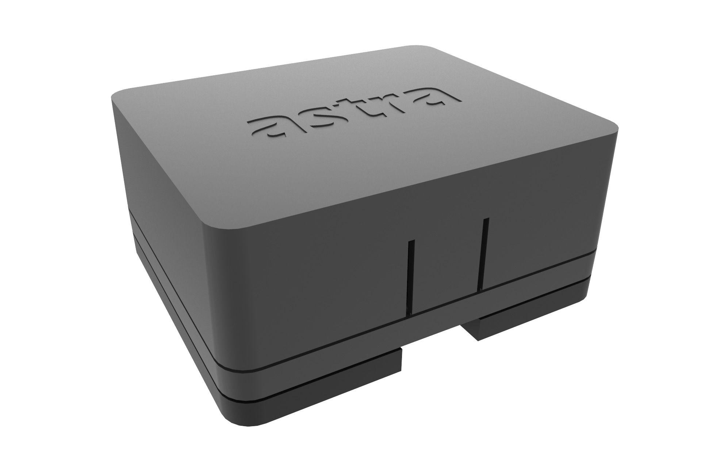

# Astra Telematics - AT500

El AT500 Mini Asset Tracker de Astra Telematics es un rastreador GPS recargable y compacto diseñado para el seguimiento discreto y de larga duración de activos pequeños y de difícil acceso. Integra posicionamiento GNSS multiconstelación, conectividad celular multinetwork con opciones modernas de baja potencia de área amplia y carga inalámbrica Qi en una carcasa compacta con clasificación IP68. La gestión de energía con detección de movimiento y componentes internos como una eSIM y antenas internas hacen que la unidad sea adecuada para despliegues densos y para mantenimiento de baja intervención.

Como dispositivo compatible con Plaspy, el AT500 se integra en los flujos de trabajo de gestión de flotas y activos de Plaspy para ofrecer visibilidad continua de la ubicación, el movimiento y el estado del dispositivo. Sus funciones de configuración por BLE y la provisión simplificada facilitan implementaciones a escala, mientras que la telemetría del dispositivo se refleja de forma natural en los paneles, reglas de alertas e informes de Plaspy para la supervisión operativa de flotas de activos de alta densidad.

## Aspectos clave

- Factor de forma compacto ideal para colocación discreta en activos y equipos pequeños en despliegues densos.
- Diseño recargable con carga inalámbrica Qi y perfiles de batería de larga duración adecuados para reportes de baja frecuencia.
- Conectividad celular multinetwork que incluye opciones de baja potencia de área amplia y compatibilidad con redes legacy para mayor cobertura.
- GNSS multiconstelación para fijaciones de posición confiables en entornos variados.
- Bluetooth Low Energy para configuración, puesta en marcha y diagnóstico in situ mediante smartphone.
- Gestión de energía basada en movimiento que usa un acelerómetro para reducir reportes cuando los activos están estacionarios.
- Carcasa con clasificación IP68 y batería interna de respaldo para uso exterior e industrial duradero.

## Cómo funciona con Plaspy

Cuando usted lo utiliza con Plaspy, el AT500 envía datos de ubicación, eventos de movimiento y salud del dispositivo al entorno de monitoreo y reportes de Plaspy, de modo que los equipos pueden rastrear activos, configurar alertas y analizar la utilización. Plaspy consume la telemetría del dispositivo para ofrecer visibilidad en tiempo real y reportes históricos a través de flotas y tipos de activos mixtos.

- Actualizaciones de ubicación en tiempo real e indicadores de salud del dispositivo visibles en los paneles de Plaspy
- Comportamiento de activación y reporte basado en movimiento que permite alertas por desplazamiento y notificaciones anti robo
- Configuración y diagnóstico en campo vía BLE para acelerar la provisión y solución de problemas
- Reportes celulares de baja potencia de área amplia que mantienen conectividad persistente para el monitoreo de la flota
- Provisión y integración pensadas para Plaspy, facilitando la inclusión en flujos de trabajo de seguimiento y reporte más amplios

## Casos de uso típicos

- Rastreo de activos pequeños sin fuente de alimentación como herramientas, maletines y equipos compartidos donde el tamaño compacto es crítico
- Programas de préstamo y alquiler de equipo que requieren rastreadores discretos para control de uso y prevención de pérdidas
- Protección de herramientas portátiles y flujos anti robo con alertas por movimiento e historial para recuperación
- Flotas de activos de alta densidad en almacenes o instalaciones donde la puesta en marcha simple y las antenas internas reducen el mantenimiento
- Despliegues remotos o en entornos exigentes que requieren protección contra ingreso y carga inalámbrica para mantener un mantenimiento mínimo

## Por qué elegir este rastreador con Plaspy

El AT500 es una opción práctica para organizaciones que necesitan seguimiento compatible con Plaspy para activos pequeños sin entradas y salidas a nivel vehicular. Su enfoque en la compacidad, la operación recargable y la conectividad multinetwork ayuda a reducir la carga de mantenimiento mientras mantiene disponibles los datos de ubicación y movimiento en Plaspy. La puesta en marcha por BLE y la eSIM interna facilitan la provisión, lo cual es especialmente útil en despliegues a gran escala o de alta densidad.

Para equipos que usan Plaspy para gestionar flotas mixtas, el AT500 aporta visibilidad consistente a nivel de activo junto a rastreadores vehiculares y otros sensores soportados por la plataforma. Si usted necesita un rastreador discreto y recargable para extender la cobertura de Plaspy a equipos pequeños y activos compartidos, el AT500 representa un equilibrio entre tamaño, autonomía y simplicidad operativa.

Para obtener más información sobre Plaspy y cómo dispositivos compatibles como el AT500 se integran en la plataforma visite https://www.plaspy.com. Las especificaciones del producto y los detalles del fabricante pueden cambiar con el tiempo, por lo que le recomendamos verificar la información técnica y la disponibilidad actuales en el sitio de Astra Telematics https://astratelematics.com/.
