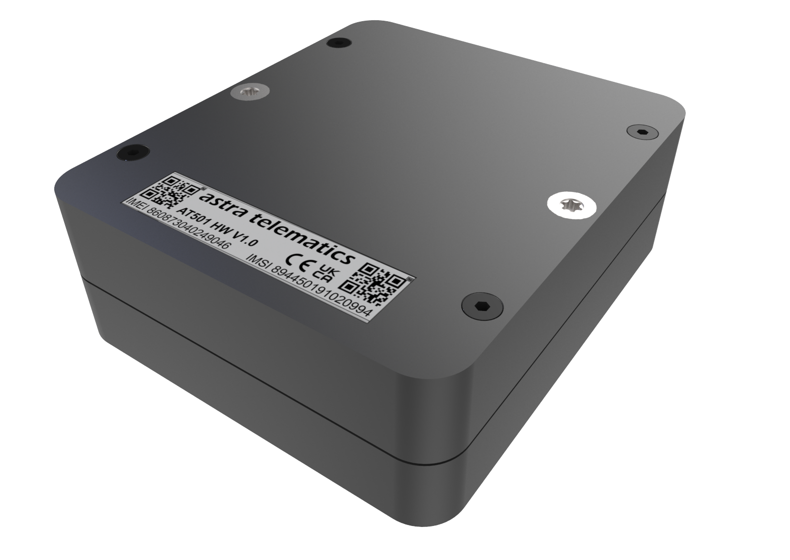

# Astra Telematics - AT501

El AT501 Mini Asset Tracker es un rastreador GPS compacto y alimentado por batería, diseñado para el monitoreo a largo plazo de activos pequeños y sin suministro de energía. Compatible con Plaspy de serie, el AT501 combina conectividad celular multired \(e-SIM con LTE‑M, NB‑IoT y conmutación a 2G como respaldo\), GNSS de múltiples constelaciones y operación de ultra bajo consumo para ofrecer una solución de seguimiento de activos confiable para flotas de herramientas, remolques, contenedores y otros equipos remotos.

Diseñado para una instalación sencilla y uso resistente en campo, el AT501 ofrece protección contra las inclemencias del tiempo IP68, un soporte magnético con la opción de montaje con tornillo M4, y un paquete de batería LTC reemplazable que puede lograr hasta ocho años de vida operativa en modos de reporte de bajo consumo. Su compatibilidad BLE y su acelerómetro permiten configuración local y telemetría basada en eventos que se integra sin problemas con Plaspy para la gestión de flotas, alertas anti-robos y reportes telemétricos a largo plazo.

## Aspectos Clave

- Autonomía extendida — Paquete de batería LTC reemplazable de 13,000 mAh \(5 x ER14505\) con hasta 8 años en modo de bajo consumo a intervalos de reporte de 24 horas.
- Compatible con Plaspy — integra la posición y telemetría en Plaspy para la gestión de flotas, informes y alertas.
- Diseño robusto preparado para el campo — carcasa IP68, antenas GSM/GNSS internas, montaje magnético y opción de tornillo M4 para instalaciones seguras.
- Conectividad a prueba de futuro — e-SIM con soporte multired: LTE‑M y NB‑IoT, plus retomo GSM/GPRS \(2G\) para una amplia cobertura celular.
- GNSS de múltiples constelaciones — GPS, Galileo, GLONASS y BeiDou con antena GNSS interna de 15 mm para una localización fiable.
- Telemetría basada en eventos — acelerómetro MEMS integrado activa informes de movimiento para maximizar la vida de la batería y mejorar la precisión de la ubicación entre estados de movimiento y reposo.
- Bluetooth Low Energy — configuración local, diagnósticos y puesta en marcha con un teléfono inteligente mediante BLE.
- Batería de repuesto y personalización — disponible un pack BT501 de repuesto; personalización de hardware e informes ofrecida sin costo adicional para la integración con Plaspy.

## Cómo Funciona con Plaspy

El AT501 transmite la posición y la telemetría a Plaspy mediante enlaces celulares gestionados por su e‑SIM y su módem multired. Para activos que requieren informes poco frecuentes, el dispositivo aprovecha transmisiones programadas de bajo consumo y informes de eventos activados por el acelerómetro; para activos que necesitan actualizaciones más frecuentes, Plaspy puede configurarse para aceptar intervalos de reporte más cortos, equilibrando el consumo de batería. BLE ofrece un canal local conveniente para la provisión y diagnósticos antes de que el dispositivo quede registrado en Plaspy.

- Actualizaciones de ubicación y telemetría en tiempo real cuando los intervalos de reporte están configurados para actualizaciones frecuentes; de lo contrario, los informes programados/basados en eventos permiten conservar la batería.
- Detección de movimiento y alertas basadas en eventos utilizando el acelerómetro MEMS interno para reducir uplinks innecesarios y mejorar la relevancia de la ubicación.
- Enlace de múltiples redes \(LTE‑M, NB‑IoT y retomo 2G\) garantiza que la telemetría llegue a Plaspy en diversas zonas de cobertura.
- Bluetooth Low Energy \(BLE\) para configuración in situ, diagnósticos y puesta en marcha con los perfiles de dispositivo de Plaspy.
- Nota: el AT501 no incluye CANBus, RS232, ADC ni entradas I/O digitales dedicadas; las entradas de ignición, inmovilizador o monitoreo directo de combustible no son compatibles con este modelo.

## Visión Técnica

| Conectividad | e‑SIM con soporte multired: LTE‑M \(4G\), NB‑IoT y conmutación a GSM/GPRS \(2G\) como respaldo |
| --- | --- |
| Bands | Soporte multired dependiente del operador \(LTE‑M / NB‑IoT / 2G\) |
| Alimentación y Batería | Capacidad de batería interna 13,000 mAh; paquete LTC reemplazable \(5 x ER14505 / equivalentes de tamaño AA\); hasta 8 años en modo de bajo consumo a intervalos de reporte de 24‑horas |
| Interfaces | No CANBus, RS232, ADC ni I/O digital; sin sensor de manipulación; montaje mediante soporte magnético integrado o tornillo M4 |
| GNSS | GNSS de múltiples constelaciones: GPS, Galileo, GLONASS y BeiDou; antena GNSS interna \(15 mm\) |
| Bluetooth | Bluetooth Low Energy \(BLE\) para configuración y diagnósticos locales |
| Gestión Remota | Personalización de hardware e informes disponible sin costo; consulte al proveedor para provisión e integración con Plaspy |
| Formato | Carcasa compacta y robusta IP68 con antena GSM interna; sin LEDs externos |

## Casos de Uso

- Gestión de flotas para activos no alimentados — rastrear remolques, contenedores y accesorios a lo largo de largos intervalos de servicio con mantenimiento mínimo.
- Seguimiento de herramientas y equipos — monitorizar herramientas portátiles de alto valor y pequeñas máquinas almacenadas al aire libre o en el sitio con sólida protección contra agua y polvo.
- Monitoreo de contenedores y carga — seguimiento duradero y de larga vida para activos estacionales o movidos con poca frecuencia, donde la vida útil de la batería es esencial.
- Telemetría remota para activos estacionarios — informes activados por movimiento reducen los costos de uplink, manteniendo la capacidad de detectar robo o reubicación.
- Instalaciones simples donde se prefiere montaje magnético o con un solo tornillo — implementación rápida en numerosos activos de una flota.

## Por Qué Elegir Este Rastreador con Plaspy

Como rastreador GPS compatible con Plaspy, el AT501 está optimizado para organizaciones que necesitan una visibilidad de activos confiable y de larga duración sin mantenimientos frecuentes. Su batería reemplazable de 13,000 mAh y los modos de reporte de bajo consumo lo hacen ideal para grandes flotas de activos sin energía, donde se deben minimizar los ciclos de reemplazo de batería y las intervenciones en campo. Una robusta protección contra intrusiones y antenas internas reducen los puntos de fallo, mientras que el soporte multired celular ayuda a mantener la telemetría fluyendo hacia Plaspy incluso en áreas de cobertura marginal.

La integración con Plaspy facilita la consolidación de seguimiento en tiempo real, telemetría y alertas de eventos en una única vista de gestión de flotas. Aunque el AT501 no está diseñado para telemetría de motores de vehículos \(no ofrece CANBus, ADC ni entradas de ignición\), destaca en detección anti-robos, alertas basadas en movimiento y historial de ubicación a largo plazo para activos. Sensores Bluetooth y la configuración BLE en sitio agilizan la puesta en marcha, y las personalizaciones proporcionadas por el fabricante aseguran que los formatos de reporte y las programaciones se alineen con sus flujos de trabajo y necesidades operativas de Plaspy.

