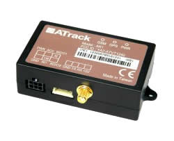

# ATrack - AK1

El ATrack AK1 es un rastreador GPS compacto para vehículos que ofrece localización y funciones de control remoto mediante GPS y comunicación GSM GPRS. Diseñado para seguimiento y localización, recuperación de vehículos, gestión de flotas y aplicaciones de telemática, el AK1 integra un motor inteligente de control de eventos con almacenamiento en el dispositivo y gestión de energía para soportar monitoreo continuo y captura de datos.

Como dispositivo compatible con Plaspy, el AK1 puede enviar datos de ubicación y eventos a la plataforma Plaspy para ofrecer visibilidad centralizada y control operativo. Sus entradas flexibles, batería de respaldo y motor de eventos configurable hacen del AK1 una opción práctica para organizaciones que desean gestionar vehículos y activos a través de Plaspy, manteniendo flujos de trabajo basados en eventos y redundancia básica.

## Aspectos destacados

- Localización precisa basada en GPS con comunicación GSM GPRS para la entrega de datos
- Motor inteligente de control de eventos que permite disparadores y acciones personalizables
- GSM cuatribanda para amplia cobertura regional
- Batería de respaldo y memoria interna para mayor seguridad y almacenamiento sin conexión
- Modo de reposo para ahorrar energía cuando el vehículo no está en uso
- Múltiples entradas digitales y entrada analógica para integrar señales y sensores externos
- Antenas GPS y GSM internas con opciones adicionales como antenas fijas, sensores de combustible, Garmin FMI, identificación de conductor y soporte 1-Wire

## Cómo funciona con Plaspy

Al integrarse con Plaspy, el AK1 transmite fijaciones de ubicación y notificaciones de eventos para que los gestores de flota puedan supervisar vehículos, reproducir rutas y responder alertas desde una única interfaz. Plaspy procesa los datos del AK1 y los presenta junto con la telemetría del resto de la flota para un seguimiento y reporte consolidados.

- Visualización de ubicación de vehículos en tiempo real y seguimiento en vivo en el mapa de Plaspy
- Alertas y notificaciones basadas en eventos impulsadas por el motor de control del AK1
- Visualización en Plaspy del estado de entradas digitales como ignición, pánico y puertas
- Reproducción histórica de datos e informes usando la memoria interna del dispositivo y los registros de la plataforma
- Soporte para fuentes de datos complementarias como sensores de combustible e identificación de conductor para mejorar la visibilidad operativa

## Casos de uso típicos

- Seguimiento de flotas y supervisión de rutas para vehículos de reparto y servicios
- Recuperación de vehículos y localización de unidades robadas
- Alertas basadas en eventos para seguridad y manejo de excepciones
- Telemática e informes operativos para análisis de mantenimiento y utilización
- Monitoreo de combustible e identificación de conductores para control de costos

## Por qué elegir este rastreador con Plaspy

El AK1 combina un conjunto práctico de funciones de rastreo con un motor de eventos adaptable, ideal para organizaciones que requieren disparadores configurables y monitoreo remoto sencillo. Su batería de respaldo y memoria interna ayudan a mantener la continuidad de los registros, mientras que las múltiples entradas y las opciones de conectividad permiten aplicar el dispositivo en diversos flujos de trabajo de flota y seguridad.

Usar el AK1 con Plaspy brinda a los equipos una forma de centralizar datos de ubicación y eventos en una plataforma gestionada para supervisión, alertas e informes. La combinación es adecuada para operadores que buscan seguimiento confiable junto con la flexibilidad de ampliar el monitoreo con sensores externos e identificación de conductores.

Para obtener más información sobre cómo Plaspy admite dispositivos como el ATrack AK1 visite https://www.plaspy.com. Las especificaciones del producto, la disponibilidad y las características del fabricante pueden cambiar con el tiempo, por lo que le recomendamos verificar los detalles actuales en el sitio oficial de ATrack https://www.atrack.com.tw/ antes de la compra.
