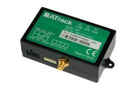

# ATrack - AK7

El ATrack AK7 es un dispositivo compacto de telemática vehicular y rastreo GPS diseñado para ofrecer datos de ubicación confiables y funciones remotas flexibles. Combina posicionamiento GPS de alta precisión con comunicación celular sobre redes UMTS HSPA y CDMA, e integra un motor inteligente de control de eventos, un sensor G de 3 ejes y soporte para accesorios 1 Wire que amplían sus capacidades de monitoreo.

Como dispositivo compatible con Plaspy, el AK7 puede transmitir ubicaciones, eventos y datos de sensores a Plaspy para brindar visibilidad a nivel de flota y supervisión operativa. Sus reglas de evento configurables, múltiples modos de comunicación de datos y la posibilidad de actualizar el firmware por aire lo convierten en una opción práctica para organizaciones que requieren comportamiento de rastreo adaptable dentro de una plataforma de gestión de flotas como Plaspy.

## Características principales

- Posicionamiento GPS de alta precisión para reportes de ubicación consistentes y visibilidad de rutas
- Motor inteligente de control de eventos para definir disparadores personalizados y acciones automatizadas
- Sensor G de 3 ejes integrado para detectar y registrar eventos de conducción brusca e incidentes relacionados con el movimiento
- Soporte para accesorios 1 Wire que permiten integrar sensores externos o identificadores
- Múltiples opciones de comunicación de datos, incluyendo SMS, USSD, TCP y UDP para conectividad flexible
- Capacidad FOTA para actualizaciones de firmware con mínima interrupción

## Cómo funciona con Plaspy

El AK7 se integra con Plaspy enviando actualizaciones de ubicación, notificaciones de eventos e inputs de accesorios, de modo que los administradores de flota puedan supervisar activos y responder incidentes desde una plataforma central. Plaspy procesa los datos del dispositivo y los presenta junto con la telemetría del resto de la flota para facilitar el análisis operativo y la generación de informes.

- Seguimiento en tiempo real de vehículos en los mapas y paneles de Plaspy
- Reenvío de eventos y alarmas por incumplimiento de umbrales o disparadores definidos por el usuario
- Visibilidad del comportamiento del conductor y de eventos bruscos a partir del sensor G
- Integración de entradas de sensores externos vía 1 Wire para ampliar la telemetría en Plaspy
- Registro histórico de viajes y reportes exportables para análisis y cumplimiento

## Casos de uso típicos

- Rastreo de ubicación de flotas de reparto y vehículos de servicio
- Programas de monitoreo y coaching de conductores basados en reportes de eventos bruscos
- Escenarios de control remoto y automatización utilizando el motor de eventos del dispositivo
- Protección de activos cuando se requiere posición precisa y alertas por eventos
- Monitoreo ampliado con sensores, por ejemplo estado de puertas o identificación mediante accesorios 1 Wire

## Por qué elegir este rastreador con Plaspy

El AK7 es una opción equilibrada para organizaciones que buscan un rastreador con muchas funciones que se integre con una plataforma completa de gestión de flotas como Plaspy. Sus capacidades de control de eventos y soporte de accesorios permiten al equipo adaptar alertas y acciones a las necesidades operativas, mientras que Plaspy ofrece visibilidad centralizada, alertas e informes que convierten los datos del dispositivo en supervisión accionable.

Para obtener más detalles sobre cómo el AK7 puede encajar en su despliegue y evaluar la alineación de funciones con las políticas de su flota, conozca más sobre Plaspy en https://www.plaspy.com. Las especificaciones del producto, la disponibilidad y los detalles del fabricante pueden cambiar con el tiempo, por lo que le recomendamos verificar la información técnica más reciente en el sitio de ATrack https://www.atrack.com.tw/.
