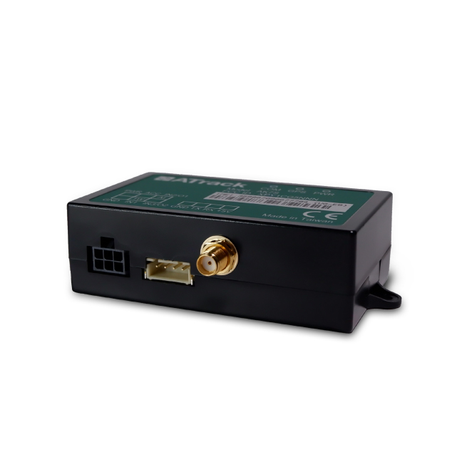

# ATrack - AK7S

El ATrack AK7S es un dispositivo telemático y rastreador GPS para vehículos diseñado para ofrecer monitoreo confiable a bordo y gestión remota. Combina posicionamiento satelital con comunicaciones celulares para proporcionar actualizaciones continuas de ubicación e integra un motor inteligente de control de eventos junto con un acelerómetro de 3 ejes que detecta movimiento e impactos. El equipo también dispone de múltiples interfaces de hardware para integrarse con otros sistemas del vehículo.

Como dispositivo compatible con Plaspy, el AK7S puede enviar información de ubicación, eventos y movimiento a la plataforma Plaspy para ofrecer visibilidad en vivo y supervisión operativa. Su motor de eventos configurable y la conectividad celular hacen del AK7S una opción práctica para organizaciones que desean usar Plaspy para monitorear activos, recibir alertas a medida y consolidar datos telemáticos para reportes y operaciones diarias de la flota.

## Puntos clave

- Posicionamiento GPS y GLONASS para seguimiento de ubicación confiable
- Conectividad celular 3G con soporte UMTS HSPA CDMA para comunicación remota
- Motor inteligente de control de eventos para definir disparadores y acciones personalizados
- Acelerómetro de 3 ejes integrado para detección de movimiento e impactos
- Múltiples interfaces, incluyendo 1 Wire y RS232, que ofrecen flexibilidad de integración
- Adecuado tanto para el seguimiento de un solo vehículo como para despliegues a nivel de flota

## Cómo funciona con Plaspy

Al integrarse con Plaspy, el AK7S transmite información de ubicación y eventos a la plataforma, lo que permite a las flotas obtener visibilidad centralizada y contexto histórico. Plaspy procesa los datos del dispositivo y los presenta junto con la telemetría del resto de la flota para apoyar el monitoreo, las alertas y los informes operativos básicos.

- Visualización de ubicación en tiempo real en Plaspy para seguimiento en vivo y conocimiento de rutas
- Alertas personalizadas y acciones automáticas basadas en las reglas del motor de eventos del AK7S
- Notificaciones de movimiento e impacto generadas por el acelerómetro interno para monitoreo de seguridad y protección
- Historial consolidado de vehículos e informes para respaldar revisiones y análisis operativos
- Uso de entradas externas a través de las interfaces del dispositivo para incorporar señales adicionales en las vistas de Plaspy

## Casos de uso típicos

- Monitoreo de la ubicación de la flota para despacho y supervisión de rutas
- Seguridad vehicular y disuasión de robos mediante alertas de movimiento e impacto
- Observación del comportamiento del conductor y revisión de incidentes usando eventos de movimiento e historial de ubicaciones
- Seguimiento logístico y de entregas para mejorar la previsibilidad de ETA
- Escenarios de comando y monitoreo remoto donde la comunicación celular permite el control fuera de sitio

## Por qué elegir este rastreador con Plaspy

El AK7S combina un motor de eventos flexible con posicionamiento robusto y conectividad celular, lo que lo hace adecuado para organizaciones que requieren reglas configurables y comunicaciones fiables. Sus opciones de sensores e interfaces permiten a las flotas capturar señales de ubicación y movimiento y enviarlas a Plaspy para obtener una vista operacional unificada.

Elegir el AK7S junto con Plaspy ayuda a simplificar el monitoreo de la flota al combinar la lógica de eventos a nivel de dispositivo con la visualización, las alertas y los informes a nivel de plataforma. Para equipos que necesitan reglas adaptables y supervisión centralizada, esta combinación ofrece un equilibrio práctico entre capacidad del dispositivo y funciones de la plataforma sin complejidad innecesaria.

To learn more about using Plaspy with compatible trackers visit https://www.plaspy.com. Product specifications and availability can change over time so please verify current details on the manufacturer site https://www.atrack.com.tw/ before making procurement or deployment decisions.
