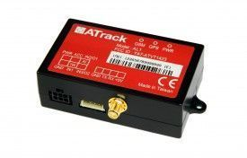

# ATrack - AL1

El ATrack AL1 es un rastreador GPS compacto para vehículos diseñado para monitoreo en tiempo real y control remoto flexible. Combina posicionamiento GPS de alta precisión con comunicación GSM GPRS y un sensor G de 3 ejes integrado, lo que lo hace útil para seguimiento, detección de comportamientos de conducción y acciones de eventos configurables. El dispositivo ofrece además múltiples opciones de transmisión de datos y soporta actualizaciones de firmware por aire, por lo que resulta adecuado para una amplia variedad de aplicaciones de rastreo de vehículos y activos.

Como dispositivo compatible con Plaspy, el AL1 puede enviar datos de ubicación y eventos a la plataforma de gestión de flotas de Plaspy para visibilidad, monitoreo e informes. Su motor inteligente de control de eventos y su seguimiento configurable lo convierten en una opción práctica para organizaciones que desean centralizar alertas, revisar historiales de viaje y mantener supervisión operativa en flotas mixtas.

## Características principales

- Factor de forma compacto, ideal para montaje discreto en vehículos y despliegues sencillos
- Posicionamiento GPS de alta precisión para un rastreo de ubicación confiable
- Sensor G integrado de 3 ejes para detectar eventos de conducción brusca y apoyar la supervisión del comportamiento del conductor
- Motor inteligente de control de eventos para acciones personalizables según condiciones del vehículo
- Múltiples opciones de comunicación de datos, incluyendo SMS USSD TCP y UDP para conectividad flexible
- Soporte para actualizaciones de firmware FOTA para mantener los dispositivos actualizados por aire
- Funciones adicionales como detección de bloqueo GSM, GPIOs configurables y soporte para sensor de combustible externo para ampliar el monitoreo

## Cómo funciona con Plaspy

Al integrarse con Plaspy, el AL1 se convierte en una fuente continua de información de ubicación y eventos que Plaspy puede mostrar y analizar. Plaspy procesa los datos del rastreador para que los responsables de flota utilicen una única interfaz para monitorear vehículos, configurar alertas y generar informes operativos.

- Visibilidad de la ubicación en tiempo real en los paneles de Plaspy para el monitoreo activo de la flota
- Alertas basadas en eventos enviadas a Plaspy para detección de conducción brusca, violaciones de geocerca y notificaciones de interferencia
- Seguimiento histórico y registro configurable en Plaspy para reconstrucción de recorridos e informes
- Información del estado del dispositivo en Plaspy para apoyar la supervisión operativa y la planificación de mantenimiento
- Mapeo de geocercas configuradas en el AL1 y zonas definidas por el usuario en Plaspy para notificaciones automáticas

## Casos de uso típicos

- Rastreo de vehículos de flota y monitoreo del comportamiento del conductor para programas de seguridad
- Supervisión de vehículos de servicio y reparto con visibilidad de rutas en tiempo real
- Gestión de autos de renta y vehículos compartidos donde se prefiere una instalación compacta
- Rastreo de activos para vehículos pequeños o equipos que requieren reportes periódicos
- Monitoreo de combustible cuando se conecta con sensores externos de nivel de combustible para obtener información sobre consumo

## Por qué elegir este rastreador con Plaspy

La combinación del AL1 entre posicionamiento preciso, sensor G integrado y un motor inteligente de eventos lo hace apto para organizaciones que necesitan rastreo configurable junto con una plataforma centralizada de gestión. Su tamaño reducido y los métodos de comunicación flexibles aseguran un flujo de datos constante hacia Plaspy, mientras que funciones como geocercas y E/S configurables amplían su utilidad en distintos escenarios operativos.

Plaspy aporta la capa de visualización e informes que convierte la telemetría del AL1 en información accionable. Para equipos que gestionan vehículos y activos, la combinación AL1 más Plaspy ofrece un equilibrio entre la configurabilidad a nivel de dispositivo y la supervisión a nivel de plataforma sin requerir personalizaciones complejas.

Para obtener más información sobre cómo Plaspy puede integrarse con dispositivos compatibles como el ATrack AL1 visite https://www.plaspy.com. Las especificaciones del producto, la disponibilidad y la documentación del fabricante pueden variar con el tiempo, por lo que le recomendamos verificar los detalles actuales en el sitio oficial de ATrack https://www.atrack.com.tw/.
