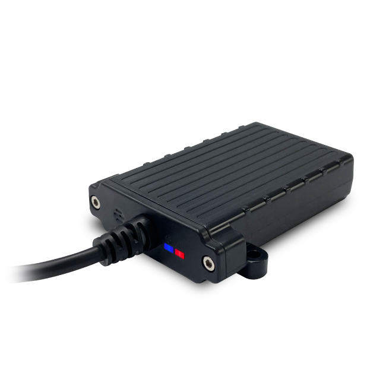

# ATrack - AL300

# AL300 GPS Tracker

El AL300 es un rastreador GPS robusto, compatible con Plaspy, diseñado para la gestión de flotas exigentes y telemática de maquinaria pesada. Con protección IP67, cumplimiento MIL‑STD‑810G y SAE J1455 para vibraciones, el AL300 ofrece de forma fiable rastreo en tiempo real y telemetría a través de LTE \(Cat.M1 / Cat.1\) y redes GSM legadas. Está diseñado para integrarse de forma fluida con Plaspy para localización, alertas de eventos y optimización de la flota basada en datos.

El dispositivo está disponible en variantes regionales de conectividad celular \(AL300‑MG, AL300‑MX, AL300‑LE\) y admite UDP/TCP, MQTT y SMS vía IMS para un transporte de datos flexible hacia Plaspy. CAN Bus opcional y Bluetooth Low Energy \(v5.1\) amplían el diagnóstico del vehículo, el monitoreo de combustible y la integración de sensores, a la vez que permiten una telemetría rica y flujos de trabajo de anti‑robo cuando se combinan con paneles y reglas de alerta de Plaspy.

## Aspectos clave

- Compatible con Plaspy para una integración fluida del rastreador GPS, rastreo en tiempo real y paneles de gestión de flotas.
- Carcasa robusta con IP67, ignífuga y cumplimiento de vibraciones/impactos para maquinaria pesada y entornos exigentes.
- Conectividad en múltiples redes: variantes LTE Cat.M1 / Cat.1, además de GSM legado para mantener cobertura cuando sea necesario.
- CAN Bus opcional \(ISO 15765‑4, SAE J1939\) para telemetría del vehículo: kilometraje, métricas del motor, monitoreo de combustible y estado de la batería.
- Soporte opcional de sensores Bluetooth \(BLE v5.1\) para monitorización de periféricos inalámbricos y emparejamiento con la app móvil.
- Bajo consumo energético con modo de sueño profundo y una batería de respaldo de 650 mAh para reportes fuera de línea de corta duración y un apagado controlado.
- Transporte flexible: UDP/TCP, MQTT y SMS sobre IMS para alimentar a Plaspy con telemetría, alertas y logs en cola.

## Cómo funciona con Plaspy

El AL300 envía actualizaciones de posición, telemetría y datos de eventos a Plaspy utilizando protocolos de transporte configurables \(UDP/TCP, MQTT o SMS sobre IMS\). Cuando está integrado, Plaspy ingiere coordenadas GNSS, parámetros del vehículo derivados del CAN y lecturas de sensores BLE para proporcionar rastreo en tiempo real, alertas de geovalla e informes históricos. El registro y la cola internos aseguran que no se pierda datos durante interrupciones temporales de cobertura.

- Actualizaciones de ubicación y telemetría en tiempo real: coordenadas GNSS, velocidad, rumbo y marca de tiempo.
- Telemetría del vehículo vía CAN opcional: kilometraje, métricas del motor, monitoreo de combustible y estado de la batería.
- Monitoreo del estado de encendido mediante entrada de ignición; salida digital disponible para control remoto o integración con inmovilizador cuando se configure.
- Eventos del acelerómetro \(3 ejes ±16 g\) para conducción brusca, detección de colisiones y alertas por movimiento.
- Sensores Bluetooth \(BLE\) para monitorización de sensores y lectura de temperatura, puertas o remolques, y envío de lecturas a Plaspy.
- Memoria a bordo \(16 Mbit\) almacena hasta 12,000 registros y 10,000 mensajes en cola para carga posterior a Plaspy.

## Visión general técnica

| Conectividad | Variantes LTE Cat.M1 y Cat.1; soporte GSM legado cuando sea necesario. |
| --- | --- |
| Variantes / Soporte regional | AL300‑MG \(LTE Cat.M1 global\), AL300‑MX \(Norteamérica\), AL300‑LE \(LTE Cat.1 para EMEA/APAC\); las variantes seleccionadas especifican la compatibilidad con operadores \(AT&T, Verizon para Norteamérica\). |
| Protocolos | UDP, TCP, MQTT y SMS sobre IMS para transporte de datos hacia servidores como Plaspy. |
| Alimentación y batería | Operación a 12 V / 24 V; consumo típico de 100 mA @12 V durante funcionamiento, 2,4 mA en sueño profundo; batería Li‑ion de respaldo de 3,7 V, 650 mAh. |
| Interfaces | Variantes de E/S múltiples: entradas digitales, puerto RS232, CAN H/L \(opcional\), entrada de ignición, una salida digital \(capaz de manejar hasta 300 mA\), dos LED de estado \(GPS/cellular\). |
| GNSS | Receptor GPS y GLONASS interno: 33 canales de seguimiento / 99 de adquisición, soporte SBAS \(WAAS/EGNOS/GAGAN/MSAS\), precisión de ubicación ~2,5 m CEP. |
| Bluetooth | Opcional Bluetooth Low Energy v5.1 para integración de sensores y conectividad móvil. |
| Memoria y registro | 16 Mbit de memoria flash interna; almacena hasta 12,000 registros y 10,000 mensajes en cola para carga diferida a Plaspy. |
| Sensores | Acelerómetro de 3 ejes \(±16 g\) para detección de movimientos e impactos; telemetría del vehículo vía CAN cuando está equipado. |
| Ambiental y certificaciones | IP67 resistente al agua, rango de temperatura de operación −20 °C a 60 °C, 95% HR sin condensación; MIL‑STD‑810G y SAE J1455 vibración/choque; CE, FCC, IC, TELEC, PTCRB, RoHS. |
| Factor de forma | Carcasa compacta ignífuga de PC ~88.9 × 76.5 × 21.2 mm \(con soporte\), ≈150 g; múltiples opciones de montaje \(bracket con tornillos, adhesivo, brida\). |
| SIM y antena | Ranura NanoSIM \(4FF\); antena celular integrada. |

## Casos de uso

- Gestión de flotas: seguimiento en vivo de vehículos, reproducción de rutas y análisis del comportamiento del conductor para reducir los costos operativos.
- Antirrobo e inmovilización remota: monitoreo de ignición y salida digital para control remoto o flujos de trabajo de inmovilizador a través de Plaspy.
- Monitoreo de maquinaria pesada y agrícola: vibración, tiempo de operación y datos del motor derivados del CAN para mantenimiento preventivo.
- Monitoreo de combustible y control de costos: telemetría de consumo de combustible \(vía CAN\) alimentada en informes y alertas de Plaspy.
- Remolques y activos sensorizados: sensores BLE para temperatura, estado de puertas o monitoreo de carga combinados con ubicación GPS.

## Por qué elegir este rastreador con Plaspy

El rastreador GPS AL300 une hardware robusto y conectividad flexible para ofrecer un rastreo en tiempo real confiable, telemetría y capacidades anti‑robo cuando se empareja con Plaspy. Sus variantes regionales LTE y el soporte para GSM legado aseguran cobertura celular fiable, mientras que las opciones de protocolo \(UDP/TCP/MQTT/SMS a través de IMS\) facilitan la integración para flotas grandes o distribuidas. CAN Bus opcional y BLE amplían la telemetría y la cobertura de sensores para monitoreo de combustible, diagnóstico del motor y sensores periféricos, proporcionando a Plaspy los datos necesarios para optimizar rutas, reducir tiempos de inactividad y mejorar la seguridad de la flota. Modos de bajo consumo, registro a bordo y robustas certificaciones ambientales hacen del AL300 una opción práctica para despliegues en vehículos, construcción y agrícola que requieren telemática escalable y compatible con Plaspy.

  \<meta itemprop="model" content="AL300">

