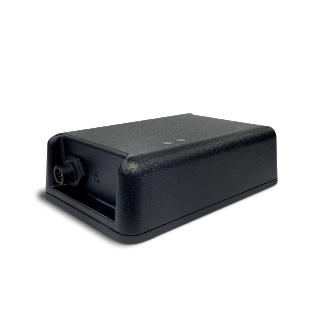

# ATrack - AS11

El AS11 es un rastreador GPS LTE resistente diseñado para la gestión de activos a largo plazo en entornos adversos. Pensado para contenedores, equipo pesado, remolques y otros activos de alto valor, combina protección de grado industrial con una duración de batería prolongada y opciones flexibles de conectividad celular y GNSS. Su carcasa cumple con las normas IP68 y MIL STD 810H y el hardware está concebido para despliegues donde el acceso para mantenimiento es limitado.

El AS11 es compatible con Plaspy desde el primer momento, lo que lo convierte en una opción práctica para organizaciones que requieren ubicación y telemetría confiables integradas directamente en una plataforma de gestión de flotas. El equipo ofrece posicionamiento GNSS, reporte de eventos de sensores y E/S, y registro en cola para redes intermitentes, de modo que Plaspy puede mantener visibilidad continua, alertas e informes incluso para activos remotos o con conexión intermitente.

## Aspectos clave

- Seguimiento de activos compatible con Plaspy para integración directa en paneles, alertas e informes.
- Carcasa resistente IP68 y cumplimiento MIL STD 810H para protección contra agua, polvo, vibración y golpes.
- Batería recargable de larga vida y gestión de energía pensada para despliegues prolongados sin supervisión.
- Dos variantes LTE, incluyendo Cat.1 y Cat.M1, para mayor compatibilidad con operadores y amplia cobertura.
- GNSS integrado con opción de antena externa para mejorar la recepción en ubicaciones difíciles.
- Amplias opciones de E/S y soporte de sensores locales, más registro en cola para retener datos durante cortes de red.

## Cómo funciona con Plaspy

Cuando se integra con Plaspy, el AS11 transmite la telemetría y los eventos necesarios para seguimiento en tiempo real, supervisión de flotas y flujos de trabajo anti robo. Puede enviar fijaciones de ubicación, lecturas de E/S y sensores a los endpoints de Plaspy y mantiene registros localmente cuando se pierde la conectividad, cargándolos cuando la red esté disponible. Este comportamiento garantiza visibilidad operativa confiable para activos que operan en condiciones remotas o adversas.

- Actualizaciones continuas de ubicación e historial de posiciones para seguimiento en vivo y reproducción.
- Reenvío de eventos de E/S y sensores para accionar geocercas, alertas y notificaciones de cambios de estado.
- Registro sin conexión y cargas en cola para preservar la continuidad de los datos durante brechas de conectividad.
- Integración BLE y de sensores locales para enriquecer la telemetría con lecturas de temperatura, proximidad o accesorios.
- Alimentación de datos a los informes y vistas de panel de Plaspy para análisis operativo y cumplimiento.

## Casos de uso típicos

- Gestión de flotas de remolques sin fuente de energía y equipo pesado para controlar utilización y movimiento.
- Contenedores logísticos y activos remotos que requieren despliegues de larga duración con mínimo mantenimiento.
- Flujos de trabajo anti robo y recuperación que usan seguimiento en tiempo real y eventos de alarma para apoyar la respuesta.
- Telemetría y monitoreo de sensores analógicos para combustible, equipos o parámetros ambientales.
- Envíos sensibles a la condición que se complementan con lecturas de sensores locales para visibilidad básica de la cadena de frío.

## Por qué elegir este rastreador con Plaspy

El AS11 equilibra construcción resistente, larga autonomía de batería y E/S flexibles para proyectos exigentes de seguimiento de activos. Su capacidad para seguir registrando datos sin conexión y transmitir una mezcla de ubicación y eventos lo convierte en una fuente de datos confiable para Plaspy, reduciendo huecos de información y facilitando la supervisión remota de flotas distribuidas.

Al ser compatible con Plaspy desde el primer momento, el AS11 permite a las organizaciones minimizar el tiempo de integración y comenzar a recibir telemetría en los paneles de Plaspy para alertas, informes y supervisión operativa. Para más detalles sobre Plaspy y cómo puede usar el AS11 en sus despliegues visite https://www.plaspy.com. Las especificaciones del producto y la disponibilidad pueden cambiar con el tiempo, por favor verifique los detalles técnicos actuales y el soporte de variantes en el sitio del fabricante https://www.atrack.com.tw/.
