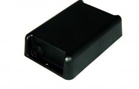

# ATrack - AS3

El ATrack AS3 es un rastreador GPS compacto y versátil diseñado para el monitoreo de vehículos y remolques. Combina posicionamiento satelital con comunicación de datos celulares para proporcionar información continua de ubicación y modos de seguimiento configurables. Pensado para activos que normalmente están conectados a la alimentación pero que pueden desconectarse temporalmente, el AS3 incorpora una batería interna recargable y una batería de respaldo de gran capacidad para mantener el funcionamiento cuando no hay energía principal.

Como dispositivo compatible con Plaspy, el AS3 puede integrarse para enviar datos fiables de ubicación y eventos a la plataforma Plaspy, facilitando la supervisión de flotas y activos. Su carcasa resistente con certificación IP67 y las opciones de comunicación flexibles lo hacen apropiado para despliegues donde la resiliencia frente al ambiente y la fiabilidad de los reportes son críticas. Usted, como usuario de Plaspy, puede aprovechar las capacidades del AS3 para mejorar la visibilidad, las alertas y los informes históricos en flotas de vehículos y remolques.

## Características principales

- Diseñado específicamente para el monitoreo de vehículos y remolques con seguimiento en tiempo real y registro configurable
- Varias opciones de comunicación de datos para adaptarse a diferentes necesidades de conectividad
- Alimentación interna recargable y batería de respaldo de alta capacidad para operación continua cuando se retira la energía principal
- Carcasa con clasificación IP67 que ofrece resistencia al polvo y al agua en entornos exigentes
- Posicionamiento opcional con GPS y GLONASS para mayor fiabilidad de localización
- Acelerómetro de 3 ejes integrado para detección de movimiento y eventos por impacto
- Actualizaciones de firmware FOTA para mantenimiento remoto y nuevas funcionalidades

## Cómo funciona con Plaspy

El AS3 transmite información de ubicación y eventos que Plaspy ingiere para ofrecer visibilidad en tiempo real, alertas y reproducción histórica. Plaspy convierte los datos del AS3 en mapas, reportes y notificaciones operativas para que las flotas puedan monitorear desplazamientos, detectar incidentes y analizar el rendimiento.

- Seguimiento de ubicación en vivo y visualización en mapa desde el panel de Plaspy
- Alertas y notificaciones basadas en eventos gestionadas por el motor inteligente de eventos del AS3
- Registro y reporte histórico de rutas para revisión de viajes y análisis operativo
- Captura y envío de datos continuos cuando se restablece la alimentación gracias a la batería de respaldo
- Supervisión operativa de activos en entornos hostiles respaldada por la certificación IP67 del AS3

## Casos de uso típicos

- Rastreo de remolques y vehículos para operadores logísticos y de transporte
- Monitoreo de activos que habitualmente están alimentados pero pueden desconectarse periódicamente
- Flotas que operan en exteriores o en entornos exigentes que requieren hardware robusto
- Rastreo de equipos en renta o uso compartido para registrar movimiento y historial de uso
- Registro prolongado de rutas y análisis post‑viaje para mejoras operativas

## Por qué elegir este rastreador con Plaspy

El AS3 es una opción práctica para organizaciones que necesitan un rastreador resistente capaz de soportar pérdidas de energía ocasionales sin perder datos críticos. Su combinación de opciones GNSS, detección de eventos y alimentación de respaldo lo hace ideal para remolques y vehículos que alternan entre estados con y sin alimentación. Integrado con Plaspy, el dispositivo aporta la telemetría y los eventos esenciales que los administradores de flota utilizan para mantener visibilidad, automatizar alertas y generar reportes útiles.

Plaspy puede ingerir el flujo de datos del AS3 para ofrecer una supervisión consolidada en flotas mixtas, ayudando a los equipos a responder más rápido ante incidentes y a tomar decisiones operativas mejor informadas. Dado que las especificaciones y las opciones de producto pueden cambiar con el tiempo, le recomendamos verificar las especificaciones actuales en el sitio del fabricante.

Para saber más sobre cómo Plaspy puede trabajar con el ATrack AS3 visite https://www.plaspy.com. Para obtener las especificaciones más recientes y detalles del fabricante, consulte la documentación oficial de ATrack en https://www.atrack.com.tw/.
