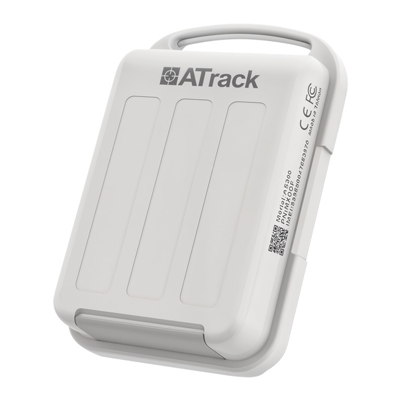

# ATrack - AS300

El AS300 Compact Asset Tracker es un rastreador GPS compacto y resistente diseñado para la supervisión de envíos a corto plazo y activos móviles. Combina una carcasa impermeable IP67 y un formato ligero con posicionamiento GNSS preciso y detección de movimiento a bordo, proporcionando datos confiables de ubicación y desplazamiento para activos en tránsito o almacenados.

Como dispositivo compatible con Plaspy, el AS300 está pensado para integrar sus posiciones, telemetría y lecturas basadas en eventos dentro de Plaspy para mapeo, alertas e informes. Su compatibilidad con sensores BLE y el almacenamiento en buffer interno lo hacen una opción práctica cuando se requiere reportes intermitentes, telemetría de cadena de frío o protección de activos portátiles visible desde una plataforma unificada de gestión de flotas.

## Características principales

- Rastreador compatible con Plaspy optimizado para envíos a corto plazo y activos movibles.
- Posicionamiento GNSS preciso con soporte SBAS para mayor fiabilidad en la ubicación.
- Carcasa robusta IP67 y construcción resistente a impactos para entornos exigentes.
- Soporte Bluetooth Low Energy para emparejar sensores externos de temperatura, humedad y eventos de puerta o inclinación.
- Comportamiento de bajo consumo en espera adecuado para horarios de reporte intermitente.
- Acelerómetro integrado y escaneo Wi‑Fi para ayudar en la detección de movimiento y en la asistencia híbrida de ubicación.
- Almacenamiento flash interno y soporte de gestión remota para mantener la continuidad frente a interrupciones de conectividad.

## Cómo funciona con Plaspy

Al integrarse con Plaspy, el AS300 envía posiciones, eventos de movimiento y lecturas de sensores BLE a los flujos de trabajo de mapeo y alertas de Plaspy, de modo que usted y su equipo puedan supervisar activos, activar notificaciones y generar informes operativos. Plaspy correlaciona la telemetría del dispositivo con geocercas, el historial de movimientos y paneles de flota para ofrecer una supervisión práctica de envíos a corto plazo y equipos portátiles.

- Localización y telemetría en tiempo real entregadas a Plaspy para mapas en vivo y reproducción de historial.
- Eventos de movimiento y manipulación detectados por el acelerómetro que generan alertas antirrobo y resúmenes de desplazamiento.
- Datos de sensores BLE como temperatura y humedad integrados en la telemetría de Plaspy para visibilidad de la cadena de frío.
- Escaneo Wi‑Fi y GNSS asistido por SBAS para mejorar la localización en entornos con señal limitada.
- Buffer interno y gestión remota que ayudan a mantener la continuidad de datos y la sincronización de ajustes en flotas gestionadas con Plaspy.

## Casos de uso típicos

- Monitoreo de remolques de cadena de frío y envíos sensibles a la temperatura con sensores BLE de temperatura y humedad.
- Seguimiento de activos de alquiler a corto plazo, como maquinaria de construcción y equipos portátiles, con alertas de ubicación y manipulación.
- Rastrear paquetes y carga de alto valor durante el tránsito donde se requiere protección impermeable y resistente a impactos.
- Protección de objetos personales o equipos en mochilas y kits portátiles con montaje discreto e integración de sensores.
- Visibilidad logística y de última milla combinada con geocercas y reportes de rutas en Plaspy para reducir pérdidas y mejorar la fiabilidad en las entregas.

## Por qué elegir este rastreador con Plaspy

El AS300 ofrece un equilibrio entre robustez, posicionamiento GNSS preciso y eficiencia energética en conectividad celular, características que encajan con múltiples casos de uso en Plaspy, desde supervisión de flotas hasta flujos anti robo. Su soporte para sensores BLE externos y la detección de movimiento a bordo permiten ampliar la telemetría más allá de la ubicación, incluyendo señales ambientales y de manipulación, todo visible en los paneles y reportes de Plaspy.

Si su operación necesita un rastreo de activos compacto e impermeable con posibilidad de expansión por sensores y reportes fiables durante conectividad intermitente, el AS300 es una opción sólida para integrar con Plaspy. Para conocer más sobre cómo Plaspy puede gestionar dispositivos y flotas AS300 visite https://www.plaspy.com. Las especificaciones del producto y la disponibilidad pueden cambiar con el tiempo, por favor verifique los detalles técnicos y las certificaciones actuales con el fabricante en https://www.atrack.com.tw/.
