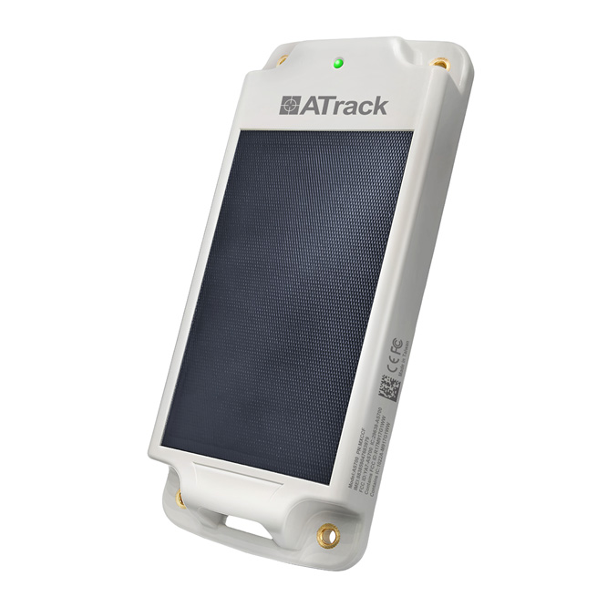

# ATrack - AS700

El AS700 es un rastreador GPS alimentado por energía solar, diseñado para despliegues exteriores a largo plazo y es compatible con Plaspy para una visibilidad unificada de activos. Construido para contenedores, generadores, remolques y maquinaria pesada, el AS700 combina un hardware robusto certificado IP68/IP69K y MIL-STD-810H con posicionamiento GNSS, conectividad LTE Cat.1 y soporte para sensores Bluetooth para brindar un seguimiento en tiempo real confiable y una vida útil ampliada en campo con mantenimiento mínimo.

Los usuarios de Plaspy obtienen acceso inmediato a telemetría, posicionamiento híbrido interior/exterior y estado de batería/energía solar desde el AS700. Ya sea que gestione flujos de trabajo de gestión de flotas, monitorización anti-robos o telemetría de activos en zonas amplias, este rastreador ofrece la durabilidad y las entradas de señales mixtas necesarias para despliegues industriales en entornos severos.

## Aspectos clave

- Operación al aire libre a largo plazo: célula solar de 1.7W y batería interna de 8,000 mAh para mayor tiempo de funcionamiento y ciclos de mantenimiento reducidos.
- Compatible con Plaspy para seguimiento en tiempo real y paneles de gestión de flotas, alertas e informes históricos.
- Carcasa robusta y certificada: IP68 / IP69K y MIL-STD-810H para resistencia a vibraciones, impactos, niebla salina y caídas.
- Posicionamiento híbrido: receptor GNSS de 99 canales \(GPS y GLONASS\) con escaneo Wi‑Fi y balizas Bluetooth para mejorar la precisión interior/exterior.
- Diseño de bajo consumo: corriente de sueño profundo \<22 µA para maximizar la duración de la batería cuando los intervalos de reporte son infrecuentes.
- Bluetooth Low Energy 5.0 \(Long Range\) para conectar sensores externos BL1 para monitorización de apertura de puertas, temperatura, humedad y ángulo.
- Conectividad celular global a través del modelo LTE FDD Cat.1 \(AS700-LG\) y transporte de datos flexible sobre UDP/IP o TCP/IP.
- Detección de movimiento y manipulación a bordo con un acelerómetro de 3 ejes de ±16 g para antirrobo y generación de informes basados en eventos.

## Cómo funciona con Plaspy

El AS700 proporciona a Plaspy datos de posición y sensores a través de LTE. Plaspy ingiere fijaciones GNSS, datos de escaneo/testigo Wi‑Fi y telemetría de sensores Bluetooth para ofrecer seguimiento en tiempo real, alertas de geocercas y paneles de telemetría. El comportamiento de bajo consumo del dispositivo y los informes de carga solar permiten el monitorizado a largo plazo de activos remotos con actualizaciones automáticas de estado a Plaspy.

- Ubicación y telemetría en tiempo real enviadas sobre LTE Cat.1 mediante UDP/IP o TCP/IP.
- Estado de la batería y carga solar para la planificación de mantenimiento y comprobaciones de estado a distancia.
- Eventos de movimiento y manipulación mediante el acelerómetro de 3 ejes para alertas inmediatas de antirrobo.
- Datos de sensores Bluetooth \(serie BL1\): apertura de puerta, temperatura, humedad y reporte de ángulo para monitorización del estado del activo.
- Escaneo Wi‑Fi y balizas Bluetooth para ayudar a Plaspy con posicionamiento híbrido interior/exterior cuando GNSS no está disponible.
- Configuración local y gestión de firmware a través de ATrack Device Management \(ADM\) vía Bluetooth o USB Type-C.

## Vista técnica

| Modelo | AS700 \(AS700-LG LTE FDD Cat.1 variant\) |
| --- | --- |
| Conectividad | LTE FDD Cat.1 \(AS700-LG\), transporte de datos UDP/IP o TCP/IP |
| Bandas | Cobertura global amplia de LTE FDD \(AS700-LG\) |
| Alimentación y batería | 1.7W célula solar; batería interna de 8,000 mAh. Ejemplos de tiempo de funcionamiento: hasta ~8 años con informes diarios; ~6 meses con informes cada hora; ~1 mes con informes cada 10 minutos \(sin recarga externa\). Corriente de sueño profundo \<22 µA. USB Type-C para recarga/configuración. |
| SIM | SIM mini \(2FF\) y soporte eSIM; opción de antena celular integrada |
| GNSS | Receptor de 99 canales que soporta GPS y GLONASS |
| Bluetooth | Bluetooth Low Energy 5.0 con soporte Long Range; compatible con la serie de sensores BL1 |
| Sensores y E/S | Acelerómetro de 3 ejes a bordo \(±16 g\) para detección de movimiento y manipulación; LED de nivel de batería interno y indicador operativo externo |
| Gestión | ATrack Device Management \(ADM\) para configuración y actualizaciones de firmware vía Bluetooth o USB Type-C |
| Carcasa y certificaciones | Policarbonato resistente a los rayos UV, IP68 / IP69K, MIL-STD-810H; certificados FCC, IC, CE, RoHS, TELEC |
| Factor de forma | 216 × 89 × 30 mm; peso aprox. 500 g \(AS700-LGCSB-AT02\) o 540 g \(AS700-LGCSE-AT02\) |
| Montaje | Varias opciones de montaje, incluida la fijación con tornillos y la instalación mediante pernos |

## Casos de uso

- Seguimiento de contenedores a través de puertos y patios de almacenamiento donde la protección IP68/IP69K y la carga solar reducen las visitas de mantenimiento.
- Monitoreo de remolques y generadores para mantener la disponibilidad operativa y brindar inteligencia de gestión de flotas con geocercas.
- Logística de maquinaria pesada donde se requieren resistencia a vibraciones, impactos y niebla salina para telemetría precisa.
- Monitoreo remoto del estado de activos mediante sensores Bluetooth para temperatura, humedad y estado de apertura de puertas/ángulo.
- Despliegues de activos a largo plazo que exigen posicionamiento híbrido interior/exterior y autonomía de batería de varios años.

## Por qué elegir este rastreador con Plaspy

La combinación del AS700 con Plaspy ofrece una solución de rastreo GPS de bajo mantenimiento y alta fiabilidad para la gestión industrial de flotas y la protección de activos. El sistema de alimentación asistido por energía solar del AS700 y su consumo extremadamente bajo en modo de suspensión prolongan los intervalos de despliegue sin supervisión y reducen los costos de ciclo de vida. Su diseño mecánico robusto y su amplia certificación garantizan un funcionamiento fiable en entornos adversos típicos de flotas de contenedores, remolques y equipos.

La integración compatible con Plaspy lleva esas capacidades del dispositivo a sus flujos de trabajo operativos: seguimiento en tiempo real, alertas anti-robos basadas en eventos y paneles de telemetría para monitoreo de condiciones. Mientras el AS700 se centra en la resiliencia ambiental, el posicionamiento híbrido y la agregación de sensores, Plaspy proporciona la visualización, el motor de reglas y las alertas necesarias para la gestión de flotas, procedimientos anti-robos y generación de telemetría. Para el monitoreo de combustible, el encendido o el inmovilizador, Plaspy puede integrar interfaces o sensores de vehículo adicionales junto al AS700 para construir soluciones integrales de telemática de flotas.

