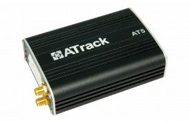

# ATrack - AT5i

El ATrack AT5i es un dispositivo de rastreo vehicular multifuncional diseñado para ofrecer información de posición y movimiento confiable y actualizada. Soporta posicionamiento por GPS y GLONASS y utiliza la red GPRS para enviar actualizaciones de ubicación en tiempo real. El equipo además incluye entradas y salidas configurables y personalización de eventos, lo que permite adaptarlo a distintos requisitos de monitoreo vehicular.

Como rastreador compatible con Plaspy, el AT5i puede integrarse en el entorno de gestión de flotas de Plaspy para proporcionar visibilidad continua y supervisión operativa. Su compatibilidad con seguimiento en tiempo real configurable, geocercas, eventos personalizables y reportes de manipulación se alinea con las funciones habituales de Plaspy para monitoreo, alertas e informes, lo que lo convierte en una opción práctica para empresas que desean combinar capacidad de hardware con las herramientas de la plataforma Plaspy.

## Aspectos clave

- Posicionamiento con doble constelación GPS y GLONASS para mayor fiabilidad en la localización.
- Rastreo en tiempo real mediante la red GPRS para actualizaciones continuas de posición.
- Eventos personalizables y hasta 64 geocercas definidas por el usuario para ajustarse a reglas operativas.
- Múltiples puertos de entrada y salida digitales y analógicos para integración flexible con señales del vehículo.
- Encriptación de datos AES 128 y detección de manipulación de la antena GPS para mayor seguridad de la información.
- Seguimiento en tiempo real configurable y registro local para apoyar el monitoreo y la revisión histórica.

## Cómo funciona con Plaspy

Cuando lo utiliza con Plaspy, el AT5i envía datos de ubicación y eventos a la plataforma para que su equipo pueda supervisar vehículos, recibir alertas y generar informes desde una única interfaz. Plaspy procesa las actualizaciones de posición y los mensajes de evento del dispositivo para ofrecer visibilidad operativa y notificaciones automáticas.

- Envíe actualizaciones de posición en tiempo real a Plaspy para seguimiento en mapa y registro de movimientos.
- Use los eventos configurables del AT5i para disparar alertas en Plaspy por entradas, salidas o condiciones específicas del vehículo.
- Aplique las capacidades de geocerca del dispositivo para definir límites virtuales en Plaspy y recibir notificaciones al cruzar esas fronteras.
- Combine los reportes de manipulación y seguridad con las alertas de Plaspy para mejorar los flujos de protección de activos.
- Incluya los datos registrados por el AT5i en los informes de Plaspy para análisis de rutas y revisión operativa.

## Casos de uso típicos

- Rastreo de flotas comerciales y supervisión de rutas para operaciones diarias.
- Seguridad vehicular y detección de manipulación en activos de alto valor.
- Monitoreo de vehículos de alquiler o compartidos con control de acceso y alertas basadas en geocercas.
- Seguimiento logístico y de entregas donde eventos configurables respaldan reglas operativas.
- Registro de movimientos a largo plazo para cumplimiento o análisis de rendimiento.

## Por qué elegir este rastreador con Plaspy

El AT5i combina funciones prácticas de rastreo con configuración flexible de eventos, lo que lo convierte en una opción sólida para organizaciones que necesitan actualizaciones de ubicación confiables y reglas de monitoreo personalizables. Su soporte para GPS y GLONASS, junto con las opciones de E/S digitales y analógicas, ofrece a los integradores la flexibilidad para adaptar el dispositivo a distintas configuraciones vehiculares, manteniendo los datos protegidos mediante cifrado AES 128.

Si está evaluando hardware para usar con Plaspy, el AT5i ofrece un equilibrio entre fiabilidad de ubicación, personalización de eventos y características de seguridad que se ajustan a muchos escenarios de monitoreo de flotas y vehículos. Conozca más sobre cómo Plaspy puede gestionar dispositivos como el AT5i visitando https://www.plaspy.com. Las especificaciones del producto y su disponibilidad pueden cambiar con el tiempo, por lo que le recomendamos verificar los detalles actuales y la documentación oficial en el sitio del fabricante https://www.atrack.com.tw/.
