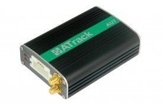

# ATrack - AU7

El rastreador GPS ATrack AU7 es un dispositivo de seguimiento de vehículos GPS/GLONASS de última generación que utiliza tecnología de comunicación móvil CDMA/UMTS/HSPA. Este dispositivo ofrece flexibilidad en cuanto a la personalización de la información para usuarios avanzados, al tiempo que permite ahorrar costos de comunicación y mantener un seguimiento en tiempo real de la ubicación del vehículo para los administradores. Además, el AU7 es compatible con accesorios externos como RS-232, intérprete de CAN Bus y 1-Wire®, lo que brinda más opciones para satisfacer todas las necesidades de su proyecto.

El AU7 está disponible en dos versiones: una versión GPS única y una versión GPS/GLONASS que procesa simultáneamente ambas señales. Entre las características destacadas de este rastreador se encuentran las siguientes:

- Opciones de red inalámbrica flexibles
- Cifrado de datos AES-128
- Comunicación de datos a través de SMS/USSD/TCP/UDP
- Antena GPS manipulada y detección de informes
- Sensor G-Sensor de 3 ejes incorporado
- Sensor de velocidad del vehículo \(VSS\) compatible
- Actualización del firmware a través de FOTA \(Firmware Over-The-Air\) mediante FTP
- Configuración de seguimiento en tiempo real y registro
- 64 geocercas definidas por el usuario en formas circulares, rectangulares y poligonales
- Configuración de preferencias de itinerancia
- Eventos de comportamiento de conducción dura
- Administración de energía configurable
- Capacidad de registro de hasta 140,000 mensajes y 21,000 mensajes en cola
- Comunicación bidireccional de voz y escucha telefónica
- Clave 1-Wire® para identificación del conductor Dallas
- Sensor de temperatura 1-Wire® compatible
- Compatible con Garmin FMI 2.0 y superior
- Control inteligente de eventos de la máquina

Con el rastreador GPS ATrack AU7, podrá tener un control total sobre la ubicación y el rendimiento de sus vehículos, brindando una mayor eficiencia y seguridad en su flota.

