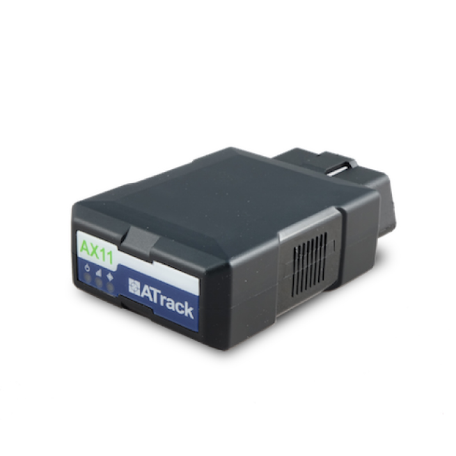

# ATrack - AX11

# AX11 OBDII Vehicle Tracker

El AX11 es un rastreador GPS OBDII plug-and-play diseñado para una rápida integración con plataformas telemáticas como Plaspy. Construido para gestión de flotas, seguros basados en el uso, operaciones de alquiler de vehículos y monitoreo de conductores adolescentes, el AX11 combina conectividad LTE celular, posicionamiento GNSS integrado y una rica telemetría del bus del vehículo para ofrecer seguimiento e informes en tiempo real confiables y compatibles con Plaspy.

Construido para una instalación rápida a través del puerto OBDII SAE J1962 Tipo B, el AX11 ofrece una captura de datos sólida desde coches de pasajeros hasta camiones pesados. Su hardware LTE preparado para operadores, su GNSS interno y el soporte opcional Bluetooth Low Energy lo convierten en un rastreador GPS ideal para despliegues de flotas a gran escala y casos de uso de IoT centrados en vehículos en Plaspy.

## Aspectos Clave

- Instalación OBDII plug-and-play \(SAE J1962 Tipo B\) para un despliegue rápido en toda la flota.
- Conectividad LTE con variantes de módulo Cat.1 y Cat.M1, además de transporte TCP/UDP y SMS para un seguimiento fiable en tiempo real.
- Motor GNSS integrado GPS/GLONASS de 99 canales, con sensibilidad de seguimiento de −167 dBm y una precisión típica de ubicación CEP de 2.5 m \(50%\).
- Amplio soporte de protocolos de bus vehicular \(OBDII, SAE J1939, J1708/J1587, ISO 15765-4 CAN, ISO 14230-4, ISO 9141-2, SAE J1850\) para desbloquear telemetría como combustible y estado del motor cuando esté disponible.
- Memoria flash interna de 64 Mbit para almacenamiento local de registros \(~120,000 registros\) y consumo en modo sueño profundo muy bajo \(alrededor de 1.7 mA @12V en algunas variantes\) para reducir la carga sobre las baterías de los vehículos.
- Acelerómetro de 3 ejes de ±16 g y giroscopio de 3 ejes \(±2000 dps\) integrados para eventos de comportamiento de conducción, frenadas bruscas y análisis de detección de colisiones.
- Diseño robusto que cumple MIL-STD-810G/SAE J1455, con rango de operación −40 a +70 °C y carcasa de ABS+PC retardante de llama.
- Funciones de gestión del dispositivo: NanoSIM interno, configuración ADM/SMS/USB y actualizaciones de firmware vía ADM, FOTA o USB.

## Cómo Funciona con Plaspy

Cuando se empareja con Plaspy, el AX11 transmite la ubicación del vehículo y telemetría a la plataforma mediante su enlace de datos celulares \(TCP/UDP\) o recurre a SMS cuando es necesario. Plaspy ingiere lecturas GNSS, telemetría OBD/CAN y eventos de sensores para proporcionar mapas en tiempo real, alertas e informes históricos para gerentes de flotas y aseguradoras.

- Actualizaciones de ubicación y telemetría en tiempo real sobre LTE \(Cat.1 / Cat.M1\) hacia Plaspy para seguimiento en vivo y alertas de geocercas.
- Captura de datos del bus del vehículo \(OBDII / CAN / J1939 / J1708\) que permite monitoreo de combustible, parámetros de diagnóstico del motor y estado de encendido cuando estén disponibles en el vehículo.
- Almacenamiento de registros locales \(memoria flash interna de 64 Mbit\) con carga por lotes a Plaspy para escenarios de reconexión o cobertura intermitente.
- Eventos de comportamiento de conducción \(acelerómetro/giroscopio\) transmitidos a Plaspy para puntuación de eventos bruscos, entrenamiento del conductor y reportes de seguridad.
- Soporte opcional de Bluetooth Low Energy para sensores BLE \(TPMS y otros periféricos\) para ampliar la telemetría de Plaspy con datos de sensores inalámbricos.

## Visión general técnica

| Conectividad | LTE celular \(variantes: Cat.1 y Cat.M1\); transporte de datos a través de UDP/IP, TCP/IP y SMS |
| --- | --- |
| Bandas / Preparación para operadores | Variantes certificadas para operadores para AT&T, Verizon, Sprint, TELUS y operadores certificados para módulos \(NTT Docomo, KDDI, Telstra\); variantes de bandas de frecuencia disponibles para diferentes mercados |
| Alimentación y batería | Alimentación de vehículo de 12V/24V; sueño profundo ~1.7 mA a 12V en algunas variantes; batería de respaldo interna de 3.7V 90 mAh para breves fallos de energía |
| Interfaces | Conector OBDII SAE J1962 Type B \(plug-and-play\); interfaz mini USB para PC/accesorios; adaptadores opcionales e interfaces de accesorios \(adaptadores J1939/J1708, RS232, 1-Wire, cables de extensión OBD\) |
| GNSS | GPS/GLONASS integrado, motor de 99 canales, sensibilidad de seguimiento de −167 dBm, precisión típica de ubicación CEP de 2.5 m \(50%\) |
| Bluetooth | Opcional Bluetooth Low Energy v4.2 para periféricos IoT y sensores TPMS |
| Gestión remota | Configuración ADM/SMS/USB y actualizaciones de firmware vía ADM, FOTA o cable USB |
| Formato y durabilidad | Estilo dongle OBDII: 84 × 52 × 25 mm, 80 g; carcasa de ABS+PC retardante de llama; certificado MIL-STD-810G/SAE J1455; rango de operación −40 a +70 °C \(sin batería\) |

## Casos de uso

- Gestión de flotas: seguimiento en tiempo real de vehículos, reproducción de rutas, planificación y telemetría para flotas comerciales.
- Seguros basados en el uso y puntuación de conductores: recolectar datos OBD/CAN junto con eventos de acelerómetro/giroscopio para alimentar modelos de conducción segura.
- Alquiler de coches y movilidad compartida: instalación plug-and-play para kilometraje, alertas de manipulación y reporte de ubicación sin cableado complejo.
- Monitoreo de conductores adolescentes y alertas para padres: velocidad, eventos bruscos y reporte de ubicación para ayudar a mejorar el comportamiento de conducción.
- Telemetría de camiones pesados: use adaptadores J1939/J1708 opcionales y lecturas CAN de OEM para recoger parámetros del motor y combustible para camiones y flotas vocacionales.

## Por qué elegir este rastreador con Plaspy

El AX11 es un rastreador GPS compatible con Plaspy que equilibra una implantación rápida con telemetría rica. Su formato OBDII elimina instalaciones complejas, mientras que GNSS de grado industrial y conectividad LTE aseguran un seguimiento en tiempo real preciso y cargas de datos fiables. Sensores integrados y un amplio soporte de protocolos de bus vehicular lo convierten en una opción sólida para la gestión de flotas, programas de seguros basados en telemetría y operaciones de alquiler.

Elija el AX11 con Plaspy para obtener un seguimiento escalable y gestionado de forma remota que admite sensores Bluetooth, captura de datos OBD/CAN integral \(parámetros de combustible e encendido cuando estén disponibles\), registro local para cobertura intermitente y actualizaciones de ciclo de vida impulsadas por FOTA. Esta combinación ofrece una ubicación fiable, capacidades de recuperación ante robo, análisis de comportamiento de conducción y la base telemétrica necesaria para optimizar las operaciones.

