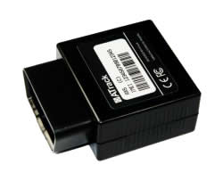

# ATrack - AX5

El rastreador GPS Atrack AX5 es una solución de seguimiento de vehículos que se conecta directamente al puerto OBD II del vehículo. Esto significa que la instalación es rápida y sencilla, ya que el rastreador se conecta en cuestión de segundos. Una vez conectado, el AX5 puede comenzar a realizar la localización de su flota o cualquier tipo de vehículo.

El Atrack AX5 es compatible con GPRS y se puede actualizar el firmware a través de esta conexión. Esto significa que siempre tendrá acceso a las últimas actualizaciones y mejoras del rastreador. Además, el AX5 cuenta con una memoria interna y una batería de respaldo, lo que garantiza que los datos se almacenen de manera segura incluso en caso de pérdida de energía.

El rastreador GPS Atrack AX5 es ideal para empresas que desean realizar un seguimiento de su flota de vehículos, así como para aquellos que desean proteger su vehículo personal. Con su conexión directa al puerto OBD II, los costos de instalación se reducen significativamente. Además, el AX5 cuenta con una amplia gama de características técnicas, como comunicación GPRS, ahorro de energía y capacidad de realizar copias de seguridad de la batería.

### Características destacadas del rastreador GPS Atrack AX5:

- Conexión directa al puerto OBD II del vehículo
- Instalación rápida y sencilla en cuestión de segundos
- Compatible con GPRS y actualizable a través de esta conexión
- Memoria interna y batería de respaldo para garantizar la seguridad de los datos
- Amplia gama de características técnicas, como comunicación GPRS, ahorro de energía y capacidad de realizar copias de seguridad de la batería

El rastreador GPS Atrack AX5 es una solución confiable y fácil de usar para el seguimiento de vehículos. Ya sea que necesite realizar un seguimiento de su flota de vehículos comerciales o proteger su vehículo personal, el AX5 ofrece todas las características necesarias para mantenerlo informado y seguro.

