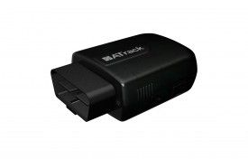

# ATrack - AX9

El rastreador GPS AX9 de ATrack es una unidad de seguimiento 2G/3G opcional con interfaz OBD-II y plug-n-play. Con la adquisición de datos del bus J1939 DAB/CAN, conectividad Bluetooth, gestión de eventos de comportamiento de conducción y informes definidos por el usuario, el AX9 es una solución ideal para el uso basado en seguros, alquiler de coches, gestión de flotas tanto de vehículos de pasajeros como de camiones pesados, y seguimiento de adolescentes.

El AX9 ofrece opciones de red inalámbrica flexibles y es pequeño y fácil de usar con su función plug-and-play. Además, tiene un consumo de corriente ultra bajo en modo de sueño profundo. La comunicación de datos se puede realizar a través de SMS, TCP o UDP, y cuenta con una alta sensibilidad GPS y un sensor G de 3 ejes incorporado. También ofrece actualización de firmware FOTA a través de FTP y seguimiento en tiempo real y tala configurables.

Otras características destacadas del AX9 incluyen la capacidad de definir 32 geocercas, un zumbador incorporado para eventos configurables, ajustes de preferencias de roaming, eventos de comportamiento de conducción duros, administración de energía configurable, recopilación de datos OBDII, recopilación de datos FMS/J1939, cálculo de ahorro de combustible, transmisión de eventos OBDII definidos por el usuario, informes de códigos de problemas OBDII, y un inteligente control de eventos de la máquina. Además, cuenta con un buffer de avisos de servicio de 150,000 posiciones.

Tenga en cuenta que las variantes AX9 \(CV\) y AX9 \(CS\) no admiten la función de preferencia de itinerancia.

