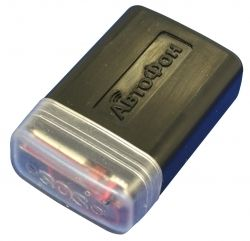

# AutoFon - α-Маяк

El AutoFon α-Маяк es un rastreador GPS independiente y compacto diseñado para determinar la ubicación de un objeto y transmitir coordenadas a través de la red GSM. Construido sobre una plataforma de hardware más moderna, el dispositivo prioriza un tamaño reducido y una larga vida útil con un único juego de baterías. Incorpora un módulo de navegación combinado GLONASS y GPS para fijar la posición de forma fiable, un botón SOS integrado para activación forzada y viene preconfigurado para operar automáticamente, reduciendo la gestión diaria.

Como dispositivo compatible con Plaspy, el α-Маяк puede enviar datos de posición a Plaspy para una visibilidad y gestión centralizadas. Su funcionamiento preconfigurado y el comportamiento de reporte ajustable lo hacen una opción práctica para quienes buscan un rastreador de bajo mantenimiento que se integre en un flujo telemático mayor. Plaspy puede utilizar los datos del dispositivo para mostrar el historial de ubicaciones, generar alertas y facilitar la supervisión rutinaria de activos y personal.

## Puntos clave

- Factor de forma diminuto, similar al tamaño de una caja de fósforos, ideal para colocación discreta y fácil transporte
- Operación autónoma extendida de hasta aproximadamente tres años con un solo juego de baterías, reduciendo el mantenimiento
- Módulo de navegación combinado GLONASS y GPS de alta sensibilidad para un posicionamiento preciso
- Botón SOS integrado para activación manual y conmutación rápida de modo cuando sea necesario
- Comportamiento del dispositivo preconfigurado con ajuste SIM incorporado para simplificar la puesta en marcha
- Frecuencia de reporte configurable y acceso al historial de ubicaciones a través del Área Personal del fabricante

## Cómo funciona con Plaspy

Al conectarse a Plaspy, el AutoFon α-Маяк proporciona actualizaciones de posición que Plaspy puede procesar y mostrar junto con otros datos de flota y activos. Plaspy aprovecha esos reportes de ubicación para ofrecer supervisión operativa y registros históricos sin necesidad de supervisión constante del dispositivo.

- Visibilidad en tiempo real y periódica de la ubicación de los objetos rastreados en los mapas de Plaspy
- Informes históricos de rutas y posiciones para revisión y auditoría
- Manejo de eventos como activaciones SOS que se canalizan hacia Plaspy para alertas y respuesta
- Alertas y notificaciones personalizables según movimiento o cambios de ubicación
- Señales que ayudan a reducir el mantenimiento, como intervalos de reporte poco frecuentes que extienden la vida de la batería manteniendo la supervisión necesaria

## Casos de uso típicos

- Rastreo de pequeños activos de valor donde el tamaño compacto y la larga duración de la batería son prioritarios
- Seguridad personal y monitoreo de trabajadores aislados aprovechando la función SOS integrada
- Colocación temporal o discreta para recuperación de bienes o equipos móviles
- Monitoreo de pequeñas flotas o activos mixtos donde se desea un rastreo de bajo mantenimiento
- Situaciones que requieren operación prolongada sin supervisión con comprobaciones periódicas remotas de posición

## Por qué elegir este rastreador con Plaspy

El AutoFon α-Маяк es una elección práctica para organizaciones e individuos que usan Plaspy y necesitan un rastreador de perfil bajo con larga autonomía y operación sencilla. Su naturaleza preconfigurada reduce la complejidad de instalación, mientras que Plaspy aporta visualización centralizada, alertas e informes que hacen al α-Маяк útil en el monitoreo cotidiano y en la gestión de incidentes.

Para obtener más información sobre Plaspy y cómo se gestionan los dispositivos compatibles en la plataforma, visite https://www.plaspy.com. Las especificaciones de producto y las opciones de servicio pueden cambiar con el tiempo, por lo que para los detalles técnicos y la disponibilidad más recientes verifique la documentación actual del fabricante en https://www.autofon.ru/.
