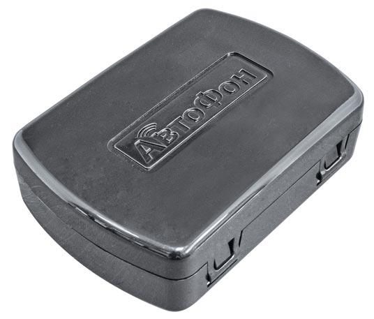

# AutoFon - Альфа-Маяк XL

El AutoFon Альфа-Маяк XL es una baliza GPS compacta y autónoma diseñada para despliegues de larga duración con mínimo mantenimiento. Pensada para la protección encubierta de vehículos y bienes, envía reportes de posición por SMS o GPRS y viene configurada de fábrica con una SIM prepaga integrada y una autonomía extendida para operar de forma continua y discreta en el campo.

Como dispositivo compatible con Plaspy, el Альфа-Маяк XL se integra en los flujos de monitoreo de flotas para ofrecer ubicaciones en tiempo real, alertas de eventos y recorridos históricos. Su combinación de carcasa resistente, larga autonomía y reporte autónomo lo convierte en una opción práctica para operadores que necesiten consolidar actualizaciones de ubicación y notificaciones antirrobo dentro de las herramientas de gestión de flotas de Plaspy.

## Características principales

- Compatible con Plaspy: envía ubicaciones y estados por SMS y GPRS para integrarse en los paneles y alertas de Plaspy.
- Autonomía ultra larga con vida útil de batería de varios años bajo frecuencia de reporte baja típica.
- Diseño discreto y robusto con carcasa hermética y protección IP67 para instalaciones exteriores y ocultas.
- Posicionamiento combinado GLONASS y GPS para ubicaciones confiables en distintos entornos.
- Provisionado de fábrica con SIM prepaga integrada y configuración por defecto para despliegue inmediato.
- Botón SOS y monitoreo de audio opcional, junto con buffering local de eventos para mejorar la persistencia de datos.

## Cómo se integra con Plaspy

El Альфа-Маяк XL transmite mensajes periódicos de posición y estado por enlaces celulares que Plaspy recibe y normaliza en mapas, alertas e informes. Plaspy consolida coordenadas entrantes y eventos del dispositivo para que usted pueda monitorear activos, investigar alarmas y revisar el historial de movimientos desde una única plataforma.

- Las ubicaciones y telemetría en tiempo real se muestran en los mapas y listas de vehículos de Plaspy a medida que llegan los mensajes.
- Los eventos SOS y las señales de vida se reenvían a Plaspy para el enrutamiento inmediato de notificaciones y la escalación correspondiente.
- El almacenamiento local tipo caja negra preserva datos recientes no enviados para que Plaspy reciba actualizaciones completas cuando se restablezca la conectividad.
- Los cambios en la frecuencia y el horario de reporte se reflejan en los informes de Plaspy cuando el dispositivo se configura en consecuencia.
- El monitoreo de audio y los informes completos de comandos de acceso pueden emplearse como insumos complementarios en las investigaciones junto con los datos de ubicación de Plaspy.

## Casos de uso típicos

- Antirrobo encubierto y recuperación rápida para autos, motocicletas y scooters.
- Seguimiento de larga duración de remolques, maquinaria alquilada y equipos con mantenimiento mínimo.
- Seguridad de propiedades remotas y estructuras como garajes, cabañas y activos fuera de sitio.
- Monitoreo de flotas de alquiler para mantener visibilidad periódica sin servicios frecuentes.
- Revisión periódica de carga y logística donde la durabilidad y la autonomía extendida son prioridad.

## Por qué elegir este rastreador con Plaspy

Combinar el AutoFon Альфа-Маяк XL con Plaspy ofrece una solución de seguimiento de bajo mantenimiento para organizaciones que requieren visibilidad discreta y de larga duración. El aprovisionamiento de fábrica y la operación autónoma prolongada reducen las tareas de mantenimiento, mientras que Plaspy consolida actualizaciones de posición, alarmas y recorridos históricos en vistas operativas e informes que facilitan la toma de decisiones a tiempo.

Para obtener más información sobre cómo puede usar este modelo dentro de Plaspy, visite el sitio web de Plaspy https://www.plaspy.com. Las especificaciones del producto, la disponibilidad y los detalles del fabricante pueden cambiar con el tiempo, por lo que le recomendamos verificar las especificaciones actuales con la documentación oficial del fabricante en https://www.autofon.ru/.
