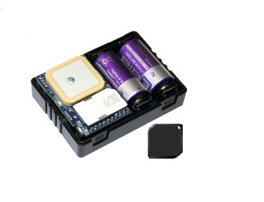

# AutoFon - D-Маяк

El АвтоФон D‑Маяк \(AutoFon D‑Beacon\) es una baliza compacta y autónoma con GSM/GLONASS+GPS, diseñada para despliegues encubiertos de rastreadores GPS y una recuperación fiable ante robo. Construido sobre una moderna plataforma de hardware v.6.x, el D‑Маяк ofrece una operación autónoma prolongada, informes configurables por SMS/GPRS y detección robusta de eventos — y es totalmente compatible con Plaspy para rastreo en tiempo real, alertas y telemetría histórica en su panel de monitoreo.

Ya sea que necesite una unidad discreta para recuperación de vehículos, un nodo de larga vida para protección de activos remotos o un rastreador compacto para complementar herramientas de gestión de flotas, el D‑Маяк se integra sin problemas con Plaspy para proporcionar actualizaciones de ubicación inmediatas, notificaciones de alarmas y acciones de control remoto. Su tamaño compacto y los modos de informes flexibles lo convierten en un rastreador GPS ideal para instalaciones ocultas donde la resistencia y las comunicaciones confiables son fundamentales.

## Principales características

- Duración autónoma prolongada: hasta 2 años con dos baterías CR123A \(3.0 V, 1500 mAh cada una\) para operaciones encubiertas extendidas.
- Navegación combinada GLONASS + GPS \(con chipset SIM68R\) para un rendimiento de posicionamiento superior frente a dispositivos de una sola constelación.
- Monitoreo por GPRS e informes por SMS aseguran conectividad persistente con Plaspy para seguimiento en tiempo real y entrega de alertas.
- Acelerómetro digital con detección de múltiples eventos \(inicio de movimiento, impactos, vuelcos, caídas y otros\) para telemetría precisa y alarmas inteligentes.
- Botón SOS incorporado, entrada de alarma externa y canal auxiliar universal para control remoto del inmovilizador, arranque, sirena o precalentador.
- Buffer de caja negra para almacenar hasta 98.000 paquetes GPRS no enviados, evitando la pérdida de datos durante interrupciones de conexión.
- Micrófono integrado para monitorización de audio remoto y etiqueta de presencia del propietario por RF para detección de proximidad autorizada.
- Dimensiones compactas \(69 × 51 × 22 mm\) y placa de alimentación/expansión externa incluidas para opciones de instalación flexibles.

## Cómo funciona con Plaspy

Cuando se integra con Plaspy, el АвтоФон D‑Маяк se convierte en una fuente fiable de rastreo en tiempo real y telemetría de eventos. La unidad transmite la ubicación y los datos de sensores a Plaspy vía GPRS \(con respaldo por SMS cuando esté configurado\). Plaspy asimila esos mensajes y los presenta en mapas, en líneas de tiempo de eventos y como alertas automáticas para operadores o usuarios móviles. La memoria de la caja negra del dispositivo garantiza que Plaspy reciba la telemetría almacenada tras interrupciones de la red, manteniendo la continuidad para gestión de flotas o escenarios de recuperación.

- Actualizaciones de ubicación y telemetría en tiempo real vía GPRS \(con informes a intervalos configurables y modo activo continuo cuando está en movimiento\).
- Reenvío de eventos de alarma y SOS — la entrada de alarma externa y el microbotón SOS activan alertas inmediatas de Plaspy.
- Buffer de paquetes de la caja negra \(hasta 98.000 paquetes GPRS\) garantiza la entrega de mensajes perdidos una vez que se restablece la conectividad.
- Acciones de control remoto — Plaspy puede enviar comandos para activar el canal auxiliar \(inmovilizador, arranque, sirena, precalentador\) donde esté configurado.
- Monitorización de audio y estado de la etiqueta de presencia del propietario por RF están disponibles en Plaspy como telemetría adicional para mejorar la conciencia situacional.
- Conmutación de informes de respaldo — GPRS por intervalos, informes continuos de movimiento y modo beacon ante pérdida de energía externa aseguran un comportamiento de rastreo persistente.

## Resumen técnico

| Modelo / Fabricante | АвтоФон D‑Маяк \(AutoFon D‑Beacon\) |
| --- | --- |
| Conectividad | GSM/GPRS \(monitoreo GPRS soportado\); informes por SMS soportados |
| Módulo de navegación | GLONASS + GPS \(chipset SIM68R\) |
| Módulo GSM | QUECTEL M12 |
| Alimentación & Batería | 2 × CR123A 3.0V \(1500 mAh cada una\); alimentación externa soportada; hasta 2 años de operación autónoma |
| Entradas / Salidas | 1 entrada de alarma; 1 canal auxiliar universal \(control remoto de inmovilizador, arranque, sirena, precalentador\) |
| Sensores | Acelerómetro digital integrado \(inicio de movimiento, impactos, vuelcos, caídas y otros eventos\); microbotón SOS |
| Buffer de Datos | Buffer de caja negra para hasta 98,000 paquetes GPRS no enviados |
| Audio | Micrófono integrado para monitorización de audio remoto |
| Etiqueta RF | Etiqueta de presencia del propietario por RF con código de diálogo |
| Antenas | Tamaño de la antena GPS: 25 × 25 × 4 mm \(detalles de la antena externa con la unidad\) |
| Firmware & Gestión | Actualización remota de firmware vía GPRS; modos de informes configurables por SMS/GPRS; reloj en tiempo real; protección por PIN |
| Dimensiones | 69 × 51 × 22 mm |
| Idiomas | Soporte de mensajes en ruso / inglés |

## Casos de uso

- Anti-robo encubierto de vehículos y recuperación rápida — instalación discreta en automóviles o motos con SOS y detección de impactos.
- Rastreo de carga y contenedores valiosos — larga vida de la batería y buffer de caja negra para proteger la continuidad del rastreo durante el tránsito.
- Vigilancia remota de activos — garajes, casas de verano, quioscos y objetos estacionarios donde la energía externa puede no estar disponible.
- Rastreo personal y de animales donde se requiere un rastreador GPS discreto y de larga duración para monitoreo de seguridad.
- Gestión de flotas complementaria — use D‑Маяк para ubicación a nivel de unidad y telemetría de eventos, combinada con los paneles de flotas de Plaspy.

## Por qué elegir este rastreador con Plaspy

Combinar el АвтоФон D‑Маяк con Plaspy ofrece una solución de rastreo GPS fiable, centrada en la resistencia, la integridad de los datos y alertas accionables. La combinación de posicionamiento GLONASS+GPS, el amplio buffering de la caja negra y las actualizaciones de firmware remotas reduce el tiempo de inactividad y garantiza que la telemetría llegue a Plaspy incluso tras interrupciones de la conectividad. El acelerómetro integrado, el botón SOS y la monitorización de audio proporcionan a los equipos de seguridad telemetría más rica para la respuesta ante robos y la investigación de incidentes.

Para organizaciones que utilizan Plaspy para la gestión de flotas o protección antirrobo, el D‑Маяк ofrece una baliza compacta y de fácil ocultación que complementa telemetría más amplia como el monitoreo de combustible o datos de encendido cuando esos sensores están presentes en el vehículo. Mientras el D‑Маяк se centra en la ubicación, eventos y control remoto a través de su canal auxiliar \(inmovilizador, arranque\), Plaspy puede combinar su telemetría con sensores externos de combustible o sensores Bluetooth gestionados a través de la plataforma para entregar una imagen completa de telemática. El resultado es una solución escalable y compatible con Plaspy que equilibra las necesidades de instalación encubierta con monitoreo y control de nivel empresarial.

