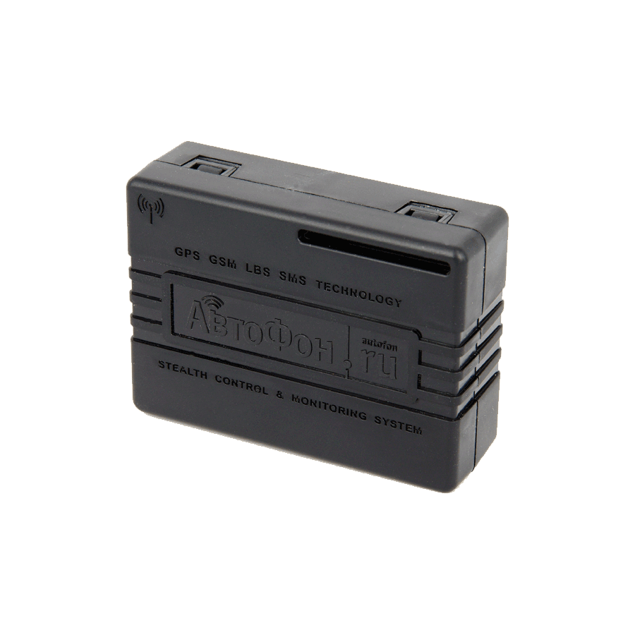

# AutoFon - DX Маяк

El AutoFon DX Маяк es un rastreador GPS compacto y multipropósito que utiliza GLONASS y GPS para determinar la ubicación de un objeto protegido, con posicionamiento alternativo desde estaciones base celulares cuando los satélites no están disponibles. Envía coordenadas y eventos registrados a través de redes GSM 2G usando GPRS hacia un servidor de monitoreo o por SMS a números de teléfono seleccionados. El sensor de aceleración incorporado permite detectar movimiento y golpes, y un módulo Bluetooth BLE ofrece detección de presencia de smartphones y búsqueda por dirección a corta distancia.

Como dispositivo compatible con Plaspy, el DX Маяк puede alimentar la plataforma de monitoreo Plaspy con datos de posición y notificaciones de eventos para su visualización en mapas, revisión histórica y supervisión operativa. Sus opciones de reporte flexibles, el almacenamiento en el dispositivo para paquetes no enviados y las capacidades de configuración remota lo convierten en una opción práctica para organizaciones que desean combinar un hardware de rastreo confiable con los paneles, alertas y herramientas de informe de Plaspy.

## Características principales

- Fijación de posición precisa mediante GLONASS y GPS con fallback a estaciones base celulares para mayor disponibilidad
- Vías de datos duales por GPRS a un servidor de monitoreo y por SMS a números predefinidos
- Acelerómetro integrado para detección de movimiento y golpes, útil en escenarios antirrobo
- Funciones Bluetooth BLE para etiquetado de presencia de smartphones y localización de corta distancia
- Factor de forma compacto y modos de operación que intercambian conectividad activa por mayor duración de batería
- Memoria tipo black box no volátil y estimación de consumo energético para mejorar la continuidad de los datos

## Cómo funciona con Plaspy

El AutoFon DX Маяк envía mensajes de ubicación y eventos que Plaspy puede ingerir y mostrar dentro de una interfaz de monitoreo unificada. Plaspy puede usar esos reportes entrantes para mantener vistas de posición en tiempo real, recorridos históricos y líneas de tiempo de eventos, mientras permite a los operadores configurar alertas y revisar el estado del dispositivo.

- Ubicación en vivo y historial de rutas mostrados en los mapas de Plaspy para supervisión de flotas y activos
- Eventos de movimiento y golpes canalizados a las alertas de Plaspy para notificación rápida de posibles incidentes
- Geocercas y alertas operativas configurables en Plaspy para vigilar entradas y salidas de zonas
- Información de estado del dispositivo, como batería e indicadores de señal, disponible en Plaspy para planificación de mantenimiento
- Recuperación automática de mensajes almacenados tras pérdidas temporales de conectividad gracias a la memoria black box del dispositivo

## Casos de uso típicos

- Rastreo antirrobo y apoyo en la recuperación de vehículos particulares y activos comerciales
- Monitoreo de carga valiosa y remolques en operaciones de transporte mixto
- Rastreo de motocicletas, vehículos todo terreno, bicicletas y otros vehículos pequeños donde la instalación discreta es importante
- Seguridad personal y monitoreo de ubicación para niños, adultos mayores y animales domésticos
- Escenarios de reporte periódico donde la larga autonomía y modos por intervalos son determinantes

## Por qué elegir este rastreador con Plaspy

El DX Маяк es una opción práctica para organizaciones que necesitan un rastreador pequeño y discreto capaz de enviar datos de ubicación y eventos a una plataforma de monitoreo remota. Su combinación de posicionamiento satelital, fallback celular, detección de movimiento y almacenamiento en el dispositivo ayuda a mantener la continuidad del rastreo en condiciones reales. Al integrarlo con Plaspy, el dispositivo forma parte de un flujo de trabajo de monitoreo más amplio que incluye visibilidad en mapas, alertas y reportes operativos.

Dado que el DX Маяк soporta modos tanto de conexión continua como de sueño por intervalos, los equipos pueden equilibrar la capacidad de respuesta y la duración de la batería según los requisitos del caso de uso. Si usted necesita reportes de posición confiables con opciones de respaldo por SMS y funciones de presencia, la integración de este rastreador con Plaspy puede mejorar la conciencia situacional sin agregar complejidad innecesaria.

To learn more about Plaspy and how it can present and manage data from devices like the AutoFon DX Маяк visit https://www.plaspy.com. Product specifications, availability, and manufacturer details may change over time, so please verify current technical and service information on the official manufacturer site https://www.autofon.ru/.
