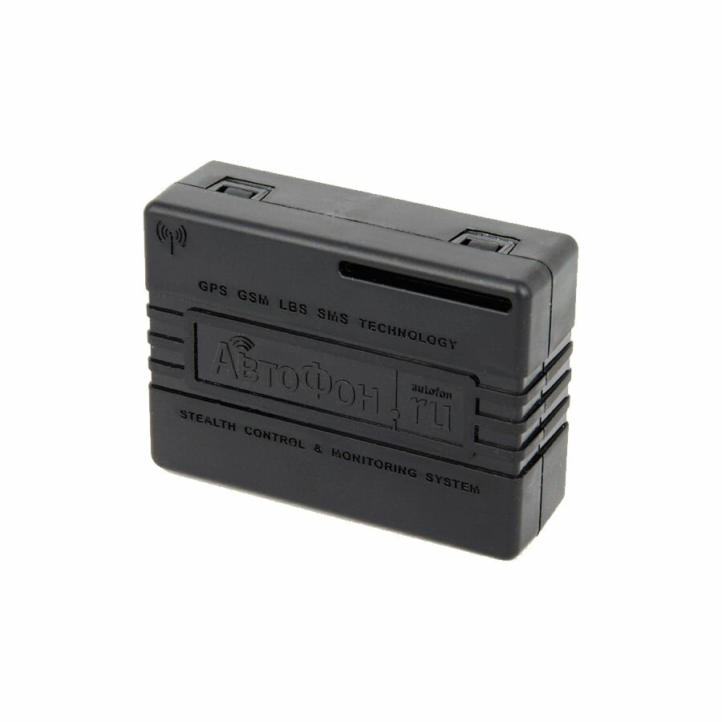

# AutoFon - DX Mayak 8.1

El AutoFon DX Mayak 8.1 es un rastreador GPS compacto alimentado por batería, diseñado para ofrecer protección antirrobo discreta y monitoreo prolongado de activos. Pensado para un funcionamiento de bajo consumo y montaje oculto, proporciona actualizaciones periódicas de posición y alertas por eventos para mantener vehículos, carga y equipos portátiles localizados y seguros durante despliegues prolongados.

Como dispositivo compatible con Plaspy desde el primer momento, el DX Mayak 8.1 puede integrarse en los flujos de trabajo de monitoreo de Plaspy para enviar localizaciones, telemetría y eventos de alarma a paneles de flotas y seguimiento de activos. Su combinación de posicionamiento por satélite, reporte de telemetría y retransmisión en cola lo convierten en una opción práctica para organizaciones que requieren visibilidad fiable con mantenimiento mínimo.

## Aspectos destacados

- Compatible con Plaspy, con reporte a servidor y fallback por SMS para mayor redundancia.
- Factor de forma compacto con opciones de carcasa IP54 e IP67 para instalación oculta.
- Diseño de bajo consumo pensado para despliegues de varios años en modos de rastreo por intervalos.
- Alertas basadas en eventos, incluyendo movimiento, choque y notificaciones SOS.
- Envía telemetría como nivel de batería, temperatura, número de satélites y señal GSM en cada mensaje.
- Acelerómetro integrado para detección de movimiento y choques, más funciones de presencia del propietario mediante BLE.
- Almacenamiento no volátil que conserva mensajes no enviados y los retransmite cuando se restablece la conectividad.

## Cómo funciona con Plaspy

Al integrarlo con Plaspy, el DX Mayak 8.1 proporciona visibilidad operativa continua mediante el envío de mensajes estructurados de localización, telemetría y alarmas a la plataforma de monitoreo. Plaspy procesa estas actualizaciones y las muestra en mapas, paneles y canales de notificación para que los equipos puedan actuar sobre la información de posición y eventos.

- Actualizaciones de ubicación y telemetría en tiempo real entregadas a Plaspy para visualización en mapas y rutas.
- Eventos de movimiento, inclinación, choque y SOS encaminados a las reglas de alerta y escalamiento de Plaspy.
- Nivel de batería, temperatura, conteo de satélites y potencia de señal disponibles en los paneles de telemetría del dispositivo.
- Información de presencia del propietario y localización de corto alcance visible en Plaspy cuando el dispositivo interactúa con la app del smartphone.
- Retransmisión de paquetes almacenados garantiza que eventos históricos se entreguen a Plaspy tras pérdidas temporales de conectividad.

## Casos de uso típicos

- Seguimiento de flotas para vehículos livianos, remolques y equipos de apoyo donde se requiere monitoreo discreto.
- Protección antirrobo y recuperación de vehículos robados con alertas inmediatas de movimiento y SOS.
- Monitoreo prolongado de carga y activos cuando la duración de batería y el bajo mantenimiento son prioritarios.
- Rastreo de motocicletas y vehículos todoterreno que necesitan una solución pequeña y discreta.
- Supervisión de personas vulnerables o uso personal cuando se requiere localización discreta y alertas de emergencia.

## Por qué elegir este rastreador con Plaspy

El DX Mayak 8.1 combina un rastreador compacto y eficiente en consumo con capacidades de telemetría y reporte de eventos que cubren necesidades comunes de gestión de flotas y activos. Su buffer no volátil y la riqueza de telemetría ayudan a preservar el historial de eventos y aportan contexto a las alertas dentro de Plaspy, mientras que las opciones de carcasa pequeña lo hacen adaptable para usos ocultos.

Si desea explorar más opciones de integración y monitoreo, conozca Plaspy en el sitio principal https://www.plaspy.com. Las especificaciones de producto, disponibilidad y detalles del fabricante pueden cambiar con el tiempo, por lo que le recomendamos verificar las especificaciones técnicas y opciones actuales en el sitio del fabricante https://www.autofon.ru/.
